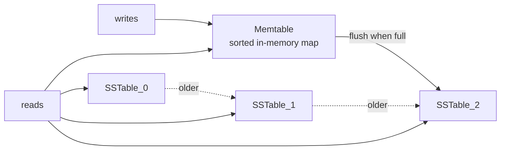

The pitch for an LSM tree is short: writes go to memory, get sorted, and periodically pour out to disk as immutable sorted files. Reads check memory first, then walk disk files newest-to-oldest. That's the whole structure. Everything else - compaction, bloom filters, the WAL - is engineering on top of that shape.

## The shape

Three moving parts:

1. **Memtable** - a sorted map (`TreeMap` / `BTreeMap`) holding pending writes in memory. A delete inserts a *tombstone* - a marker that says "this key is dead", treated as a hit by readers.
2. **SSTable** - an immutable sorted file with a bloom-filter trailer. Same on-disk layout in both languages.
3. **The coordinator** - routes writes to the memtable, flushes it to a new SSTable when it crosses a size threshold, and resolves reads by checking memory first, then SSTables newest-to-oldest. First hit wins, tombstones included.

## The one optimisation

Naive reads scan every SSTable in the walk. On a 50k-entry tree spread across ~50 SSTables that's catastrophic - hundreds of microseconds at best, milliseconds at worst. Two changes get us into single-digit microseconds at the median:

1. **Slurp the file on open.** SSTables are immutable, so `open()` reads the whole file into a buffer once. After that a get is an in-memory linear scan - no filesystem traffic.
2. **A bloom filter per SSTable trailer.** Before scanning the records, the get asks the filter "is the key plausibly here?" Seven hash probes against an in-memory bit array. A negative answer skips the file entirely. This is the [bloom-filter cookbook entry](/cookbook/recipes/subms-bloom-filter), pulled in as a dependency.

The toggle is a real runtime flag (`BloomMode::On` / `BloomMode::Off`). The performance test runs both modes back-to-back so you can see the value of the optimisation rather than take it on faith. On the cookbook's reference workload: **get-miss p99 of 17.5 us (Rust) / 29.8 us (Java) with bloom on, vs 596.7 us / 1.50 ms without** - a 34x regression in Rust and a 50x regression in Java when you disable the seven hash probes.

## On-disk format

Three sections, all big-endian. The footer at the file's end is the navigational anchor - it tells a reader where the records stop and the bloom section begins without scanning the file.

  <header class="smm-glance-head">
    
    SSTable layout
  </header>
  <ul class="smm-glance-grid">
    <li class="smm-glance-cell">
      records
      key_len, key, flag, value_len, value
      repeated, sorted by key; flag 0x00 = present, 0x01 = tombstone (value_len == 0)
    </li>
    <li class="smm-glance-cell">
      bloom
      from recipes/subms-bloom-filter
      one filter sized to this SSTable's entry count, ~1% FPR
    </li>
    <li class="smm-glance-cell">
      footer
      records_end_offset:u64 + magic:u32 "LSMT"
      last 12 bytes of the file
    </li>
  </ul>

Keys within the records section are strictly increasing. Files are immutable once written.

## What you get for free

- **Submillisecond reads** at p99, both languages, with margin.
- **Append-shaped writes** - sequential I/O, friendly to SSDs.
- **Crash-incomplete-but-not-corrupted state** - partially-written SSTables are detected by a bad footer magic; the rest of the tree is intact.

## What you have to engineer

- **Compaction.** SSTable count grows linearly with writes; tombstones never get reclaimed. Real systems run *levelled* or *size-tiered* compaction in the background.
- **Write-ahead log.** A memtable lost on crash is silently corrupted data. Production engines append every write to a sequential log *before* acking and replay on startup. Sequential, so usually cheap, but pins you to fsync semantics.
- **Sparse index.** With the bloom we skip whole files cheaply, but inside a single SSTable a get still scans linearly. A sparse index (one offset per N records) turns the per-file scan into a seek.
- **Concurrency.** The cookbook is single-threaded. Real engines serialise writes through one queue while reads run lock-free against an immutable snapshot - the memtable and SSTable list are atomically swapped, never mutated in place.

## Common pitfalls

- **Forgetting the bloom on reads but writing it anyway.** Wasted CPU, no payoff. The mode toggle is a one-line change; flip it and re-measure if your read p99 is mysteriously bad.
- **Sizing the bloom for one SSTable's worth of entries.** Each SSTable has its own bloom sized at flush time, not a single global filter. Easy to confuse.
- **Mutating SSTables.** Don't. Compaction *replaces* them; nothing else writes. The "files are immutable" invariant is what lets reads run lock-free against the SSTable list.

## Why this shape, for trading

LSM trees are tuned for **write-heavy, append-shaped workloads with sorted reads** - which describes a depressing amount of trading infrastructure: a tick recorder, a fill log, a per-symbol order history keyed by `(symbol, ts)`. The write path is a memory store; the hot-range read path is also a memory store because today's memtable hasn't flushed yet. Yesterday's data lives in a few large sorted files that compaction has already packed.

The cost is point reads on cold keys - they walk multiple files. With a bloom filter even that walk is microseconds. The wrong shape for a workload that random-reads across the full keyspace with no locality; the right shape for one that writes a lot and reads recent.

The implementations below show the same tree in two languages with the same on-disk format. The Rust version is the canonical std-only build; the Java version is the same algorithm with the same percentile structure, roughly 2x slower at every percentile (UTF-8 decoding + per-call boxing, not anything architectural).
