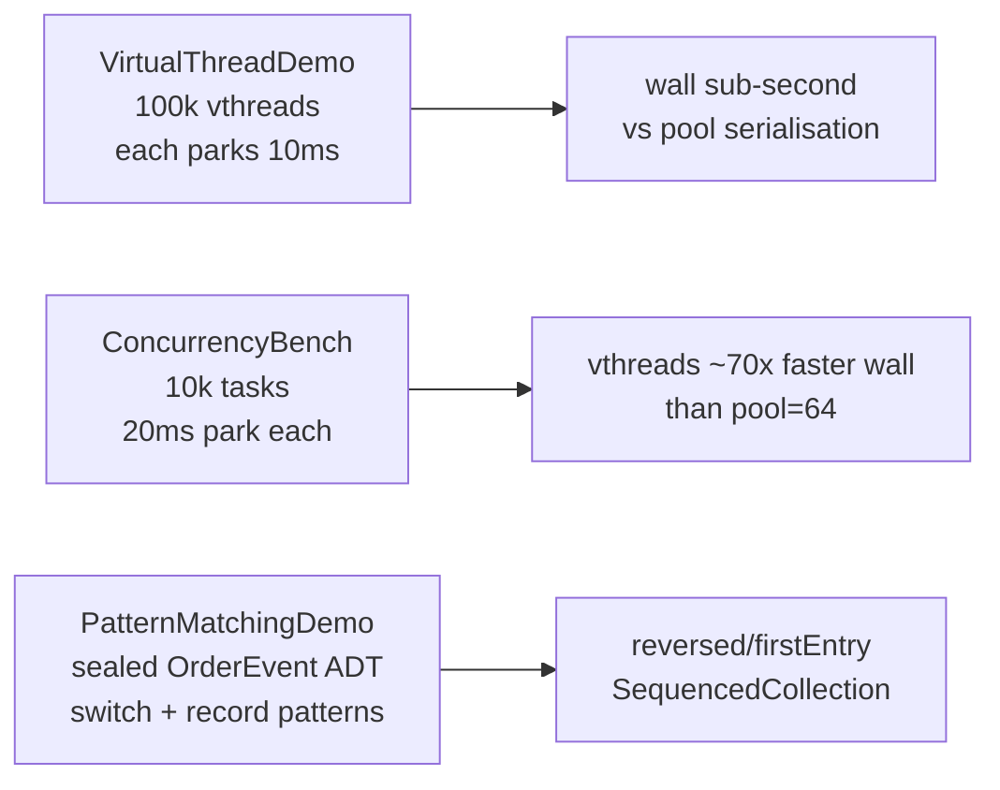

Java 21 ships four features that change how a low-latency Java codebase looks: virtual threads, record patterns, switch patterns, and sequenced collections. Each is **stable** - no `--enable-preview` flag, no API churn risk. This primer runs them on a realistic submillisecond fan-out workload and shows the head-to-head numbers.

The whole thing is one Maven project, zero external dependencies, OpenJDK 21 only.

## What's in this primer



## Virtual threads, in one sentence

`Thread.ofVirtual().start(r)` schedules `r` on the JVM's carrier-thread pool but the runnable holds no OS thread when it parks. The Loom runtime saves the continuation, frees the carrier, and resumes you later. **You can have a million of them.** The cost of "concurrency" stops being a function of how many threads the OS will give you.

The two consequences worth internalising:

- **Pools become an anti-pattern for IO.** The classic `ThreadPoolExecutor(corePoolSize=100)` exists because OS threads are expensive. Virtual threads aren't. Submit one per task and let the scheduler do its job.
- **CPU work still costs CPU.** Virtual threads don't make a tight loop faster. The win is for code that spends most of its time parked - which describes most service code.

## The bench

`ConcurrencyBench` submits 10,000 independent tasks, each parking for 20 ms of simulated IO. Same shape twice: once through `Executors.newVirtualThreadPerTaskExecutor()`, once through `Executors.newFixedThreadPool(64)`.

Flat parallelism on purpose. A fan-out shape where each parent task submits children to the same fixed pool that holds the parent is a classic thread-pool starvation deadlock - the parents pin the slots, the children queue forever. Avoiding that here keeps the comparison honest.

```text
vthread                tasks=10000  park=20000us  wall=69ms    p50=39.76ms  p99=52.56ms  p999=52.71ms  max=52.72ms
platform pool=64       tasks=10000  park=20000us  wall=4952ms  p50=2516.36ms p99=4898.73ms p999=4946.90ms max=4946.96ms

Speedup (platform / vthread): 71.8x wall
```

(Numbers from a quiet developer laptop; the bench asserts a >= 10x speedup so a regression fails CI even on a noisy runner.)

What to read in those numbers:

- The vthread carrier pool has roughly one carrier per core, so 10k tasks parking 20 ms ride a small number of carriers. Wall is ~70 ms - about 3x the park - because the JVM scheduler interleaves them efficiently and the parking itself isn't pinning a carrier.
- The platform pool of 64 OS threads serialises 10k tasks into 10000/64 ~= 156 batches, each costing 20 ms. Wall is ~5 s and p99 latency is essentially the wall time - the median task waits half the run before getting a slot.

Park time (20 ms) is chosen above the Windows kernel timer resolution (~15.6 ms) so the measurement isn't dominated by timer slop. On Linux you could drop it sub-millisecond and still measure cleanly.

## Record patterns + switch patterns

`PatternMatchingDemo` defines a sealed `OrderEvent` hierarchy - `New`, `Fill`, `Cancel`, `Reject` - and walks a tape through it with a pattern-matched switch:

```java
return switch (e) {
    case New(var id, var symbol, var qty, var pxTicks)
            -> "new  #" + id + "  " + qty + " " + symbol + " @ " + pxTicks;
    case Fill(var id, var qty, var pxTicks)
            -> "fill #" + id + "  " + qty + " @ " + pxTicks;
    case Cancel(var id, var reason)
            -> "cxl  #" + id + "  (" + reason + ")";
    case Reject(var id, var reason)
            -> "rej  #" + id + "  (" + reason + ")";
};
```

Three things you would have written before Java 21 are gone:

1. The `if (e instanceof Fill f) { ... } else if (...)` ladder.
2. The accessor calls inside each branch (`f.qty()`, `f.pxTicks()`) - the record pattern destructures the fields directly.
3. The default case. The compiler enforces exhaustiveness against the sealed hierarchy. Add `Reject` to the sealed list without a matching case, and compilation fails.

Guards work the way you would hope:

```java
case Fill f when f.qty() >= 1_000  -> "block-trade";
case Fill f                         -> "ordinary-fill";
```

## Sequenced collections

`SequencedCollection.reversed()` returns a view, not a copy:

```java
List<OrderEvent> tape = List.of(...);
SequencedCollection<OrderEvent> latestFirst = tape.reversed();
```

`LinkedHashMap.firstEntry()` / `lastEntry()` give you the insertion-order endpoints without iterating. It's a small thing, but it deletes a class of one-off iterator code that used to live in every Java project.

## Run it

```sh
cd cookbook/primers/java/subms-java21-virtual-threads
mvn -q package

java -cp target/classes com.submillisecond.primers.java21.VirtualThreadDemo
java -cp target/classes com.submillisecond.primers.java21.PatternMatchingDemo
java -cp target/classes com.submillisecond.primers.java21.ConcurrencyBench
java -cp target/classes com.submillisecond.primers.java21.Tests
```

Full source at [`cookbook/primers/java/subms-java21-virtual-threads`](https://github.com/submillisecond/subms-cookbook/tree/main/primers/java/subms-java21-virtual-threads).
