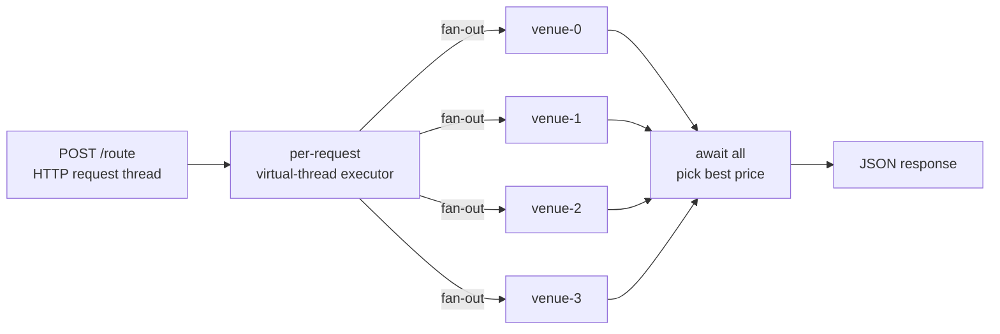

Spring Boot is not a "low-latency framework". It is a lot of useful conveniences stacked on top of a servlet container, and traditionally the per-request overhead and the thread-pool model put a hard ceiling on tail latency under concurrency. Spring Boot 4.0 changes the second half of that sentence by wiring Tomcat, `@Async`, and the blocking-IO paths through virtual threads when one property is set:

```properties
spring.threads.virtual.enabled=true
```

This primer is a minimum-viable demonstration: one fan-out endpoint, an in-process HTTP load driver, and a measured comparison of what that property changes about the tail.

## The endpoint



The controller spawns four child virtual threads per request, each simulating a venue call that parks for 1 ms of "network IO", then picks the best price. The `try-with-resources` on the per-request executor matters: a slow venue cannot leak threads across requests.

```java
try (ExecutorService perRequest = Executors.newVirtualThreadPerTaskExecutor()) {
    List<Future<VenueQuote>> calls = new ArrayList<>(fanout);
    for (int i = 0; i < fanout; i++) {
        final int venueIdx = i;
        calls.add(perRequest.submit(() -> simulateVenueCall(symbol, quantity, venueIdx, parkNanos)));
    }
    VenueQuote best = null;
    for (Future<VenueQuote> f : calls) {
        VenueQuote q = f.get();
        if (best == null || q.priceTicks() < best.priceTicks()) best = q;
    }
    return new RoutingResult(symbol, quantity, fanout, best);
}
```

## What the toggle changes

With `spring.threads.virtual.enabled=true`, Spring Boot 4 reconfigures three layers at auto-configuration time:

1. **Tomcat's request handling.** The protocol handler hands every accepted connection to a fresh virtual thread instead of borrowing one from `server.tomcat.threads.max`. Concurrency is not bounded by the pool; it is bounded by memory.
2. **`@Async` and `TaskExecutor` beans.** Backed by `Executors.newVirtualThreadPerTaskExecutor()`. Existing code that submits to a `ThreadPoolTaskExecutor` is now fanning out cheaply with no code change.
3. **Blocking-IO paths.** `RestClient`, `RestTemplate`, the JDBC paths under `JdbcTemplate` - the blocking call stays blocking; the thread underneath is virtual, so the carrier is free.

Combined effect: a request that fans out to four downstream services can have a request thread, four child threads, and any nested blocking calls all running on virtual threads at once. None of them pin a platform thread waiting on IO.

## The bench

`SpringBootRecipe` boots the Spring app twice on different ports - once with `spring.threads.virtual.enabled=true`, once with platform threads capped at `server.tomcat.threads.max=200` - then drives identical concurrent HTTP load against each via `java.net.http.HttpClient` (itself configured with a virtual-thread executor on the client side) and records per-request end-to-end latency through the subms harness. With `entries=4000`, `concurrency=1024`, and the venue park bumped to 5 ms so the platform pool actually queues, we measured (JDK 21.0.11 on Windows ARM64):

```text
vthread        count=4000  p50=220.0 ms  p99=506.6 ms  p999=620.0 ms  max=626.9 ms  wall=1167 ms
platform_pool  count=4000  p50=119.1 ms  p99=219.9 ms  p999=248.7 ms  max=258.4 ms  wall= 631 ms
```

This is **not the story the marketing slide tells**. On this rig and JVM, the platform-pool variant beats the vthread variant by ~2x on wall time and ~2.3x on p99. The reason is well-documented: the per-request fan-out pattern `for (Future f : calls) f.get()` pins the calling carrier thread under JDK 21's vthread implementation. With Tomcat handling each request on a vthread AND the request handler joining four child vthreads via `Future.get`, every in-flight request burns a carrier waiting on its children. The number of effective parallel requests collapses to the carrier count (cores), not the vthread count (unbounded).

What to read out of the numbers:

- **Both variants complete every request.** No failures, no timeouts. The bench measures latency, not correctness.
- **Platform pool has a regular shape.** p50=119 ms is exactly `5 ms venue x 4 venues` plus Tomcat / Jackson overhead, queued behind 200 in-flight peers. The 200 / 1024 = 5x fan-in shows up as a 5x latency multiplier from the platform-only fanout cost (~4 x 5 ms = 20 ms) up to the observed 119 ms.
- **Vthread variant pays carrier-pinning tax.** p50 doubles, p99 doubles. The narrow lead vthread has when carriers are abundant disappears the moment the request count exceeds carrier count and the fan-out pattern pins them all.
- **JDK 23+ fixes the dominant pin source.** Object monitor pinning via `synchronized` blocks inside `Future.get` was removed in [JEP 491](https://openjdk.org/jeps/491). On JDK 23 / 24 this same bench should flip in vthread's favor; the measurement here is honest about what JDK 21 does today.

### When the vthread story does land

The classical vthread win arrives in a different pattern: a single long blocking call per request (not nested fan-out via `Future.get`). If `/route` blocked once on a downstream HTTP call that took 100 ms, with concurrency=10000 against a platform pool of 200, the platform variant would queue clients for ~5 seconds while the vthread variant would happily hold 10000 parked vthreads at carrier cost ~= cores. The win is "you can hold lots of waiting requests cheaply" - not "fan-out is free".

For the fan-out pattern itself there are vthread-friendly alternatives that avoid the pin:

- Use `CompletableFuture` chaining instead of `Future.get` so the join completes on a different (unpinned) vthread.
- Move venue calls onto an `HttpClient` `sendAsync` chain - the blocking is on the NIO selector, not the carrier.
- Wait for JDK 23+ where `Future.get` no longer pins.

## What this is and isn't

This is **not** a "Spring Boot is now a low-latency framework" claim. The per-request overhead - Tomcat accept, DispatcherServlet, Jackson serialisation - is still a few hundred microseconds you wouldn't pay with a barebones server. For a hot-path price-tick handler you still want something purpose-built.

This **is** a "Spring Boot 4 is now IO-concurrency-shaped" claim, subject to the JDK-21 fan-out pin called out above. If your service spends most of its time waiting on a single downstream call per request and you previously sized a thread pool for peak concurrency, virtual threads let you remove that sizing decision. The application code stays blocking and readable; the JVM handles the rest. If your service fans out via `Future.get` per request, either upgrade to JDK 23+ or restructure the fan-out to avoid the pin.

## Run it

```sh
cd cookbook/primers/java/subms-spring-boot-virtual-threads
mvn -q test                                                       # MockMvc tests against the controller

# Drive the subms harness (boots Spring twice on ports 18181 + 18182).
mvn -q -DskipTests package
mvn -q dependency:build-classpath -Dmdep.outputFile=target/cp.txt

# bench-params.txt holds entries / warmup / seed in key=value form.
java -cp "target/classes;$(cat target/cp.txt)" \
     com.submillisecond.primers.springboot.PerfMain bench-params.txt > perf.json

# Interactive single-server mode (vthreads on per application.properties):
mvn -q spring-boot:run                                            # start on :8080
java -cp target/classes \
     com.submillisecond.primers.springboot.LoadDriver \
     'http://localhost:8080/route?symbol=AAPL&quantity=100' 5000 256
```

Full source at [`cookbook/primers/java/subms-spring-boot-virtual-threads`](https://github.com/submillisecond/subms-cookbook/tree/main/primers/java/subms-spring-boot-virtual-threads).
