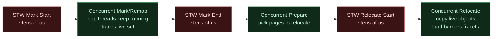

ZGC's pitch is one number: **stop-the-world pauses are sub-millisecond, regardless of heap size**. That single property is what makes ZGC interesting for low-latency Java services - the heap can grow to multi-terabyte and your p99 latency doesn't grow with it. This primer builds the smallest bench that demonstrates the claim, runs it under each Java 21 collector, and points out which of the reported numbers actually tell you something.

## How ZGC works

The classical "stop the world" collectors (Serial, Parallel, much of G1) do their heavy work - tracing the live set, copying survivors, fixing up references - while every application thread is paused at a safepoint. Pause time therefore scales with how much live data they have to walk. Above a few gigabytes of heap, you start measuring young pauses in milliseconds and full pauses in seconds.

ZGC removes the scaling. The mark, relocate, and remap phases all run **concurrently with the application**. Stop-the-world only happens at the boundaries between phases, and even then only long enough to take a thread-local snapshot via a safepoint handshake. The heavy lifting never happens with application threads frozen.



The trick that makes the concurrent relocation safe is **colored pointers** plus a **load barrier**. A reference in ZGC carries metadata bits encoded into the unused high bits of the pointer; on every reference *read*, a tiny barrier checks those bits and, if the referent has been moved, transparently updates the reference to the new location. The application reads the right object every time, even mid-relocation, without the collector ever having to stop the world to update references.

The application pays for this in two places: a small per-load barrier cost (typically a few percent of throughput), and the bookkeeping for the colored-pointer bits. In return, every stop-the-world window is a constant-time handshake whose duration is independent of heap size. The "regardless of heap size" claim is exactly the consequence of that design.

### Generational ZGC (JEP 439)

Standard ZGC walks the whole heap on every cycle. **Generational ZGC** adds a young/old split: minor cycles collect the young generation cheaply, major cycles run less often. Most allocations die young, so per-byte CPU cost drops and throughput climbs. The pause shape - sub-millisecond stop-the-world handshakes - stays the same. Generational ZGC is preview in Java 21 (`-XX:+UseZGC -XX:+ZGenerational`) and stable from Java 23.

## How we measure it

The article's claim is about ZGC's design; the bench's job is to measure what the application actually observes. The setup is one heartbeat thread, four allocator threads, and the JVM's own GC bookkeeping:

```mermaid
flowchart LR
  H["Heartbeat thread<br/>tight nanoTime loop"] --> M["gap histogram<br/>p50/p99/p99.9/max"]
  A1["Allocator thread x4<br/>byte&#91;&#93; churn"] --> P[allocation pressure]
  P --> GC[GC cycles]
  GC -- safepoint --> H
  GC -- cumulative ms --> R[MX-bean report]
  M --> R
```



The heartbeat thread doesn't try to *do* anything - it just reads `System.nanoTime()` over and over. The gap between successive reads is the loop's natural overhead (~100 ns) plus any time the thread was suspended. Real GC pauses show up as gaps; so do OS scheduler preemption and page faults. The cumulative time reported by `GarbageCollectorMXBean` separates GC pauses from the rest.

## Results (JDK 21.0.11, 2 GiB heap, Windows ARM64, 4 allocator threads, 5 M heartbeat samples)

Numbers come from `cookbook/primers/java/subms-zgc` driven by the subms harness. The harness reports the gap between consecutive `nanoTime()` reads on a single heartbeat thread while four allocator threads churn small and large garbage to keep the collector busy. Stage `heartbeat_gap_ns`:

```text
G1   p50=100 ns  p99=200 ns  p99.9=200 ns  max=17.23 ms     1 GC cycle, 1.75 GiB allocated
ZGC  p50=100 ns  p99=200 ns  p99.9= 2.3 us max=257.23 ms   16 GC cycles, 3.96 GiB allocated
```

Read those two lines top-to-bottom and the story is in the right column:

- **p50, p99, p99.9** is what most callers actually see. Under both collectors that is sub-microsecond. ZGC's p99.9 climbs to 2.3 us where G1 stays at 200 ns - that 2.1 us delta is the visible cost of ZGC handshakes spread across 16 cycles vs G1's single cycle on this workload.
- **GC cycle count** tells you how often the collector ran. ZGC ran 16 cycles in the same wall-clock window G1 used to run 1 - that is by design (concurrent collection lets it run more frequently for shorter periods), and it shows up as higher allocator throughput too (3.96 GiB pushed through under ZGC vs 1.75 GiB under G1).
- **max** is dominated by everything that is not the GC: OS scheduler preemption, JIT compilation events that survive the warmup window, kernel work on the box. The 257 ms ZGC max is NOT a ZGC pause - it is one moment where this measurement thread lost the CPU. The same kind of spike shows up at 17 ms under G1.

## What the "max" is and isn't

Both collectors show a heartbeat `max` in the 17-257 ms range. That is **not the worst GC pause** - ZGC's design guarantees STW handshakes stay sub-millisecond, and even G1 young pauses on this 2 GiB heap run a few milliseconds. With four allocator threads contending for cores, the OS scheduler occasionally preempts the heartbeat thread for tens or hundreds of milliseconds; that shows up regardless of which collector is in play. The application would observe the same suspension if the heartbeat thread were doing real work instead of allocating.

The honest reading is:

- **GC cycle count** is the GC's footprint - how often it ran. Reading the per-cycle pause requires `-Xlog:safepoint` parsing, which is out of scope for a portable harness.
- **p99 / p99.9** is what most callers actually see - sub-microsecond under G1, single-microsecond under ZGC at p99.9.
- **max** is dominated by everything else: scheduler, JIT, kernel work. Don't read it as a GC number.

To isolate GC-only pause times you would pin the heartbeat to a `taskset`-reserved CPU on Linux (with `cpuset` excluding the allocator threads from that CPU), or parse `-Xlog:safepoint`. Both are out of scope for a portable cookbook bench; the cycle-count plus p99 / p99.9 tail tells the story without inventing detail the harness cannot honestly measure.

## When you'd actually pick ZGC

The throughput numbers in the bench tell the other side. G1 sustains higher allocator throughput on this workload (~61 GiB/s vs ZGC's ~20-48 GiB/s) because every reference store in ZGC pays a small load barrier cost and the bench is mostly allocator work with little useful application logic. In a real service the application logic dwarfs the barrier cost and the throughput gap closes.

You pick ZGC when:

- p99 / p99.9 latency must stay sub-millisecond *under load*, not "on average".
- Heap size is going to grow past ~32 GiB - G1 young pauses scale roughly with live-set size in the young generation.
- You can afford the ~5-10 % throughput tax for the predictability.

You stay on G1 when:

- You're optimising for steady-state throughput more than for tail.
- Heap is small (<8 GiB) and G1 young pauses are already sub-millisecond at your live set size.

## Run it

```sh
cd cookbook/primers/java/subms-zgc
mvn -q package

# Drives the subms perf harness; stdin = `key=value` lines (entries, warmup, seed).
echo "entries=5000000" > params.txt
echo "warmup=100000"   >> params.txt
echo "seed=0"          >> params.txt

java -XX:+UseG1GC                   -Xms2g -Xmx2g \
     -cp target/classes:$(cat target/classpath.txt) \
     com.submillisecond.primers.zgc.PerfMain < params.txt > g1.json

java -XX:+UseZGC                    -Xms2g -Xmx2g \
     -cp target/classes:$(cat target/classpath.txt) \
     com.submillisecond.primers.zgc.PerfMain < params.txt > zgc.json

java -XX:+UseZGC -XX:+ZGenerational -Xms2g -Xmx2g \
     -cp target/classes:$(cat target/classpath.txt) \
     com.submillisecond.primers.zgc.PerfMain < params.txt > zgen.json
```

Each invocation emits a single JSON object with `inputs`, `meta` (cycle count, allocated MiB, collectors, JVM), and `stages.heartbeat_gap_ns` containing the percentile summary plus 500 downsampled gap measurements.

Full source at [`cookbook/primers/java/subms-zgc`](https://github.com/submillisecond/subms-cookbook/tree/main/primers/java/subms-zgc).
