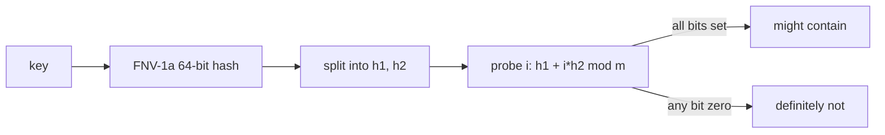

A **bloom filter** answers one question fast: *is this key definitely not in the set?* It can say "definitely not" or "maybe yes". False positives are possible at a tunable rate; false negatives are not. That asymmetric answer is exactly the shape you want when a real lookup is expensive and a fast negative can short-circuit it - SSTable scans, cache miss filters, log dedup checks, "have we seen this user yet" gates.

## The shape

A fixed-size bit array of `m` bits and `k` hash functions. To add a key: set `k` bits, one per hash. To probe a key: check the same `k` bits - if any is zero, the key was never added; if all are set, the key was probably added (but might be a collision with previous adds - that's the false positive).

## Sizing

The standard optimum for false-positive rate `p` and `n` entries:

| variable | optimal value          | meaning                |
|----------|------------------------|------------------------|
| `m`      | `-n · ln(p) / (ln 2)²` | bits in the array      |
| `k`      | `(m / n) · ln 2`       | number of hash probes  |

At `p = 0.01` this collapses to a memorable constant pair: **~10 bits per key, k = 7**. Both implementations hard-code these constants - the cookbook value is in seeing how few moving parts the structure actually has, not in tuning.

## The double-hashing trick

A naive bloom filter evaluates `k` separate hash functions per `add`/`probe` - wasteful when `k = 7`. Instead, compute one 64-bit hash, split it into two 32-bit halves `h1` and `h2`, and derive every probe from those two:

| probe index            | bit position                       |
|------------------------|------------------------------------|
| `i ∈ 0..k`             | `(h1 + i · h2) mod m`              |

Two hash evaluations per call instead of seven. The trick is sound (Kirsch & Mitzenmacher 2006) and what every production bloom does. We use **FNV-1a 64-bit** as the underlying mixer - a five-line non-cryptographic hash that's deterministic across languages.

## Wire format

Identical across Java and Rust so a filter written by one can be read by the other:

  <header class="smm-glance-head">
    
    on-disk layout
  </header>
  <ul class="smm-glance-grid">
    <li class="smm-glance-cell">
      bit_count
      u32 BE
      total bits in the array
    </li>
    <li class="smm-glance-cell">
      k
      u32 BE
      probes per add / lookup
    </li>
    <li class="smm-glance-cell">
      word_count
      u32 BE
      number of u64 words that follow
    </li>
    <li class="smm-glance-cell">
      bits
      u64 BE × word_count
      the bit array itself, packed
    </li>
  </ul>

A 1000-key filter is 12 B header + ~1.25 KB bits. Cheap.

## What you get for free

- **Sub-microsecond `mightContain`.** Seven memory accesses against a small bit array. Branch-predictable.
- **Deterministic across languages.** Same FNV-1a, same bit layout, same probe formula.
- **Trivial serialisation.** Sized once, immutable thereafter.

## What you have to engineer

- **Hash quality.** A bad hash clusters bits and inflates the FPR. FNV-1a is fine for non-cryptographic use; if your keys are adversarial, swap for SipHash.
- **`(h2 | 1)`.** If the upper 32 bits happen to be zero, every probe lands at index `h1` and the filter degenerates to one hash. Force the low bit to 1.
- **Don't size for `expected_entries = 0`.** The 64-bit floor in `BloomFilter::new(n)` is what stops `m = 0` from blowing the modulus.

## Common pitfalls

- **False negatives "feel like a bug".** They aren't possible. If `mightContain` returns false, the key was never added - full stop. If you observe one, the real cause is an aliased buffer, a write you forgot to commit, or two filter instances pointed at different bits.
- **Removing keys.** A standard bloom can't unset a bit without risking false negatives for other keys that share it. If you need deletes, use a *counting* bloom (bit array → 4-bit counters).
- **Resizing.** A filter is immutable in size. To grow, build a new one and re-add every key from the source of truth (you do have a source of truth, right?).

## Consumed by

[LSM tree](/cookbook/recipes/subms-lsm-tree) - one bloom filter per SSTable, parsed out of the file's trailer. Lets a get short-circuit before scanning the records. The performance figures above come from that integration: with bloom on, miss p99 is ~16 µs (Rust) / ~35 µs (Java); off, it blows past 1 ms.
