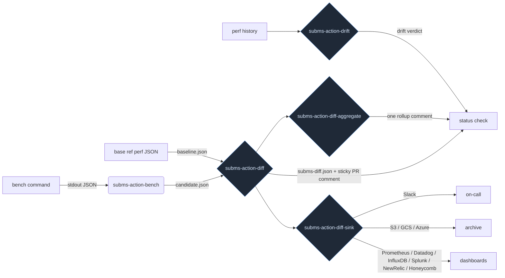

A typical perf bench tells you "p99 is 30 us." That's a useful number for a blog post and useless for a CI gate. The number you actually need at PR time is: **"compared to main, did p99 regress beyond the threshold I'm willing to tolerate?"**

This recipe is the gate that answers that question. Five composable GitHub Actions plus a reusable workflow plus a pre-commit hook, all reading and writing the same JSON shape - so any tool that can emit the shape (Rust, Java, JMH, Criterion, HdrHistogram, a 200-line Python script) plugs into the same pipeline.

## The pipeline



Five actions, one umbrella, one reusable workflow. The headline is the **status check**: if any stage regresses beyond its threshold, the PR cannot merge.

## What you get for free

- **Sticky PR comment** with a per-stage delta table. Re-runs update the same comment rather than spamming.
- **Per-stage threshold overrides.** Noisy stages tolerate more drift; tight stages get a stricter gate.
- **Matrix rollup.** Running 32 jobs (16 components x 2 langs)? One aggregated comment instead of 32.
- **13 sinks** for downstream observability: Slack, generic HTTP, S3 (presigned URL), GCS, Azure Blob, Prometheus Pushgateway, InfluxDB, Datadog, Splunk HEC, New Relic, Honeycomb, file, stdout. Multi-sink dispatch: `sink: "slack,s3,datadog"`.
- **Drift detection** that catches the slow case base-ref diffing misses: "p99 has been creeping +1 % per week and is now 3.5 sigma above the 14-day mean."
- **Pre-commit hook** that refuses local commits whose staged perf JSON regresses vs HEAD - same diff math, runs in <100 ms, doesn't re-run the bench.

## The contract

Every action consumes / emits this shape - the [`SubMsBenchSummary`](https://github.com/submillisecond/subms-actions/blob/main/docs/JSON-CONTRACT.md) JSON:

```jsonc
{
  "workload":  "my-workload",
  "lang":      "rust",                        // free-text; any tag works
  "timestamp": "2026-05-19T13:11:58Z",
  "inputs":    { "entries": "50000" },
  "meta":      { "host":    "ci-1" },
  "stages": {
    "put": {
      "count":      50000,
      "p50_ns":     300,
      "p99_ns":     1200,
      "p999_ns":    153900,
      "max_ns":     3895300,
      "mean_ns":    1761,
      "samples_ns": [...]
    }
  }
}
```

Produce that JSON from anything and the pipeline accepts it. Rust and Java emit it natively via the [`subms`](https://crates.io/crates/subms) crate / jar; JMH and Criterion need a ~60-line adapter ([template](https://github.com/submillisecond/subms-actions/blob/main/docs/JSON-CONTRACT.md#producing-the-contract-from-existing-tools)).

## Choosing a platform

Pick GitHub Actions (the canonical path) or GitLab CI (coming soon - the underlying actions are Node std-lib only, so a port is straightforward but not yet shipped). The tabs below switch between platform-specific setup; the gate's *behaviour* is identical either way.

## What this isn't

- **Not a bench runner.** You bring your own bench; this gates its output.
- **Not a hosted service.** Zero infra to run. The actions execute on your existing GitHub Actions runner; the sinks push to your existing observability stack.
- **Not opinionated about your language.** One stage shows `p99_ns: 1200`; we don't care if your bench was in Rust, Java, Python, Go, or a shell script.
