If your AMM ever publishes a price torn between two reserve
snapshots, your protocol is dead. Not "your protocol has a bug" -
dead. Whoever notices first will pull every USDC out of every pool
at a 50x off-market rate. There is exactly one defence and it's
not a lock.

The defence is packing `(x, y)` into a single u128, doing a
single 128-bit atomic load on the read side, and a single CAS on
the write side. x86_64 supports this since 2008 via `CMPXCHG16B`.
ARM64 supports it via `LDXP`/`STXP`. The implementation refuses
to compile on platforms that don't have it. There is no fallback
to a lock. Don't try to write one.

## The quote, in code

```rust tab=quote label=Rust
fn quote(pool: &Pool, dx: u128, fee_bps: u32) -> u128 {
    // ONE atomic load. Not two reads of x and y. Not an RwLock
    // around them. Not a Mutex. The platform's 128-bit atomic.
    // Read this code and if you ever consider changing it,
    // walk away from the keyboard for an hour.
    let packed = pool.reserves.load_atomic_u128(Ordering::Acquire);
    let (x, y) = unpack_u128(packed);

    // Fee math in integer parts-per-ten-thousand. Float would
    // introduce per-architecture rounding differences; you don't
    // want that here.
    let dx_net = dx * (10_000 - fee_bps as u128) / 10_000;

    // Constant product. y - (x*y)/(x+dx_net). The naive form
    // overflows at 1e18 reserves; in production use a u256
    // intermediate or do the division before the multiply.
    y - (x * y) / (x + dx_net)
}
```
```java tab=quote label=Java
long quote(Pool pool, long dx, int feeBps) {
    // VarHandle::getAcquire on the long pair backing the reserves.
    // The pair MUST be in a 16-byte aligned record; misalign it
    // and the JIT may split the read. There is no compiler check
    // for this. Test it at boot.
    long packed = pool.reserves().loadAcquire();
    long[] xy = unpackLong(packed);
    long x = xy[0], y = xy[1];
    long dxNet = dx * (10_000L - feeBps) / 10_000L;
    return y - (x * y) / (x + dxNet);
}
```

The quote itself is ~3 nanoseconds of arithmetic. Two
multiplies, one divide, one subtraction. That's not where your
time goes; if you find a slow quote, look UP the call stack at
the surrounding read path, not the math.

## Why this specifically

Take a swing at the alternatives and watch them break:

| Approach | What breaks |
|---|---|
| **Two separate loads of x and y** | Torn read between them. Quote against `(x_new, y_old)`. Price off by orders of magnitude. Catastrophic. |
| **RwLock around the reserves struct** | 30% throughput penalty in the uncontended case; under contention the writer (updater) starves the readers. Quote latency goes from 2us to 200us. |
| **Mutex around the reserves struct** | Same as RwLock, worse. Now you're serialising read traffic too. |
| **Read x with one fence, y with another** | Same torn-read problem; the fences don't help because there's nothing PUTTING `(x, y)` into a consistent pair. |
| **128-bit atomic (this design)** | One load on read, one CAS on write. ~5 ns per load. No torn reads. Done. |
| **Lock-free CAS retry loop in a sequence-locked struct** | Works, but you've reinvented atomic 128-bit with extra steps. The platform did it better and faster. |

If you're tempted to "improve" the atomic 128-bit approach, ask
yourself: are you reinventing it with extra steps, or are you
actually doing something different? If reinventing, stop.

## When you should not be quoting against an AMM

Strong opinions:

- **Never use AMM-spot-quote for derivatives mark.** The AMM is
  too jittery for a mark price under any tuning. You need a
  smoothed TWAP from the [price oracle](./price-oracle) topic,
  not a raw spot quote.
- **Don't quote AMM for cross-pool routes by walking each
  segment.** You'll mis-estimate slippage. Run the multi-hop
  through the [simulator](../smart-contracts/simulator) or accept
  that you're going to print free MEV to whoever sniffs the
  route.
- **Don't quote pre-trade and assume the same quote at execution.**
  Mid-flight reserve updates change the quote. Either lock the
  quote at the front-end (slippage tolerance + reject if
  exceeded) or accept that the user will hit the actual
  reserves at execution time.

If your venue is two-sided and has active makers, you may not
want an AMM at all - use the [order-book](./order-book-matching)
instead. The AMM is for long-tail tokens and passive LP capital.

## The data flow

```mermaid
flowchart LR
  Q["Quote request<br/>(asset_a, asset_b, dx)"]
  Q --> Bloom{"pair exists?<br/>(bloom)"}
  Bloom -- "no, FP" --> Treap["treap lookup"]
  Bloom -- "yes" --> Treap
  Bloom -- "no, real" --> NotFound["return no-such-pair"]

  Treap --> Veto{"circuit broken?"}
  Veto -- "yes" --> Halt["return halted"]
  Veto -- "no" --> Load["atomic u128 load"]
  Load --> Math["y - x*y/(x+dx_net)"]
  Math --> Arena["arena.alloc(response)"]
  Arena --> Hist["hist.record"]
  Hist --> Return["return quote"]

  classDef bad fill:#2e1a25,stroke:#ff5f8a
  class NotFound,Halt bad
```



The circuit-breaker veto is the FIRST check after the lookup. A
quote against a circuit-broken pair returns "halted," not a
stale price. The veto check exists because the oracle's
circuit-breaker is the only thing standing between you and a
quote against a price the oracle doesn't trust.

## Latency budget

| Step | Recipe perf | Cost (warm) |
|---|---|---|
| Bloom pre-check | [Bloom miss p99 ~16us w/ bloom](/cookbook/recipes/subms-bloom-filter) | ~16 ns (in-process) |
| Treap lookup | [Treap lookup p99 < 1us](/cookbook/recipes/subms-treap) | ~150 ns |
| Atomic 128-bit load | Platform intrinsic | ~5 ns |
| Quote arithmetic | Integer ops | ~3 ns |
| Response allocate | [Arena allocate p99 < 100ns](/cookbook/recipes/subms-arena-allocator) | ~50 ns |
| Hist record | [HDR record p99 < 100ns](/cookbook/recipes/subms-hdr-histogram) | ~80 ns |

Per-quote at steady state: ~300 ns. At 200k qps that's 6% of
one core; the rest is for the surrounding I/O and the
reserve-update path. If you're seeing >1us per quote, you're
fighting cache misses or lock contention; look there before
"optimising" the math.

## Specific things that have killed protocols

**Reserve update via two separate writes.** The team thought
"updates are sequential per pool, so the writer is single-threaded,
so I can just write x then y." Then they ran QuickCheck against
the property "no quote ever returns a torn price," and within
hours found the failure: between the `write x` and `write y`, a
reader on the same socket can observe `(x_new, y_old)`. There is
no memory-ordering trick that saves you. CAS on the packed pair.

**Float instead of integer in the fee math.** "We'll use double;
it's faster than BigInteger." Then a quote on Linux x86_64
matched against the same quote replayed on macOS ARM64 produced
different results in the 7th decimal. Replicas diverged. Found
out during a fault drill. Use integer parts-per-ten-thousand.

**Quoting against a circuit-broken pair.** The check existed but
was below the lookup, and the lookup itself was wrapped in a
function that returned early on a fast-path. The veto was
skipped on the fast-path. A 6-hour incident; the oracle was
circuit-broken on a manipulation event and the AMM kept quoting.
The veto check must be a structural property of the handler,
enforced by lint or test.

**`x * y` overflow on 1e18 reserves.** u128 holds 2^128 ≈ 3.4e38.
A pool with $10B liquidity has reserves of order 1e10 (in
6-decimal tokens) or 1e18 (in 18-decimal tokens). `x * y`
reaches 1e36 and stays under u128. But if you put it through a
u64 intermediate (e.g. Java's `long`), you overflow at 1e9 × 1e9
= 1e18. Java's `Math.multiplyExact` will throw; Java's plain `*`
will silently wrap. Use the explicit-overflow function. In
Rust, use `checked_mul` and treat overflow as a refuse-to-quote
condition.

## What you actually need v0

Two-week-ship spot AMM:

- Constant-product. V2-style. Don't reach for V3 yet (see the
  [liquidity-pool](./liquidity-pool) topic for why).
- Packed u128 reserves. Atomic 128-bit load. No exceptions.
- Treap-of-pairs for the pool index.
- Per-thread arena for response allocation.
- HDR histogram with CO backfill.
- Circuit-breaker veto from the [price oracle](./price-oracle).
- Multi-pair routing: defer. v0 ships single-hop only and refers
  multi-hop routing to a future "Router" topic.
