Funding-rate manipulation is what sophisticated traders do for
breakfast on poorly-engineered perp DEXs. The attack is clean:
push the mark a fraction of a percent right before the funding
interval boundary, capture the rate, unwind immediately after.
Repeat every 8 hours. Free money from the protocol's underwater
counterparty pool.

The defence is a TWAP over the FULL interval + a variance gate
that refuses to publish if the sample variance during the window
exceeded a threshold. Together: the manipulator has to sustain
their push across the entire window (expensive) AND keep variance
low (impossible while pushing). The gate is the tax that makes
manipulation uneconomic.

Tune the gate too loose and manipulation slips through. Tune too
tight and legitimate moves trigger refuses, the rate stays stuck,
positions drain on whichever side is funded. There's no automatic
answer; this is operator policy. Publish the threshold and the
gate-action policy publicly.

## The boundary handler

```rust tab=boundary label=Rust
fn on_boundary(eng: &mut Engine, symbol: SymbolId) {
    let window = eng.windows.get(symbol);  // block-cache hit, <100ns
    let twap = window.time_weighted_average();
    let variance = window.sample_variance();
    let threshold = eng.params.variance_threshold(symbol);

    // The gate. Three policy options, operator picks per symbol.
    let rate_ppm = if variance > threshold {
        match eng.params.gate_policy(symbol) {
            // Safest. Retain previous interval's rate. Most
            // production setups use this for primary symbols.
            GatePolicy::Refuse => {
                eng.audit.gate_refused(symbol, variance, threshold);
                return;
            }
            // Compromise. Publish at half-cap. For secondary
            // symbols where halting funding would be more
            // disruptive than slightly-suspect publication.
            GatePolicy::HalfCap => {
                eng.audit.gate_half_cap(symbol);
                clamp(twap, eng.params.cap(symbol) / 2)
            }
            // Loosest. Publish with audit flag. Don't use this
            // unless you understand the operational consequences.
            GatePolicy::Publish => {
                eng.audit.gate_published_flagged(symbol);
                clamp(twap, eng.params.cap(symbol))
            }
        }
    } else {
        clamp(twap, eng.params.cap(symbol))
    };

    // Settle across positions. Integer parts-per-million math.
    // Float here would cross-architecture-diverge during replica
    // verification; you don't want that.
    let holders = eng.holders_by_symbol.get(symbol);  // ART
    for pos in holders {
        let payment = (pos.size * eng.mark.get(symbol) * rate_ppm) / 1_000_000;
        pos.account.adjust_collateral(-payment * pos.sign);
        eng.counterparty(symbol, pos.sign).adjust(+payment);
    }
    eng.hist.record_per_symbol(symbol, /* timing */);
}
```
```java tab=boundary label=Java
void onBoundary(Engine eng, SymbolId symbol) {
    Window window = eng.windows().get(symbol);
    BigInteger twap = window.timeWeightedAverage();
    BigInteger variance = window.sampleVariance();
    BigInteger threshold = eng.params().varianceThreshold(symbol);

    BigInteger ratePpm;
    if (variance.compareTo(threshold) > 0) {
        switch (eng.params().gatePolicy(symbol)) {
            case REFUSE -> {
                eng.audit().gateRefused(symbol, variance, threshold);
                return;
            }
            case HALF_CAP -> {
                eng.audit().gateHalfCap(symbol);
                ratePpm = clamp(twap, eng.params().cap(symbol).divide(TWO));
            }
            case PUBLISH -> {
                eng.audit().gatePublishedFlagged(symbol);
                ratePpm = clamp(twap, eng.params().cap(symbol));
            }
        }
    } else {
        ratePpm = clamp(twap, eng.params().cap(symbol));
    }

    for (Position pos : eng.holdersBySymbol().get(symbol)) {
        BigInteger payment = pos.size().multiply(eng.mark().get(symbol)).multiply(ratePpm).divide(MILLION);
        pos.account().adjustCollateral(payment.negate().multiply(pos.sign()));
        eng.counterparty(symbol, pos.sign()).adjust(payment);
    }
    eng.hist().recordPerSymbol(symbol);
}
```

## The variance gate in pictures

```mermaid
flowchart LR
  Samples["premium index<br/>samples (every few sec)"]
  Window["rolling window<br/>(block-cache)"]
  Boundary["8h boundary fires<br/>(timer-wheel)"]

  Samples --> Window
  Boundary --> Compute["TWAP + variance"]
  Window --> Compute

  Compute --> Gate{"variance<br/>> threshold?"}
  Gate -- "no (95%)" --> Clamp["clamp(TWAP, cap)"]
  Gate -- "yes (5%)" --> Policy["operator policy:<br/>refuse / half-cap / publish-flag"]
  Policy --> Clamp
  Clamp --> Settle["settle: walk holders ART<br/>apply payment to each"]

  classDef gate fill:#2e1a25,stroke:#ff5f8a
  class Policy gate
```



The 5% gate-fire rate is approximate; varies per symbol. Thin alts
trip the gate more (their premium index is naturally noisier);
majors rarely trip. Tune the threshold per asset class until the
real-time gate-fire-rate matches your operational comfort.

## Rate cap policy

| Asset class | Typical cap (per 8h) | Why |
|---|---|---|
| Majors (BTC, ETH) | ±0.075% | Tight spreads + deep books; small rates suffice for rebalancing |
| Top alts | ±0.20% | Wider spreads; faster rebalancing pressure needed |
| Long-tail | ±0.50% | Thin liquidity; manipulation harder when rebalancing is aggressive |
| Stablecoin perps | ±0.025% | Should rarely deviate; tight cap prevents minor manipulation |

Operator-tunable. Higher cap = stronger rebalancing pressure + more
drain on funded side. Lower cap = slower rebalancing + smoother UX.

## Integer math is the law

```rust
// Rates stored as parts-per-million. Floating-point would
// reorder operations across architectures (x86 80-bit extended
// vs ARM64 64-bit double). Replicas diverge during fault drills.
// You find out at the wrong time.
const PPM: u64 = 1_000_000;
fn clamp(rate_ppm: i64, cap_ppm: u64) -> i64 {
    rate_ppm.clamp(-(cap_ppm as i64), cap_ppm as i64)
}
```

Per-position rounding gain/loss is booked to the protocol's fee
account, not silently absorbed. Operators tend to want this
explicit; auditors definitely want it explicit.

## Latency budget

| Step | Recipe perf | Cost |
|---|---|---|
| Window read | [Block-cache get p99 < 100ns](/cookbook/recipes/subms-block-cache) | ~100 ns |
| TWAP + variance | inline | ~200 ns |
| Boundary timer fire | [Timer-wheel schedule p99 < 100ns](/cookbook/recipes/subms-timer-wheel) | ~50 ns |
| Symbol → holders | [ART lookup p99 < 1us](/cookbook/recipes/subms-adaptive-radix-tree) | ~800 ns |
| Per-position settle | inline integer math | ~100 ns × N |
| Sample MPSC drain (continuous) | [MPSC offer p99 < 1us](/cookbook/recipes/subms-mpsc-queue) | ~300 ns/sample |
| Hist record | [HDR p99 < 100ns](/cookbook/recipes/subms-hdr-histogram) | ~80 ns |

Boundary compute + settle for 1000 open positions: ~1.2 ms. Inside
the per-symbol 1ms budget by a hair; for symbols with 10k+
positions, the settle becomes the dominant cost and you parallelise
across position-shards.

## Manipulation patterns and what's caught

**Boundary push.** Attacker pushes mark 0.3% in the last 30
seconds of an 8h window. WITHOUT TWAP: rate published reflects
the boundary push; attacker funded by counter-side; unwinds.
WITH TWAP over 8h window: the 30-second push is averaged with
~7.5h of pre-push samples; its effect is diluted ~960x.
Manipulation requires sustaining the push across hours, vastly
more expensive.

**Sustained push.** Attacker maintains the push for the full
window. WITHOUT variance gate: rate published; manipulation
profits. WITH variance gate: the sustained-push window has
high sample variance (the price was pushed AGAINST natural
trades); gate fires; rate refuses to publish OR caps at half.

**Two-sided coordinated manipulation.** Manipulator pushes
mark up, counterparty pushes down. WITHOUT cross-source check
(this is in the [price oracle](./price-oracle)): both sources
move; median moves; rate moves. The price oracle's
circuit-breaker is what catches this; if it doesn't catch it,
the funding rate inherits the wrong basis.

**Fake-variance attack.** Manipulator artificially inflates
variance to trigger the gate (refuse-publish), then captures
funding via the rate-stays-stuck path. The defence is the
operator's choice of gate policy; "refuse" is right for primary
symbols where retaining previous rate is safer than publishing
suspect, but operators should monitor for prolonged gate-refuses
and intervene.

## Per-protocol funding fee policy

| Protocol design | Funding distribution |
|---|---|
| dYdX v4 | 100% to counter-side; no protocol fee |
| Hyperliquid | ~5% to insurance fund, rest to counter-side |
| Aevo | ~10% to protocol; rest to counter-side |
| Older perps | Often 100% to counter-side (simpler) |

Operator policy. Protocols that take a cut of funding are
accumulating reserves; those that don't are leaning on
liquidation fees + trading fees only. Both work.
