Auto-deleveraging is the political surface of your protocol. The
score function decides which traders absorb losses during a
cascade; the wrong choice will retain none of the market-makers
the protocol most needs to keep. They never tell you why they left.
They just stop providing liquidity. The book hollows out. The next
cascade is worse than the last.

The canonical score function `leverage * max(0, unrealised_PnL)`
exists for a reason. Pure-PnL is naive (rewards low-leverage
profit-takers equally to high-leverage ones). Pure-leverage is
worse (ADLs unprofitable high-leverage positions, which is
gratuitous). The product is the Pareto frontier you actually want.
Publish whichever choice you make + don't change it without a
governance event.

## The cascade event

```rust tab=adl-event label=Rust
fn handle_liquidation(eng: &mut Engine, evt: LiquidationEvent) {
    // Idempotency. Same event ID arriving twice (the liquidation
    // watch retried because it didn't see the first ACK in time)
    // must not double-drain. The bloom is the fast check; the
    // event audit log is the authoritative dedup.
    if eng.idempotency_bloom.contains(evt.id) {
        // Bloom-positive falls through to the audit; FP rate
        // is low but real.
        if eng.audit.has_event(evt.id) {
            return;  // already handled
        }
    }
    eng.idempotency_bloom.insert(evt.id);

    let shortfall = evt.notional - evt.recovered;

    // Stage 1: insurance fund. The balance update + the audit
    // log entry happen in the same transaction so a crash here
    // can't double-drain on recovery.
    if eng.fund.balance >= shortfall {
        eng.fund.balance -= shortfall;
        eng.audit.log_payout(evt.id, shortfall);
        return;
    }

    // Stage 2: ADL. Walk the counter-side treap by score; emit
    // force-close fills until shortfall is covered. Each fill
    // goes through the matching engine's post-trade pipeline, so
    // position-state + market-data + everything else updates
    // through the same path as a normal trade.
    let mut arena = Arena::with_capacity(4096);
    let mut remaining = shortfall;
    for counter in eng.counter_treap.iter_desc(evt.symbol) {
        let take = remaining.min(counter.size);
        eng.emit_force_close_fill(
            counter.position_id,
            take,
            evt.bankruptcy_price,
            &mut arena
        );
        remaining -= take;
        if remaining == 0 { break; }
    }
    eng.audit.log_adl(evt.id, shortfall, /* selected positions */);
    arena.reset();
}
```
```java tab=adl-event label=Java
void handleLiquidation(Engine eng, LiquidationEvent evt) {
    if (eng.idempotencyBloom().contains(evt.id())
        && eng.audit().hasEvent(evt.id())) {
        return;
    }
    eng.idempotencyBloom().insert(evt.id());

    BigInteger shortfall = evt.notional().subtract(evt.recovered());
    if (eng.fund().balance().compareTo(shortfall) >= 0) {
        eng.fund().debit(shortfall);
        eng.audit().logPayout(evt.id(), shortfall);
        return;
    }

    Arena arena = Arena.withCapacity(4096);
    BigInteger remaining = shortfall;
    for (CounterPosition counter : eng.counterTreap().iterDesc(evt.symbol())) {
        BigInteger take = counter.size().min(remaining);
        eng.emitForceCloseFill(counter.positionId(), take, evt.bankruptcyPrice(), arena);
        remaining = remaining.subtract(take);
        if (remaining.signum() == 0) break;
    }
    eng.audit().logAdl(evt.id(), shortfall);
    arena.close();
}
```

## Score function comparison

| Function | What gets ADL'd first | Reaction from MMs |
|---|---|---|
| `pnl alone` | Anyone with the largest absolute profit | Big retail accounts feel "punished for being right." MMs are fine. |
| `leverage alone` | Highest-leverage positions, profitable or not | Disastrous - ADLs MMs sitting on small profits at high leverage. They quit. |
| `leverage × max(0, pnl)` | High-leverage profitable positions | The canonical choice. MMs accept it; retail accepts it; the math is publishable. |
| `(leverage × pnl) × (1 + age_factor)` | Same shape, slightly less hit on any one trader | Spreads cost across more accounts; some MMs prefer this. Operator choice. |

The function is deterministic. No tie-breaking by wall-clock or
thread-id. No discretion at runtime. Operators who give themselves
discretion here become operators who quietly tilt ADL outcomes
during a cascade; the fact that they have the lever means they'll
eventually pull it; reputational implosion follows. Take the
discretion away from yourself at design time.

## The ranking

```mermaid
flowchart TB
  Treap["counter-side treap<br/>keyed by (score, account_id)<br/>score = leverage * max(0, pnl)"]

  Treap --> n1["account X<br/>20x lev, +$50k PnL<br/>score: 1,000,000"]
  n1 -. ADL first .-> n2["account Y<br/>10x lev, +$80k PnL<br/>score: 800,000"]
  n2 -. ADL second .-> n3["account Z<br/>5x lev, +$30k PnL<br/>score: 150,000"]

  Note["Score updates as PnL fluctuates with every tick.<br/>The treap absorbs the churn at expected-log per move."]

  classDef adl fill:#2e1a25,stroke:#ff5f8a
  class n1,n2,n3 adl
```



The treap re-inserts on score change. At 100k position-update
events/sec across all symbols, expected ~150ns per insert, the
cost is 15ms/sec of CPU - one shard's worth. Acceptable.

## Latency budget

| Step | Recipe perf | Cost |
|---|---|---|
| Inbound drain | [MPSC offer p99 < 1us](/cookbook/recipes/subms-mpsc-queue) | ~300 ns |
| Idempotency bloom | [Bloom p99 ~16ns](/cookbook/recipes/subms-bloom-filter) | ~16 ns |
| Counter treap iter | [Treap lookup p99 < 1us](/cookbook/recipes/subms-treap) | N × ~150 ns |
| Per-fill alloc | [Arena p99 < 100ns](/cookbook/recipes/subms-arena-allocator) | ~50 ns/fill |
| Audit log write | append-only LSM | ~500 ns |
| Hist record | [HDR p99 < 100ns](/cookbook/recipes/subms-hdr-histogram) | ~80 ns |

ADL touching 5 counter-positions: ~2us. Fund-only payout: ~900ns.
Both inside 200us by orders of magnitude; the budget exists for
cascade-induced throughput, not the per-event base.

## What kills protocols

**Double-drain on retry.** Liquidation watch fires a trigger,
times out waiting for ACK, retries. The retry's event ID is the
SAME as the original. Without idempotency, the fund pays out twice
for the same shortfall. The fund's balance now reflects phantom
solvency. Months later, during the next cascade, the fund runs
out earlier than expected, ADL fires when it shouldn't have, MM
trust crashes. The audit log catches this in postmortem; the
idempotency bloom catches it in real-time.

**Score function changed silently.** Devs "improved" the score
function to reduce one user's ADL exposure during a cascade.
Didn't announce. MMs noticed during the next cascade that the
distribution changed. Filed it as "operator manipulation." Three
MMs withdrew capital permanently. The function is policy; treat
changes as governance events, with publication and a grace
period.

**Replica divergence on selection.** Active engine picks counter-
position A; passive replica picks B. Different fills emitted.
Cause: floating-point in the score function. Replicas diverge
based on which CPU vector mode the JIT happens to pick. Fix:
integer arithmetic on parts-per-million representations. Same
input + same code + integer math = same output.

**ADL fill fails matching.** Selected counter-position was
closed by its owner in the same millisecond. Matching engine
refuses the fill. ADL coordinator sat there waiting for an ACK
that never came. Mitigation: ADL fill goes against a pinned
snapshot of the counter-side at selection time; if the matching
engine sees a conflict, it returns "stale snapshot" and the
coordinator picks the next-best candidate from the treap.

## Fund replenishment

| Source | Default % | Comment |
|---|---|---|
| Liquidation fees | 10-30% of liquidated notional | The big revenue line |
| Trading fees | 5-10% of taker fee | Steady accrual |
| Funding rate (protocol share) | 5% of funding payments | Tiny but persistent |
| Initial seed | Operator-funded | Pre-launch capital |

Production deployments target a fund balance of ~1-3% of open
interest. Below that, the cascade-survival math gets thin. Above
that, capital is unused. Operator-tunable per protocol risk
appetite.
