The single most dangerous setting on a derivatives backend is the
liquidation tick interval. Set it too slow and bad debt accrues
during sharp moves. Set it too fast and oracle jitter mass-
liquidates solvent positions during normal volatility. People
agonise over this number; they pick a uniform value because
"that's what every protocol does;" they pay the cost during the
next regime change.

The correct answer is: don't pick a uniform value. Stratify the
population. Hot positions get tight cadence; cold positions get
loose cadence; a count-min sketch tracks who's hot.

## The tick handler

```rust tab=tick label=Rust
fn tick(eng: &mut Engine) {
    // First defence. The oracle is the only thing standing between
    // you and firing a liquidation against a price the protocol
    // doesn't trust. If the oracle says "I don't know," you don't
    // fire. Period.
    if eng.oracle.is_circuit_broken() {
        eng.audit.log("liquidation paused: oracle uncertain");
        return;
    }

    for pos_id in eng.wheel.fired_this_tick() {
        let pos = eng.positions.get(pos_id);  // ART
        let ratio = eng.position_health.ratio_of(pos);
        let maint = eng.params.maintenance(pos.symbol);

        if ratio < maint {
            // Fire on-chain trigger. But not until the rate
            // limiter says so - cascade scenarios produce many
            // triggers in one tick; you must NOT outrun mempool
            // space, or your transactions get stuck and the
            // problem worsens.
            if eng.rate_limiter.try_acquire(pos.symbol) {
                eng.fire_trigger(pos_id);
            }
            // else: try again next tick. Backlog has a known
            // maximum depth (the rate limiter's window) so this
            // is bounded.
        } else {
            // Reschedule. Cadence is a function of how close to
            // maintenance, plus the sketch's hot-count. Conservative
            // ceiling: no position waits more than 60 seconds
            // regardless of how cold it looks.
            let next = eng.cadence(pos, ratio, maint).min(Duration::from_secs(60));
            eng.wheel.reschedule(pos_id, next);
            eng.sketch.increment(pos_id);
        }
    }
}
```
```java tab=tick label=Java
void tick(Engine eng) {
    if (eng.oracle().isCircuitBroken()) {
        eng.audit().log("liquidation paused: oracle uncertain");
        return;
    }
    for (PositionId posId : eng.wheel().firedThisTick()) {
        Position pos = eng.positions().get(posId);
        BigDecimal ratio = eng.positionHealth().ratioOf(pos);
        BigDecimal maint = eng.params().maintenance(pos.symbol());
        if (ratio.compareTo(maint) < 0) {
            if (eng.rateLimiter().tryAcquire(pos.symbol())) {
                eng.fireTrigger(posId);
            }
        } else {
            Duration next = eng.cadence(pos, ratio, maint);
            if (next.compareTo(Duration.ofSeconds(60)) > 0) {
                next = Duration.ofSeconds(60);
            }
            eng.wheel().reschedule(posId, next);
            eng.sketch().increment(posId);
        }
    }
}
```

## Stratification, in numbers

```mermaid
flowchart LR
  subgraph Pop["50k positions, realistic"]
    Hot["~5%<br/>~100ms cadence<br/>near maintenance"]
    Warm["~15%<br/>~1s cadence<br/>holding leverage"]
    Cold["~80%<br/>~30s cadence<br/>well-collateralised"]
  end

  Tick["1Hz nominal tick"] --> Wheel["timer wheel<br/>fires positions due"]
  Wheel --> Hot
  Wheel --> Warm
  Wheel --> Cold

  Sketch["count-min sketch<br/>tracks recheck frequency"]
  Sketch -- promote --> Hot
  Sketch -- demote (slow) --> Cold

  classDef hot fill:#2e1a25,stroke:#ff5f8a
  classDef warm fill:#2c2418,stroke:#ffb454
  classDef cold fill:#1f2128,stroke:#7a838f
  class Hot hot
  class Warm warm
  class Cold cold
```



The sketch is intentionally biased toward over-counting. Over-
checking a stable position costs you one CPU cycle. Under-
checking a moving one costs you bad debt. The asymmetric loss
function dictates the bias.

## What "cadence" actually means

`cadence(pos, ratio, maint)` returns how long to wait before
rechecking the position. The function:

```
distance = (ratio - maint) / maint   // how far from the line
# wider distance = looser cadence
# tighter distance = tighter cadence
# sketch_count = hot-positioning observed in last hour

interval_seconds = clamp(
  base_interval * exp(distance * 4) / log(2 + sketch_count),
  min=0.01,   # 10ms floor for the hottest positions
  max=60      # 60s ceiling regardless of how cold
)
```

The exact function is operator-tunable. The shape is: exponential
decay with distance, log-attenuation with sketch hot-count, hard
ceiling at 60s. The ceiling is the safety - no position ever
waits longer than 60s for a recheck, period, regardless of how
"cold" it appears.

## Cascade response

When the count of unhealthy positions in one tick exceeds a
threshold, the system enters cascade mode:

| Trigger | Response |
|---|---|
| > 50 unhealthy in one tick | Scan rate 1Hz → 10Hz |
| > 200 unhealthy | Cadence ceiling tightens (hot floor 10ms → 1ms) |
| Sustained for >30s | Operator paged; manual review |
| Stable 30s below threshold | All settings revert |

Production deployments wire the cascade threshold to per-symbol
volatility historics. A symbol whose 1-sigma move is 5% can
tolerate more unhealthy positions per tick than one whose 1-sigma
is 1%. Tune per-symbol.

## Latency budget

| Step | Recipe perf | Per-check cost |
|---|---|---|
| Wheel fired_this_tick | [Timer wheel schedule p99 < 100ns](/cookbook/recipes/subms-timer-wheel) | ~50 ns/position |
| Position ART lookup | [ART lookup p99 < 1us](/cookbook/recipes/subms-adaptive-radix-tree) | ~800 ns |
| Ratio read | [position-health](./position-health) cache | ~10 ns |
| Sketch increment | [count-min p99 < 100ns](/cookbook/recipes/subms-count-min-sketch) | ~80 ns |
| Rate-limit acquire | [Rate limiter p99 < 300ns](/cookbook/recipes/subms-rate-limiter) | ~150 ns |
| Hist record | [HDR p99 < 100ns](/cookbook/recipes/subms-hdr-histogram) | ~80 ns |

Per-position-check: ~1.3us. A tick touching 200 positions: ~260us.
Inside 500us budget; cascade mode tightens the cadence and
multiplies the per-tick work, but the per-position cost stays
the same.

## Failures I've seen

**Liquidation fires during oracle uncertainty.** Oracle's
circuit breaker tripped on a manipulation event. The liquidation
loop didn't check it. ~120 positions force-closed at the
manipulation price. Insurance fund paid out; users got refunds
weeks later. The check belongs at the TOP of the loop, BEFORE
any per-position work. If the breaker is tripped, you log it
and return - you don't even touch the timer wheel.

**Cascade flooded the mempool.** Sharp 8% move on ETH triggered
~2000 liquidations in one minute. No rate limiter on the
on-chain trigger path; every trigger submitted its own tx; mempool
gas fees spiked because the protocol was bidding against itself;
transactions stuck for blocks. Bad debt accumulated during the
backlog. Mitigation: per-symbol rate limiter caps on-chain
submissions. The limiter's lock-free CAS keeps it sub-microsecond
per probe, so no throughput penalty.

**Hot/cold misclassification.** A position that had been "warm"
for hours suddenly approached margin during a flash move; the
sketch hadn't promoted it to "hot" yet because the move was
faster than the sketch's update period. The position missed two
recheck cycles before the sketch caught up. Mitigation: the 60s
recheck ceiling - the position WAS rechecked in time, just at
the cold cadence. The cadence was tight enough to catch it; the
sketch was lagging but not catastrophically.

**Recheck cadence floor too aggressive.** A team set the hot
floor to 1ms during a brief cascade. Worked. They left it
there. Then during normal operation, ~3% of positions were
rechecking at 1ms cadence, burning ~40% of one core continuously.
The hot floor IS a knob; reset it after cascade. The cascade
response logic does this automatically; manual override should
be temporary.

## What you can defer to v2

- **Per-symbol cadence profiles.** v0 uses one profile across all
  symbols. Works fine for v0; tune later.
- **Cross-position dependency detection** (e.g. a position whose
  collateral is another position's PnL). v0 treats each position
  independently. Most protocols never need cross-position; if
  you do, you have a much harder design problem than the cadence
  one.
- **Auto-tuning of the cadence function from historical
  liquidations.** Belongs in a v2 ML layer. v0 picks defaults
  that work.

What you cannot defer: the rate limiter, the oracle veto, the
60s recheck ceiling, the cascade response. Those are non-
negotiable.
