Uniswap V3 launched with subtle fee-attribution bugs that nobody
caught for weeks: a class of LP positions silently accrued
slightly less fees than they should have because the global
fee-growth accumulator and the per-position snapshot didn't always
move in lockstep. The fix was the kind of subtle ordering change
that audit reviewers miss and production traffic finds.

The lesson: the per-tick liquidity, the global fee-growth, and
the per-position fee-growth-inside snapshots all have to move
together OR you're going to mis-attribute fees. The way you make
them move together is single-writer-per-pool. Don't try to split
the writes across threads. Don't try to lock subsets. Single
writer, full stop. The matching engine got this right; copy it.

## The four events the writer handles

```rust tab=pool-events label=Rust
// One writer per pool. Tighter ownership than is strictly needed
// for correctness; relaxes nothing about throughput because
// single-pool work is single-threaded ANYWAY when you account
// for the lock-step accumulator updates.
fn handle_event(pool: &mut Pool, evt: PoolEvent, arena: &mut Arena) {
    match evt {
        PoolEvent::Mint { lo, hi, liquidity, lp } => {
            // Update tick treap entries for both edges. If the
            // current price is inside [lo, hi], also bump
            // active-liquidity. Do this BEFORE the LP-supply update;
            // otherwise the LP's first reading of fee-growth-inside
            // will include fees they didn't earn.
            pool.ticks.update(lo, +liquidity);
            pool.ticks.update(hi, -liquidity);
            if pool.current_tick_in(lo, hi) {
                pool.active_liquidity += liquidity;
            }
            pool.lp_supply += liquidity;
            pool.positions.insert(lp, Position {
                lo, hi, liquidity,
                fee_growth_inside_snapshot: pool.fee_growth_inside(lo, hi),
            });
        }
        PoolEvent::Swap { dx, zero_for_one } => {
            // Walk ticks in trade direction, crossing each that
            // gets passed. At each cross: flip the tick's
            // fee_growth_outside (this is the BUG SURFACE -
            // forget this and the next collect mis-attributes).
            // ...
        }
        PoolEvent::Burn { lp_id, amount } => {
            // Eject liquidity, reverse the mint accounting.
            // ...
        }
        PoolEvent::Collect { lp_id } => {
            let p = pool.positions.get(lp_id);
            let inside = pool.fee_growth_inside(p.lo, p.hi);
            let earned = (inside - p.fee_growth_inside_snapshot) * p.liquidity;
            pool.positions.update_snapshot(lp_id, inside);
            arena.alloc(Fees::new(earned));
        }
    }
}
```
```java tab=pool-events label=Java
void handleEvent(Pool pool, PoolEvent evt, Arena arena) {
    switch (evt) {
        case PoolEvent.Mint(var lo, var hi, var liquidity, var lp) -> {
            pool.ticks().update(lo, liquidity);
            pool.ticks().update(hi, liquidity.negate());
            if (pool.currentTickIn(lo, hi)) {
                pool.activeLiquidity(pool.activeLiquidity().add(liquidity));
            }
            pool.lpSupply(pool.lpSupply().add(liquidity));
            pool.positions().insert(lp, new Position(
                lo, hi, liquidity,
                pool.feeGrowthInside(lo, hi)
            ));
        }
        case PoolEvent.Swap(var dx, var zeroForOne) -> { /* tick walk */ }
        case PoolEvent.Burn(var lpId, var amount) -> { /* reverse mint */ }
        case PoolEvent.Collect(var lpId) -> {
            Position p = pool.positions().get(lpId);
            FeeGrowth inside = pool.feeGrowthInside(p.lo(), p.hi());
            BigInteger earned = inside.minus(p.feeGrowthInsideSnapshot()).times(p.liquidity());
            pool.positions().updateSnapshot(lpId, inside);
            arena.alloc(Fees.of(earned));
        }
    }
}
```

## Constant product vs concentrated liquidity

People want a side-by-side. Here it is.

| Property | Constant product (V2) | Concentrated (V3) | What you actually have to know |
|---|---|---|---|
| Reserves shape | One `(x, y)` pair | Per-tick liquidity table | V3 turns a u128 atomic into a tick treap walk |
| Quote cost | O(1) | O(active ticks crossed) | A swap that crosses 10 ticks is still microseconds; don't be precious about this |
| LP UX | Passive, set and forget | Active, must rebalance ranges | V3 LPs lose money in trending markets if they don't rebalance |
| Fee attribution | Pro-rata to reserves | Per-tick growth_outside snapshots | This is where the bugs are |
| Capital efficiency | Low | High when LPs pick the right range | The TVL number flatters V3 by 10-100x but capital ALLOCATED is similar |
| Code surface | ~500 LOC | ~2500 LOC | You are signing up for 5x the audit surface |

If your protocol is shipping spot-only, ship V2. If you're shipping
something where capital efficiency is the load-bearing claim, ship
V3 and accept that you've signed up for the bug surface.

## The thing that catches the bugs

```mermaid
flowchart TB
  subgraph Writer["Single writer per pool"]
    direction TB
    M["Mint"]
    S["Swap"]
    B["Burn"]
    C["Collect"]
  end

  subgraph State["Pool state (writer-owned)"]
    direction TB
    R["reserves / packed u128"]
    G["fee_growth_global<br/>(token0, token1)"]
    T["tick treap<br/>each tick: fee_growth_outside"]
    P["positions: snapshots of growth_inside at last touch"]
  end

  M --> R & G & T & P
  S --> R & G & T
  B --> R & G & T & P
  C --> P
  C -. read-only .-> G & T

  Invariant["Invariant:<br/>collect(LP) = (growth_inside_now - LP.snapshot) * LP.liquidity<br/>This must hold AFTER any swap/mint/burn that touched LP's range"]

  classDef writer fill:#2c2418,stroke:#ffb454
  classDef inv fill:#2e1a25,stroke:#ff5f8a
  class M,S,B,C writer
  class Invariant inv
```



The invariant at the bottom of the diagram is the law. Every code
path that touches the pool's state must preserve it. Skip the
invariant check in tests at your peril; the bugs you ship will
manifest as LP A claiming LP B's fees during specific tick-cross
sequences that nobody fuzzed.

## Latency budget

| Step | Recipe perf | Cost |
|---|---|---|
| Drain event | [MPSC offer p99 < 1us](/cookbook/recipes/subms-mpsc-queue) | ~300 ns |
| Walk N ticks | [Treap lookup p99 < 1us](/cookbook/recipes/subms-treap) | N × ~150 ns |
| Per-position snapshot read | [Block-cache get p99 < 100ns](/cookbook/recipes/subms-block-cache) | ~80 ns |
| Allocate result | [Arena allocate p99 < 100ns](/cookbook/recipes/subms-arena-allocator) | ~50 ns |
| Record latency | [HDR record p99 < 100ns](/cookbook/recipes/subms-hdr-histogram) | ~80 ns |

A swap crossing 5 ticks: ~1.3us. A collect: ~500ns. Both inside
the 200us budget by orders of magnitude; the budget exists for
the persistence path (LSM write to disk on checkpoint
boundaries), not the in-memory event handling.

## Mistakes I've seen people make

**Splitting pool writes across threads.** Saw a team try to
parallelise per-pool work by sharding mint/burn (cold path) to
one thread and swap (hot path) to another. Race condition on
the active-liquidity update during a mint that crossed the
current tick. Three days to debug. Don't do this. One writer
per pool, full stop.

**Storing fee_growth_inside instead of growth_outside per tick.**
This is what V2 newcomers reach for: "let me just store, per
position, the fee growth that occurred inside their range." That
works until a swap crosses a tick boundary, and then you've got
to know which side of the boundary the growth happened on for
EVERY position, which means O(N positions) on every swap. V3's
fee_growth_outside trick is what makes this O(1) per swap; the
math is non-obvious but the gain is dramatic. Read the V3 paper.

**Forgetting to flip fee_growth_outside on tick cross.** This is
the V3 launch bug. Tick crossings flip the outside accumulator
because what's inside [a,b] from the current price's perspective
depends on whether the current price is above or below the tick.
Forget the flip and positions either side of the crossed tick
mis-account. The bug is silent. Fuzz this in tests.

**Reading from the pool while a swap is in flight.** This is
where the quote handler (the [AMM pricing](./amm) topic) breaks
if you don't use persistent versioning. The pool's writer
produces a new version per event; readers pin a version. Skip
this and you've got the torn-read trap from order-book-matching,
applied to liquidity pools.

## What you actually need on day one

Spot-trading protocol launching next month:

- **Ship V2 constant-product.** 500 LOC, well-understood, no
  fee-attribution bugs to chase. You can ship in two weeks.
- **Add a `subms-bloom-filter` for pool-existence pre-check.**
  Users typo pool addresses constantly; the bloom catches the
  long tail without burning treap walks.
- **Single writer per pool.** Don't argue.
- **Persistent treap versions for quote reads.** From the
  [order-book topic](./order-book-matching); same pattern, same
  reason.

V3-style concentrated liquidity launches after you've operated
V2 for six months and you genuinely need the capital efficiency.
Don't ship V3 v0 because it looks fancier.
