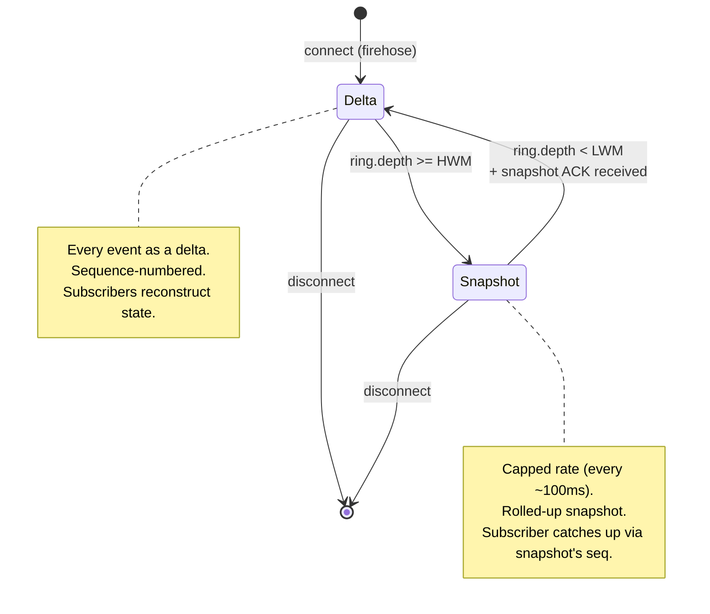

Your fanout layer is the last thing you'll think about and the
first thing that breaks under load. The naive design - one shared
queue per channel, subscribers compete for reads - serialises
every subscriber behind the slowest one. Coinbase did this once.
A single slow subscriber backed up the entire trade tape on their
WebSocket for 40 seconds. Public postmortem; six-figure
reputational cost.

The fix is per-subscriber rings + high-water-mark demotion. The
publisher never blocks. The slow subscriber gets demoted to
snapshot mode (rolled-up state at a cap rate) while the firehose
keeps moving. Once the subscriber catches up, they get promoted
back to delta mode.

## The publish path

```rust tab=publish label=Rust
fn publish(fanout: &mut Fanout, evt: Event) {
    let mut arena = Arena::with_capacity(2048);

    for sub in fanout.subscribers.iter_mut() {
        // 16ns bloom test. At 1000 subs, 95% miss rate, that's
        // 15us of bloom work per event. The bloom IS what makes
        // 1000-sub fanout tractable.
        if !sub.interest_bloom.might_contain(&evt.channel_key()) {
            continue;
        }
        // Tier-aware rate limit. Free tier capped low; pro tier
        // gets firehose. The limiter check is sub-microsecond
        // (lock-free CAS).
        if !sub.rate_limiter.try_acquire() {
            continue;
        }

        // Serialise into per-subscriber wire format. JSON for
        // retail (~2us per event). Binary for MM tier (~500ns).
        // Don't standardise on JSON for everyone; binary is the
        // ~5x speedup that makes MM-tier viable.
        let frame = sub.serialiser.serialise(&evt, &mut arena);

        // WAIT-FREE write. The publisher does not block.
        match sub.ring.try_push(frame) {
            Ok(_) => {
                if sub.in_snapshot_mode && sub.ring.depth() < sub.lwm {
                    sub.in_snapshot_mode = false;
                    sub.emit_promotion_marker();
                }
            }
            Err(_) if sub.ring.depth() >= sub.hwm => {
                // Subscriber fell behind. Demote to snapshot mode.
                // The publisher is NOT going to back-pressure;
                // the snapshot path serves them at a capped rate.
                sub.in_snapshot_mode = true;
            }
            Err(_) => {}
        }
        fanout.hist.record_subscriber(sub.id, now_ns() - evt.published_at);
    }
    arena.reset();
}
```
```java tab=publish label=Java
void publish(Fanout fanout, Event evt) {
    Arena arena = Arena.withCapacity(2048);
    for (Subscriber sub : fanout.subscribers()) {
        if (!sub.interestBloom().mightContain(evt.channelKey())) continue;
        if (!sub.rateLimiter().tryAcquire()) continue;
        ByteBuffer frame = sub.serialiser().serialise(evt, arena);
        if (sub.ring().tryPush(frame)) {
            if (sub.inSnapshotMode() && sub.ring().depth() < sub.lwm()) {
                sub.setInSnapshotMode(false);
                sub.emitPromotionMarker();
            }
        } else if (sub.ring().depth() >= sub.hwm()) {
            sub.setInSnapshotMode(true);
        }
        fanout.hist().recordSubscriber(sub.id(), System.nanoTime() - evt.publishedAt());
    }
    arena.close();
}
```

## The state machine



In Delta mode the subscriber gets the firehose. In Snapshot mode
they get rolled-up state at a capped rate. Transition is
unidirectional per event - the publisher doesn't make this
decision in flight; it's based on `ring.depth` at the time of
the push. The flag is read once per event; the transition is
applied between events.

## Tier policy

| Tier | Rate cap | Wire format | Resend buffer | Use case |
|---|---|---|---|---|
| Free | 10 evt/sec | JSON | none | Retail UI |
| Standard | 100 evt/sec | JSON | 100 events | Strategy backtest |
| Pro | firehose | Binary FIX | 10000 events | Market makers |
| Internal | firehose | Binary + audit | persistent | Compliance |

Per-tier policy is config. The fanout itself is tier-agnostic;
the per-subscriber config carries the policy. Operators tune the
caps from per-subscriber consumption observed in production.

## Latency budget

| Step | Recipe perf | Per-subscriber cost |
|---|---|---|
| Bloom test | [Bloom p99 ~16ns](/cookbook/recipes/subms-bloom-filter) | ~16 ns |
| Rate-limit acquire | [Rate limiter p99 < 100ns](/cookbook/recipes/subms-rate-limiter) | ~80 ns |
| Frame serialise (binary) | inline | ~500 ns |
| Frame serialise (JSON) | inline | ~2 us |
| Per-sub SPSC push | [SPSC enqueue p99 < 1us](/cookbook/recipes/subms-spsc-ring-buffer) | ~200 ns |
| Arena reset | [Arena p99 < 100ns](/cookbook/recipes/subms-arena-allocator) | ~50 ns (once/event) |
| MPSC inbound drain | [MPSC poll p99 < 1us](/cookbook/recipes/subms-mpsc-queue) | ~300 ns (once/event) |
| Hist record | [HDR p99 < 100ns](/cookbook/recipes/subms-hdr-histogram) | ~80 ns |

At 1000 subscribers, 5 matching per event, mixed JSON/binary: ~6us
per event total. 200k events/sec sustainable on one publisher
core; multi-core scales linearly via per-channel fanout sharding.

## What breaks at scale

**Naive shared queue across subscribers.** I mentioned the
Coinbase incident at the top. Don't do this. Per-subscriber
SPSC, period. The cost is N×(ring-size) memory for N
subscribers; 1000 subs × 64KB rings = 64MB; cheap. Pay for it.

**JSON for everyone.** Production market-maker latency
expectations are sub-millisecond. JSON serialisation alone is
~2us; the wire size is ~5x binary. MM-tier subscribers need
binary FIX-like protocols or they're disadvantaged versus
competitors using lower-latency venues. Offer both formats; let
the subscriber choose. Free tier defaults to JSON because the
audience doesn't care about the latency.

**Slow consumer + missing demotion.** Without HWM demotion, a
slow consumer's ring fills, the publisher's push fails, the
publisher's loop either spins or back-pressures upstream. Both
are bad. With demotion, the slow consumer self-services via
snapshots while the publisher keeps moving.

**Sequence-number gaps.** Subscriber missed events for any
reason (snapshot mode transition, network blip, their own
client-side bug). Without sequence numbers, they don't know.
Their reconstructed state diverges from yours. With sequence
numbers, the subscriber detects the gap and requests a resend
from the per-channel ring buffer. Sequence numbers cost 8 bytes
per event; you pay them or you eat the postmortem.

**Filter bloom false-positive sends wrong event.** Subscriber A
subscribes to BTC trades. Event is an ETH trade. Bloom returns
"maybe yes" because the bloom isn't a perfect filter. Subscriber
receives an unwanted event; their client breaks because their
schema doesn't expect ETH events. Mitigation: post-bloom precise
check (the subscriber's interest set has explicit allowlist
that gets verified). Bloom is fast-path; the allowlist is the
authoritative check.

## What you can defer to v2

- **Snapshot mode itself.** v0 ships delta-only; slow subscribers
  get disconnected when their ring fills past HWM. Snapshot
  mode adds operational complexity (per-channel cache for
  rollups, sequence-number sync) that's a v2 feature.
- **Tier hierarchy.** v0 ships one tier (firehose). Add tiers as
  paid customers appear.
- **Per-symbol channels.** v0 ships single trade-tape channel; all
  subscribers see all symbols. Add per-symbol channels when
  bandwidth demands it.

What you can't defer: per-subscriber SPSC rings, sequence
numbers, bloom-based per-event filtering. Those are the
non-negotiable shape.
