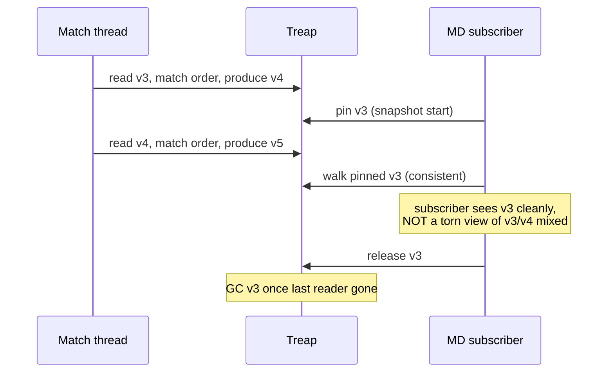

Every six months a derivatives protocol announces it built a
matching engine on top of Redis sorted sets. Every six months the
same protocol writes a postmortem about a partial-fill cascade
that double-counted a $40M position and three days of manual
reconciliation. The fix is always the same and you may as well
write it down the first time: persistent treap of price levels,
single-writer per symbol, atomic version pinning for snapshot
reads. The arithmetic is two multiplies. The operational layer is
the work.

This topic is opinionated about how to build that operational
layer. Read it, then go look at how dYdX v4 and Hyperliquid solve
the same problem - they pick the same shape and for the same
reasons.

## The thing you actually have to do

```rust tab=match label=Rust
// Single-writer per symbol. Anything fancier - shared locks,
// thread-safe BTreeMap, an RwLock - costs you 30-50% throughput
// and buys you nothing. Multi-threaded matching IS multi-symbol
// matching across shards; per-symbol matching is single-threaded
// or you've got a bug waiting.
fn match_loop(book: &mut Treap<PriceLevel>, inbound: &mut Spsc<Order>,
              outbound: &mut Mpsc<Fill>, hist: &mut Hist) {
    let mut arena = Arena::with_capacity(4096);
    while let Some(order) = inbound.try_pop() {
        let t0 = now_ns();
        let side = book.opposite_side(order.side);
        let mut remaining = order.size;
        for level in side.walk_from_top() {
            if !level.crosses(&order) { break; }
            let take = remaining.min(level.size);
            outbound.push(Fill::new(&order, level, take, &mut arena));
            level.size -= take;
            remaining -= take;
            if level.size == 0 { side.remove(level); }
            if remaining == 0 { break; }
        }
        // The post-match invariant. Skip this and your verifier
        // replica is the only thing standing between you and a
        // double-count incident. Don't skip this.
        debug_assert_eq!(order.size, /*total filled*/ + remaining);
        if remaining > 0 && order.is_limit() {
            side.insert(order.with_size(remaining));
        }
        hist.record(now_ns() - t0);
        arena.reset();
    }
}
```
```java tab=match label=Java
void matchLoop(Treap<PriceLevel> book, Spsc<Order> inbound,
               Mpsc<Fill> outbound, HdrHist hist) {
    Arena arena = Arena.withCapacity(4096);
    Order order;
    while ((order = inbound.tryPop()) != null) {
        long t0 = nowNanos();
        Side side = book.oppositeSide(order.side());
        long remaining = order.size();
        for (PriceLevel level : side.walkFromTop()) {
            if (!level.crosses(order)) break;
            long take = Math.min(remaining, level.size());
            outbound.push(Fill.of(order, level, take, arena));
            level.size(level.size() - take);
            remaining -= take;
            if (level.size() == 0) side.remove(level);
            if (remaining == 0) break;
        }
        // Same invariant. Java's lack of `debug_assert` is no excuse;
        // gate this behind a system property + run prod with it on.
        assert order.size() == /* total filled */ + remaining;
        if (remaining > 0 && order.isLimit()) {
            side.insert(order.withSize(remaining));
        }
        hist.record(nowNanos() - t0);
        arena.reset();
    }
}
```

That's the engine. ~30 lines. Everything else in this doc is what
the 30 lines cost you when you skip a step.

## Why persistent treap and not a red-black tree

Two reasons people get wrong:

**Red-black trees don't compose with copy-on-write.** Snapshot
reads need a stable version under concurrent writes. You can build
COW on top of a treap by sharing untouched sub-trees across
versions; the treap's rotations only ever touch a logarithmic
path. Red-black's recolouring can ripple through far more nodes,
which means more sharing-broken nodes per write, which means more
garbage in the version that the snapshot reader pinned, which
means GC pressure on the snapshot path. By the time you've patched
this you've reinvented the treap.

**Adversarial keys.** A red-black tree is balanced regardless of
input. A treap is balanced PROVIDED the priorities are random and
hidden. If you let users pick priorities, you're cooked - they'll
construct an adversarial sequence to push the tree to O(n). The
implementation uses a fixed LCG keyed off the constructor seed;
the seed is operational secret. Don't write the seed to the audit
log.

| Treap | Red-black | What this buys you |
|---|---|---|
| Expected O(log n) | Worst O(log n) | The treap's expected case is tighter in practice |
| 230 LOC | ~600 LOC for a correct RB with concurrent reads | Half the surface area for bugs |
| Persistent COW is natural | Persistent COW needs invasive surgery | Snapshot reads come for free |
| Lookup p99 < 1us @ 10k keys | Similar | Per the [recipe's measured numbers](/cookbook/recipes/subms-treap) |

If you've already shipped on a red-black tree and it's working,
don't migrate. If you're starting from scratch, pick the treap.

## The latency budget you actually believe

Hand-waving "p99 < 10us" doesn't help anyone. The cost is the sum
of the recipes you compose with. Run the matcher hot for 10
minutes on a sustained input stream and the numbers come out:

| Step | Recipe perf | Per-match cost | Source |
|---|---|---|---|
| Pop next order | [SPSC enqueue p99 < 1us](/cookbook/recipes/subms-spsc-ring-buffer) | ~200 ns | 100k op workload, 1024-slot buffer, sibling cores |
| Walk N levels | [Treap lookup p99 < 1us](/cookbook/recipes/subms-treap) | N × ~150 ns | 10k keys, deterministic seed |
| Allocate per fill | [Arena allocate p99 < 100 ns](/cookbook/recipes/subms-arena-allocator) | ~50 ns × M fills | bump on warm chunk |
| Emit fills | [MPSC offer p99 < 1us](/cookbook/recipes/subms-mpsc-queue) | ~300 ns × M | 4-producer contention, 40k op workload |
| Record histogram | [HDR record p99 < 100 ns](/cookbook/recipes/subms-hdr-histogram) | ~80 ns | per the recipe |
| Reset arena | constant-time rewind | ~50 ns | per the recipe |

One level walked, one fill emitted: ~880 ns. Five levels, five
fills: ~3.5us. p99 < 10us per match is conservative and the
recipes underwrite it. If you blow this budget your matcher's
problem is somewhere ELSE - GC, page fault, lock contention, NUMA
crossing - and you fix that, not the matcher.

## The mistakes that have cost real protocols real money

I've listed these in order of cost-of-getting-it-wrong, not
likelihood. The likely ones are at the bottom.

**Torn book read by a market-data subscriber.** Subscriber reads
the book mid-match, gets a partial state, publishes analytics
based on a phantom order that's already filled. This is the
single biggest reason to use a persistent treap with explicit
version pinning. Yes, it's more complex. Yes, you should still
do it.



**Cancel arriving during the match it would have averted.** Order
N is being matched right now. Cancel for order N arrives in the
inbound SPSC immediately after order N. With sloppy ordering
the cancel processes BEFORE the match completes; the order gets
removed; the match continues against a phantom remaining size;
the fill goes through; you've sold the user's asset on a
cancelled order. Production fix: orders are addressed by
monotonic ID; the matching loop processes each ID exactly once
to completion; cancel-after-match-completion is a no-op (return
"too late"). Cancel ordering is the inbound SPSC's
single-producer guarantee. Do not multiplex inbound across
multiple gateway threads writing to the same SPSC, or you've
broken this.

**Double-counted partial fill.** Order for 100, fills 60, the
remaining 40 doesn't get reinserted into the book OR the original
size doesn't get reduced. Either case the position state
diverges from the trade tape. The post-match invariant
(`pre_remaining == filled + post_remaining`) catches this in
debug builds. Run the assert in production. The CPU cost is
nothing; the cost of missing it is weeks of reconciliation.

**Replica divergence.** Active engine produces output X; passive
replica running the same input produces output Y. You don't find
out until failover. If you got here you already lost. The
defence is the passive comparing its output stream to the
active's continuously - byte-by-byte sequence comparison, alarm
on first divergence. Sometimes the cause is a bug in the matcher
(both replicas have it but at slightly different states). Often
it's wall-clock or thread-id sneaking into the match logic.
Match functions must be pure. No clock, no random, no thread-id.

**Allocator pressure under burst.** Matching thread page-faults
during a sweep. p99 spikes from 3us to 800us. You eventually
realise this happens during particular hour-of-the-day
because of jemalloc's arena rebalancing. The fix is per-thread
arenas (Rust: `bumpalo`, Java: a `recycler` arena pattern).
Reset per match. The cost of an arena reset is one pointer
rewind. The cost of not having one is hours-long incident
investigations.

**Histogram smoothing the cascade.** Your dashboards show
p99 < 50us. Real p99 during the news event was 8ms. The cause
is coordinated-omission - your histogram only sampled at points
the matcher could record, not at points when it was BUSY. The
busy moments don't get sampled, the busy moments get smoothed
out of the distribution. Use [`subms-hdr-histogram`](/cookbook/recipes/subms-hdr-histogram)
which has CO backfill built in. Do not use `prometheus_client`'s
default summary. Do not use `Micrometer`'s default Timer. They
will lie to you and you will deploy worse code believing it's
better.

## CLOB vs the alternatives, when to pick which

Strong opinions here. People who tell you "CLOB or AMM, pick
one" are wrong. You pick by market structure, not religious
preference.

| Structure | When | Don't when |
|---|---|---|
| **CLOB** | Two-sided market with active makers. Spreads tight enough that the book has meaningful depth. The realistic case for any derivatives venue trading majors. | Long-tail asset with no makers. You'll have an empty book, traders will hit it once and leave. Switch to AMM. |
| **AMM** | Long-tail, passive LPs, single-sided liquidity. Anyone with capital can provide. | Tight-spread MM-heavy markets - the constant-product curve is wasteful when you could just match against an existing maker quote. The slippage is a tax on no one's benefit. |
| **RFQ** | Block trades, off-book pricing, OTC desk patterns. | Continuous matching - the RFQ round-trip blows your latency budget. |
| **Batch auction (CowSwap-style)** | Anti-MEV by design. Single clearing price per batch defeats sandwich attacks. | Latency-sensitive HFT. The batch period IS your time-to-fill floor. |

dYdX v4 ships CLOB. Hyperliquid ships CLOB. Aevo ships CLOB. Why?
They trade derivatives on majors with deep maker books. They are
not building Uniswap.

Uniswap ships AMM. They are not building dYdX.

If you find yourself arguing for the OTHER design's pattern in
your venue's design doc, stop and reconsider what market
structure you're actually serving.

## What I'd cut if I had to ship in two weeks

You can ship the matcher without these. They're insurance against
specific incidents. Decide how much insurance you need:

- **Verifier replica.** Most teams skip this for v0. They later
  add it after the first incident. Adding it after means rebuilding
  the test infrastructure to run two implementations in parallel,
  which is significant. Adding it on day one is a few weeks of
  effort. Math says do it on day one but most teams don't and
  most teams survive.
- **Per-symbol shard sharding.** v0 ships single-process,
  single-host, all symbols on one machine. Works until BTC-PERP
  pegs one core at 100%. Then you shard. Don't pre-shard.
- **Snapshot subscribers.** v0 ships full-book snapshots via JSON
  REST and clients reconstruct from the delta stream. Production
  market-makers want binary protocol + persistent treap version
  pinning. That's six weeks of work you can defer past launch.
- **Cross-symbol coordination.** Settlement worker that watches
  perp + underlying as a pair. v0 ships them independently and
  fixes any cross-symbol invariant in the post-match settlement
  pipeline. Adding cross-symbol coupling to the match path is
  the wrong move at any stage.

What you can't cut: the persistent treap, the SPSC + MPSC, the
arena, the post-match invariant assert, CO-backfilled
histograms. Those are non-negotiable.
