Every popular symbol creates a fan-out storm. BTC-PERP ticks, fifty
thousand accounts need their PnL refreshed in the same 100ms
window. If your architecture is "iterate the accounts table and
recompute," you're going to lose. Not in a quiet way - your
liquidation watch will be reading 200ms-stale collateral ratios
during a sharp move, and the price moves out from under positions
before the watch even notices.

The fix is per-symbol holder indexes + per-account work
sharding + work-stealing between shards. Each piece is in the
cookbook. The combination is the thing.

## The fan-out, in code

```rust tab=fanout label=Rust
fn on_tick(eng: &Engine, tick: PriceTick) {
    // ART lookup: "which accounts hold this symbol?" Use ART for
    // the reverse index because account IDs share exchange-assigned
    // prefixes by tier - the trie collapses correlated accounts.
    let holders = eng.holders_by_symbol.get(tick.symbol);
    if holders.is_empty() { return; }  // cold symbol; nothing to do

    // Dispatch per shard. The shard is account-id-hash mod N;
    // each shard is single-writer to its accounts' positions.
    for shard in holders.shards() {
        eng.shards[shard].work.push(RecomputeWork {
            symbol: tick.symbol,
            mark: tick.mark,
            tick_seq: tick.seq,
        });
    }
}

// Per shard, on its own thread. No cross-shard reads or writes
// on the hot path; shards are independent.
fn shard_loop(shard: &mut Shard) {
    let mut arena = Arena::with_capacity(2048);
    while let Some(work) = shard.work.try_pop() {
        let positions = shard.positions_in_symbol(work.symbol);
        for pos in positions {
            let t0 = now_ns();
            let new_pnl = (work.mark - pos.entry) * pos.size * pos.sign;
            pos.unrealised_pnl = new_pnl;
            // Invalidate the per-account aggregate cache. Don't
            // recompute it now - the next risk check that needs it
            // will pay the cost. Lazy invalidation amortises.
            pos.account.invalidate_aggregate_cache();
            shard.hist.record(now_ns() - t0);
        }
        // Work-steal: if this shard is empty and a sibling has
        // backlog, take some of theirs. Production deployments
        // tune the steal threshold; sub-10 entries usually not
        // worth the cache-line transfer cost.
        arena.reset();
    }
}
```
```java tab=fanout label=Java
void onTick(Engine eng, PriceTick tick) {
    HolderSet holders = eng.holdersBySymbol().get(tick.symbol());
    if (holders.isEmpty()) return;
    for (ShardId shard : holders.shards()) {
        eng.shards()[shard.value()].push(new RecomputeWork(
            tick.symbol(), tick.mark(), tick.seq()
        ));
    }
}

void shardLoop(Shard shard) {
    Arena arena = Arena.withCapacity(2048);
    RecomputeWork work;
    while ((work = shard.work().tryPop()) != null) {
        for (Position pos : shard.positionsInSymbol(work.symbol())) {
            long t0 = nowNanos();
            long newPnl = (work.mark() - pos.entry()) * pos.size() * pos.sign();
            pos.unrealisedPnl(newPnl);
            pos.account().invalidateAggregateCache();
            shard.hist().record(nowNanos() - t0);
        }
        arena.reset();
    }
}
```

## The wrong way and why

```mermaid
flowchart LR
  subgraph Wrong["The wrong way"]
    direction TB
    W1["Tick arrives"]
    W2["Iterate ALL accounts"]
    W3["Check if account holds symbol"]
    W4["Recompute if yes"]
    W1 --> W2 --> W3 --> W4
  end

  subgraph Right["The right way"]
    direction TB
    R1["Tick arrives"]
    R2["ART lookup: symbol -> holders"]
    R3["Dispatch to N shards"]
    R4["Per-shard: recompute their slice"]
    R1 --> R2 --> R3 --> R4
  end

  Wrong -- O(total accounts) --> Outcome1["Hot symbol pegs one core"]
  Right -- O(holders) parallel --> Outcome2["Hot symbol fans out across cores"]

  classDef bad fill:#2e1a25,stroke:#ff5f8a
  classDef good fill:#1c2e22,stroke:#7ad9a7
  class Wrong,Outcome1 bad
  class Right,Outcome2 good
```



The wrong way LOOKS reasonable until you measure. BTC ticks at
100ms cadence, 1M total accounts on the platform, 50k of them
hold BTC. Iterating 1M accounts to find the 50k = 950k useless
iterations per tick = 9.5M useless iterations/sec. The right way
hits exactly 50k.

## Latency budget

| Step | Recipe perf | Per-recompute cost |
|---|---|---|
| Symbol → holders | [ART lookup p99 < 1us](/cookbook/recipes/subms-adaptive-radix-tree) | ~800 ns (once per tick) |
| Tick read | [SPSC dequeue p99 < 1us](/cookbook/recipes/subms-spsc-ring-buffer) | ~200 ns |
| Per-shard work push | [MPSC offer p99 < 1us](/cookbook/recipes/subms-mpsc-queue) | ~300 ns × N shards |
| Per-position math | inline integer | ~5 ns |
| Cache invalidate | inline | ~10 ns |
| Hist record | [HDR record p99 < 100ns](/cookbook/recipes/subms-hdr-histogram) | ~80 ns |

A tick fanning to 50k holders across 16 shards: dispatch ~800ns +
recompute ~95ns each = ~5ms total wall-clock with full parallelism.
That's 5ms for 50k positions; per-position is ~100ns amortised.

## Type system as the bug-defence

```rust
// Three distinct price types. No implicit conversion. Position
// health reads MarkPrice. AMM quotes against SpotPrice. Funding
// reads IndexPrice. Pass the wrong one and the compiler stops you.
struct SpotPrice(u128);
struct MarkPrice(u128);   // smoothed; tier-cap relative to spot
struct IndexPrice(u128);  // external index basis

// Compile error if anyone tries to compute mark PnL from spot.
fn recompute(pos: &Position, mark: MarkPrice) -> u128 { ... }
```

People reach for `u128` everywhere because it's simple. Then a
junior engineer fixes a bug by "just using the spot price" because
it was "what was available." Position health now reads spot
instead of mark. Liquidation fires on legitimate positions during
a brief spot dislocation. The cost of the bug is the cost of the
ensuing user-trust incident.

Use distinct types. The compiler is free; the bug is expensive.

## Three failures I've seen

**Missed recompute because the shard fell behind.** Popular symbol
ticks at 100ms. One shard's worker thread got descheduled by the
OS for 150ms (a kernel page-fault on a memory pressure event).
The shard's backlog grew. Liquidation watch read stale
collateral ratios. Solvent positions came close to false-firing.
Mitigation: per-shard backlog alarm at depth > 1 tick. Mitigation
2: pin worker threads (Linux: `sched_setaffinity` + `mlock`).
The OS-page-fault path is the production reality nobody plans
for; plan for it.

**Wrong price source by leaked type conversion.** Team was using
`Long` everywhere. A developer "simplified" by computing PnL from
the last `Long` they had in scope, which happened to be the spot
price not the mark price. The bug landed in production. The next
high-volatility window mis-triggered ~$1.2M of liquidations
before someone noticed. Use distinct types in the codebase even
if your hire's last shop didn't.

**Flapped PnL display.** Two ticks arrived 10ms apart with
slightly different marks. The trader UI showed the position's
PnL flickering. Users complained. The fix is at the display
layer (per-subscriber rate-limit on PnL update emissions in
[market-data fanout](./market-data-fanout)), not here. Position
health publishes whatever the latest tick says; the display
choice belongs downstream.

## What you don't put in this topic

Position-health publishes state. It does NOT decide:

- Whether to liquidate → [liquidation watch](./liquidation)
- Whether to allow a new order → [risk engine](./risk-engine)
- What the mark price IS → [price oracle](./price-oracle) + a
  separate mark-price layer
- How fills translate to position state → the matching engine's
  post-trade settlement worker

A single component owning all five of these becomes a 6000-line
god class that can't be failed over independently. Keep them
separate.
