Every DeFi protocol that's been exploited has had an oracle issue at
the root. Usually not the protocol's oracle's bug - the oracle's
UPSTREAM had a bug, or got manipulated, and the protocol believed
the value. bZx, Harvest, Cream, Mango - the list is long and the
pattern is identical.

The oracle is not a place to be clever. It's a place to be paranoid.
Median of N. N >= 3. Circuit breaker on cross-source divergence.
Freeze on uncertainty. Publish the freeze flag as a value. Make the
freeze be a thing every consumer EXPECTS to see and handle. The
freeze is the security property; you must make it operational.

## The aggregator

```rust tab=aggregator label=Rust
fn aggregate(state: &mut OracleState, sample: Sample) -> Option<Median> {
    // Per-source dedup. Same upstream's same value within the
    // dedup window gets dropped. Use cuckoo not bloom because the
    // window slides; you need explicit delete.
    if state.sources[sample.source].dedup.contains(&sample.tag()) {
        return None;
    }
    state.sources[sample.source].dedup.insert(sample.tag());

    state.sources[sample.source].last = sample.value;

    // Median of live sources. Sources demoted (weight=0) for
    // staleness do not contribute. Minimum N=3 live sources OR
    // the asset is marked "insufficient sources" and downstream
    // treats it as circuit-broken.
    let live = state.live_sources();
    if live.len() < 3 {
        state.freeze(sample.asset, FreezeReason::InsufficientSources);
        return None;
    }
    let median = median_of(&live);

    // Circuit breaker. ANY source diverging past threshold = freeze.
    // The threshold is asset-class-aware: majors at 0.5%; alts at
    // 2%; stablecoins at 0.1%. Tune per asset, not globally.
    let threshold = state.threshold(sample.asset);
    for src in live.iter() {
        let div = (src.last - median).abs() / median;
        if div > threshold {
            state.freeze(sample.asset, FreezeReason::SourceDivergence {
                source: src.id, value: src.last, median,
            });
            return None;
        }
    }

    state.publish(sample.asset, median);
    Some(median)
}
```
```java tab=aggregator label=Java
Optional<Median> aggregate(OracleState state, Sample sample) {
    Source src = state.sources()[sample.sourceIdx()];
    if (src.dedup().contains(sample.tag())) return Optional.empty();
    src.dedup().insert(sample.tag());

    src.setLast(sample.value());

    List<Source> live = state.liveSources();
    if (live.size() < 3) {
        state.freeze(sample.asset(), FreezeReason.INSUFFICIENT_SOURCES);
        return Optional.empty();
    }
    BigDecimal median = medianOf(live);
    BigDecimal threshold = state.threshold(sample.asset());

    for (Source s : live) {
        BigDecimal div = s.last().subtract(median).abs().divide(median, RoundingMode.HALF_EVEN);
        if (div.compareTo(threshold) > 0) {
            state.freeze(sample.asset(), FreezeReason.divergence(s.id(), s.last(), median));
            return Optional.empty();
        }
    }
    state.publish(sample.asset(), median);
    return Optional.of(Median.of(median));
}
```

## The freeze is the feature

```mermaid
flowchart TB
  Sources["3+ upstream sources"]
  Sources -- per-source ticks --> SPSC["per-source SPSC ring"]
  SPSC --> Dedup["cuckoo dedup per source"]
  Dedup --> MPSC["aggregator MPSC"]
  MPSC --> Med["compute median"]
  Med --> Check{"any source > threshold?"}

  Check -- "no" --> Pub["publish median<br/>+ freeze=false"]
  Check -- "yes" --> Freeze["publish FROZEN<br/>+ freeze=true<br/>+ diverging source ID"]

  Pub --> Consumers["AMM, Liquidation,<br/>Risk, Funding,<br/>Position health"]
  Freeze --> Consumers

  Note["Every consumer treats freeze as a value.<br/>The freeze is the security property;<br/>the value is the diagnostic."]

  classDef bad fill:#2e1a25,stroke:#ff5f8a
  class Freeze bad
```



People reach for "the oracle didn't publish, so I'll keep using
the last good value." Don't. The freeze is a SIGNAL, not an
absence. Downstream consumers must reject the last-good-value
pattern; during a freeze, they halt. [AMM pricing](./amm) returns
"halted" on a freeze, not a stale quote. [Liquidation
watch](./liquidation) returns from the top of the tick, not
"ignore the freeze."

## When the median fails you

Median is robust to ONE bad source out of N. It's not robust to:

- **N/2+1 sources reading from the same upstream.** All three of
  your "diverse" sources hit the same backend API. The API
  breaks; all three return the wrong value; the median is wrong;
  the cross-source check finds zero divergence (they all agree on
  the wrong value). Defence: source diversity audit at
  onboarding. Verify each source's PRIMARY data path is distinct -
  not just the API endpoint, but the upstream-of-the-upstream.

- **Coordinated manipulation across sources.** Same actor's
  trades hit Binance, Coinbase, and Kraken simultaneously, moving
  all three. Hard problem. Partial mitigations: weight sources by
  trade volume + add a "global liquidity-weighted" reference
  source that's harder to manipulate (Chainlink or Pyth's
  aggregated feeds). You won't fully solve this without economic
  defences (high stake for source operators).

- **Slow-moving stuck source.** A source publishes the same value
  for 30 seconds. The median is anchored toward that value.
  Defence: per-source last-changed timestamp; sources stale past
  window get demoted (weight=0). Tune the staleness window per
  asset class - 5 seconds for majors, 30 seconds for thin alts.

- **Outlier replay.** A source briefly publishes a wildly-
  different value (manipulation attempt or genuine glitch) to
  spike the median. Defence: per-source sample-to-sample delta
  check; outliers excluded from the working set; logged for
  audit.

## Spot vs mark - the elephant in the room

This topic publishes SPOT. Most derivatives backends ALSO need a
MARK PRICE for collateral valuation. Mark is spot smoothed +
deviation-capped relative to spot. The mark layer runs ON TOP of
this topic's output.

| Consumer | Reads | Why |
|---|---|---|
| [AMM pricing](./amm) | Spot (via circuit-breaker veto) | Spot is the trade price |
| [Position health](./position-health) | Mark | Mark is collateral basis |
| [Liquidation watch](./liquidation) | Mark + circuit-breaker | Mark for ratios; spot oracle's circuit for halt |
| [Funding rate](./funding-rate) | Index (basis) + mark | Funding = premium index vs underlying |
| [Risk engine](./risk-engine) | Mark | Same as position health |

Use distinct types (`SpotPrice`, `MarkPrice`, `IndexPrice` - see
[position-health](./position-health) for why). Don't let one leak
into the other's code path.

## Latency budget

| Step | Recipe perf | Cost |
|---|---|---|
| Per-source SPSC read | [SPSC dequeue p99 < 1us](/cookbook/recipes/subms-spsc-ring-buffer) | ~200 ns |
| Cuckoo dedup | [Cuckoo lookup p99 < 100ns + insert < 200ns](/cookbook/recipes/subms-cuckoo-filter) | ~150 ns |
| Aggregator MPSC | [MPSC offer p99 < 1us](/cookbook/recipes/subms-mpsc-queue) | ~300 ns |
| Median compute (N=5) | inline | ~50 ns |
| Circuit-breaker walk (N=5) | inline | ~80 ns |
| Publish to consumer rings | [SPSC enqueue p99 < 1us](/cookbook/recipes/subms-spsc-ring-buffer) | ~200 ns × M consumers |
| Hist record | [HDR p99 < 100ns](/cookbook/recipes/subms-hdr-histogram) | ~80 ns |

Feed-to-median at 5 sources, 4 consumers: ~2us. The 200us budget
is for cold-source first-touch (dedup state not warm, treap walk
to install a new source). Steady-state operation is in the
sub-microsecond range.

## The big incidents and what they teach

**bZx (Feb 2020).** Attacker used a flash loan to move Kyber's
price on bZx's oracle integration. bZx's protocol logic used the
manipulated price for liquidation calculations. Loss: ~$1M.
Lesson: use a TWAP / smoothed oracle, not a raw spot read. The
mark price layer above is exactly this.

**Harvest (Oct 2020).** Curve Y pool price manipulation via flash
loan. Harvest's vault deposit/withdraw math read the pool's
LP-token price directly. Loss: ~$24M. Lesson: don't read pool
prices as oracles. Pools are tradeable surfaces, oracles aren't.

**Mango (Oct 2022).** Manipulated MNGO oracle by buying MNGO
across multiple venues simultaneously, lifting the median. Loss:
~$117M. Lesson: thin alts need much wider source coverage or
explicit per-asset volume gates. You can't run a derivatives
market on an asset whose oracle is one trader's checkbook.

The pattern: every incident had a single oracle read that the
attacker manipulated. The defence is multiple oracles +
disagreement detection + halt. Pay for it.
