The risk engine is where you find out if you're running an
exchange or a hobby project. Real exchanges have margin checks in
the low-hundreds-of-microseconds range. Hobby projects have race
conditions that produce $20M of bad debt during a five-second
flash crash.

The race condition is always the same: order 1 lands, gets
checked against pre-trade state, passes, gets matched. Order 2
lands ten milliseconds later, gets checked against the SAME
pre-trade state because order 1's fill update hasn't propagated
yet, passes when it shouldn't have, the position now exceeds the
maintenance line, the next price move puts it underwater. Three
ways to fix this; only one is correct.

## The three-tier guard

```rust tab=check label=Rust
fn check(eng: &Engine, account: AccountId, order: &Order) -> CheckResult {
    // The 95% path. Bloom test against the account's symbol-family
    // touch set. If we've never traded the family on this account,
    // collateral covers initial margin trivially.
    let acc = eng.accounts.get(account);  // ART lookup, < 1us
    if !acc.touch_bloom.might_contain(order.symbol_family()) {
        // Don't skip the over-count safety here. A bloom FN is
        // possible; the assert catches if we're wrong.
        debug_assert!(acc.aggregate_cache.is_none() ||
                      acc.aggregate_cache.unwrap().is_empty_for(order.symbol_family()));
        return decide_from_collateral(acc.collateral, order);
    }

    // The 4% path. Aggregate cache hit; trust it until invalidated.
    if let Some(cached) = acc.aggregate_cache.get() {
        return decide(cached, order);
    }

    // The 1% path. Cold walk. This is where the latency budget
    // lives. Past 100us here = matching pipeline starves.
    let agg = eng.walk_ladder(acc);
    acc.aggregate_cache.set(agg);
    decide(agg, order)
}
```
```java tab=check label=Java
CheckResult check(Engine eng, AccountId account, Order order) {
    Account acc = eng.accounts().get(account);
    if (!acc.touchBloom().mightContain(order.symbolFamily())) {
        return decideFromCollateral(acc.collateral(), order);
    }
    AggregateExposure cached = acc.aggregateCache().get();
    if (cached != null) return decide(cached, order);
    AggregateExposure agg = eng.walkLadder(acc);
    acc.aggregateCache().set(agg);
    return decide(agg, order);
}
```

## The three wrong ways to fix the propagation race

| Approach | Looks like | Breaks because |
|---|---|---|
| **"Pessimistic lock the account during check"** | A reader-writer lock around the per-account state | Throughput dies. 50k checks/sec becomes 5k. You've solved the race by destroying the engine. |
| **"Refuse new orders until previous fill propagates"** | Per-account "in-flight" flag set on accept, cleared on fill | The flag turns into a lock at the application layer. Same throughput death plus weird latency at fill time. |
| **"Acknowledge synchronously after settlement"** | Order ACK waits for the settlement layer to confirm the fill landed | Adds 5-10ms to every order ACK. Users move to a different venue. |

The correct fix is the right ORDERING in the settlement path:
when a fill happens, the settlement worker WRITES the position
update before ACKING the fill back to the user's order session.
The next order from the same account is gated on the previous
order's ACK by the user's own session - it can't be submitted
before the previous ACK lands. So by the time the engine sees
order 2, the position update is visible.

This is invisible to the risk engine. The engine doesn't lock.
It doesn't wait. The architecture solves the race upstream.

## Over-count under ambiguity

The risk engine has an asymmetric loss function. Over-counting
costs you a frustrated user; under-counting costs you bad debt
on the next liquidation. Bias toward over-counting. Specifically:

- **Pending fill unconfirmed:** the pending size is treated as
  already filled. The next risk check sees it.
- **Mark-price source unavailable for a symbol:** use the most
  pessimistic recent mark for the position direction. Don't fall
  back to the last-known-good mark; use a mark that's WORSE for
  the trader.
- **Correlation matrix stale (you haven't repriced the
  netting):** assume zero correlation, no cross-product netting
  credit. Hurts portfolio-margin traders the most; that's
  acceptable.
- **A position type whose risk parameter you don't have:** treat
  at 1x initial margin, no leverage allowance.

Operators reach for "let me be more accurate by trusting the
ambiguous input." Don't. The bias must be conservative or you'll
write a postmortem about it.

## The 5%/4%/1% path distribution

```mermaid
flowchart TB
  Order["Order in"]
  Order --> ART["account ART lookup<br/>(100%)"]
  ART --> Bloom{"symbol family<br/>in account bloom?"}
  Bloom -- "no (95%)" --> Quick["pass on collateral<br/>~1.1 us total"]
  Bloom -- "yes (5%)" --> Cache{"aggregate<br/>cache fresh?"}
  Cache -- "yes (4%)" --> Cached["decide from cache<br/>~1.2 us total"]
  Cache -- "no (1%)" --> Walk["walk ladder treap<br/>~9 us total"]
  Walk --> CacheW["cache result"]
  CacheW --> Decided["decide"]

  Note["The 1% is where the<br/>cost lives. Tuning the<br/>cache invalidation<br/>controls how often it fires."]

  classDef fast fill:#1c2e22,stroke:#7ad9a7
  classDef slow fill:#2e1a25,stroke:#ff5f8a
  class Quick fast
  class Walk,CacheW,Decided slow
```



The 95% bloom-skip is what makes this engine fast. Read the
[bloom-filter recipe's numbers](/cookbook/recipes/subms-bloom-filter):
~16 ns per probe. At 50k checks/sec that's 800us/sec of bloom
work. Negligible. The remaining 5% pay the actual cost; you
tune the cache-invalidation policy to minimise that 1% cold-walk
rate.

## Latency budget

| Step | Recipe perf | Cost |
|---|---|---|
| Account ART lookup | [ART lookup p99 < 1us](/cookbook/recipes/subms-adaptive-radix-tree) | ~800 ns |
| Symbol-family bloom test | [Bloom p99 < 100ns](/cookbook/recipes/subms-bloom-filter) | ~16 ns |
| Aggregate-cache read | inline | ~10 ns |
| Ladder walk (cold) | [Treap lookup p99 < 1us](/cookbook/recipes/subms-treap) × 8 | ~1.2 us |
| Position-update ingest (per fill) | [MPSC p99 < 1us](/cookbook/recipes/subms-mpsc-queue) | ~300 ns |
| Hist record | [HDR record p99 < 100ns](/cookbook/recipes/subms-hdr-histogram) | ~80 ns |

Bloom short-circuit: ~1.1us. Aggregate-cache: ~1.2us. Cold walk:
~9us. Cumulative weighted average: ~1.4us. Two decimal points
under the 100us budget; the budget exists for cascade scenarios
where the cache invalidates en masse.

## Three real failure modes

**Stale snapshot when the user re-submits before ACK.** The user's
client is allowed to spam new orders before the previous ACKs.
The risk engine reads stale per-account state. Bypassed by user's
own session ordering on the API side; the engine doesn't see
this because the API gates it. If you're building an API that
doesn't gate, you have a bigger problem than the risk engine.

**Cross-product netting drift on regime change.** BTC and ETH
historically correlate 0.85. Then a single-asset event (a hack on
an ETH-specific protocol) decorrelates them for a week. Your
correlation matrix says 0.85 still; you give netting credit for
hedged BTC-long / ETH-short positions; the positions decorrelate
and the supposed-hedge actually amplifies the loss. Per-correlation
half-life on the matrix; sudden divergence between observed and
assumed correlation triggers an immediate matrix-tightening +
operator page. Don't auto-loosen back.

**An account with 10k positions.** Walk takes 2ms. Risk engine
becomes the bottleneck. Hits no warning until the user shows up
at scale. Mitigation: per-account aggregate cached at write-time,
invalidated lazily on read. The walk only runs when the cache is
dirty. Most production accounts have <100 positions; the 10k case
is rare but real (large institutional desks, market-makers).

## Cross-margin vs isolated vs portfolio margin

| Mode | Margin scope | Netting | Throughput cost | User type |
|---|---|---|---|---|
| Isolated | Per-position | None | Lowest (no aggregate) | Retail, position-by-position risk control |
| Cross-margin | Per-account | Per-product | ~2x isolated | Sophisticated traders, single-asset hedging |
| Portfolio | Per-account | Cross-product matrix | ~3-5x isolated | Institutional; requires strict daily review of the matrix |

Most production protocols offer all three as per-account
settings. The risk engine's check function dispatches on the
account's chosen mode; the cost difference is real but lives in
the cold walk path, not the hot bloom path.
