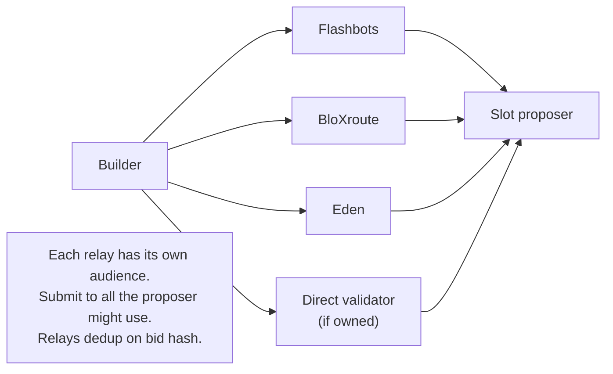

Block building is a 180ms gladiator pit. The builder that wins
is the one that produces the second-best candidate fastest, not
the one that produces the perfect candidate too late. Flashbots
publishes builder market-share by win-rate; the winners aren't
the most sophisticated optimisers - they're the operators with
the lowest end-to-end candidate-construction latency.

Builder economics: ~$1-10K profit per slot won. ~7000 slots/day
on Ethereum L1. Top 5 builders capture ~80% of slots. The
difference between #1 and #6 is a few milliseconds. The
difference between #6 and #50 is dozens of milliseconds and an
order of magnitude of revenue.

## The slot loop

```rust tab=slot label=Rust
fn on_slot_start(b: &mut Builder, slot: Slot) {
    let deadline = slot.start + Duration::from_millis(180);
    let cutoff   = deadline - Duration::from_millis(5);  // last bid

    // Parallel selection threads. Different starting heuristics
    // because the optimal block is NP-hard; greedy seeds find
    // different local maxima.
    let seeds = [
        SelectorSeed::EffectiveFee,    // sort by gas_price desc
        SelectorSeed::Tip,             // sort by priority_fee desc
        SelectorSeed::BundleBribe,     // bundles first (highest bid)
        SelectorSeed::Hybrid,          // weighted mix
    ];
    for seed in seeds.iter() {
        b.selectors[*seed].push(SelectionTask { slot, seed: *seed });
    }

    let mut best_bid: Option<Bid> = None;
    while now() < cutoff {
        if let Ok(candidate) = b.candidates.try_pop() {
            // Simulate the candidate against parent state. This
            // is the bulk of the per-candidate cost; ~25-30ms.
            let sim = b.evm.simulate(&candidate, slot.parent_state);
            if let Some(bid) = b.construct_bid(&candidate, &sim) {
                if best_bid.as_ref().map_or(true, |bb| bid.payout > bb.payout) {
                    // WAIT-FREE replace. The SPSC's "latest wins"
                    // semantics let us ship in-flight improvements.
                    b.relay_out.push(bid.clone());
                    best_bid = Some(bid);
                }
            }
        }
    }
    b.hist.record_slot(slot, best_bid.is_some());
}
```
```java tab=slot label=Java
void onSlotStart(Builder b, Slot slot) {
    Instant deadline = slot.start().plus(Duration.ofMillis(180));
    Instant cutoff   = deadline.minus(Duration.ofMillis(5));

    for (SelectorSeed seed : SelectorSeed.values()) {
        b.selectors().get(seed).push(new SelectionTask(slot, seed));
    }
    Bid bestBid = null;
    while (Instant.now().isBefore(cutoff)) {
        Candidate c = b.candidates().tryPop();
        if (c == null) continue;
        EvmResult sim = b.evm().simulate(c, slot.parentState());
        Bid bid = b.constructBid(c, sim);
        if (bid != null && (bestBid == null || bid.payout().compareTo(bestBid.payout()) > 0)) {
            b.relayOut().push(bid);
            bestBid = bid;
        }
    }
    b.hist().recordSlot(slot, bestBid != null);
}
```

## The 180ms breakdown

```mermaid
gantt
  title 180ms bid window, hot-path
  dateFormat HH:mm:ss.SSS
  axisFormat %S.%L
  section Slot
  T+0  Slot start                     :milestone, m1, 00:00:00.000
  Parallel candidate selection (4 seeds)    :a1, 00:00:00.000, 30ms
  Simulate candidates (multi-core, batched) :a2, 00:00:00.030, 90ms
  Bid refinement + replace                  :a3, 00:00:00.080, 90ms
  Final cutoff (T-5ms)                :milestone, m2, 00:00:00.175
  T+180 Deadline                      :crit, milestone, m3, 00:00:00.180
```

The wait-free SPSC for outbound bids is what makes "keep
submitting better candidates" work. Each successive bid REPLACES
the in-flight one; relays dedup on bid hash; the network only
sees the latest. Without wait-free replace, you'd have to wait
for confirmation before sending the next bid, blowing the
window.

## Per-step cost

| Step | Recipe perf | Per-candidate cost |
|---|---|---|
| Mempool/bundle ingest | [MPSC offer p99 < 1us](/cookbook/recipes/subms-mpsc-queue) | continuous |
| Priority pop | [Treap p99 < 1us](/cookbook/recipes/subms-treap) | ~150 ns |
| EVM simulate | external (revm/geth) | ~25-30 ms |
| Arena scratch | [Arena p99 < 100ns](/cookbook/recipes/subms-arena-allocator) | ~50 ns |
| Relay submit | [SPSC enqueue p99 < 1us](/cookbook/recipes/subms-spsc-ring-buffer) | ~200 ns |
| Per-searcher rate-limit | [Rate limiter p99 < 100ns](/cookbook/recipes/subms-rate-limiter) | ~80 ns |
| Stage histogram | [HDR p99 < 100ns](/cookbook/recipes/subms-hdr-histogram) | ~80 ns |

Per-candidate: ~30ms (simulation-dominated). With 4-6 candidates
per slot pipelined across cores, total fits in 180ms. The
candidate count is operator-tunable; more = better optimisation
but each candidate takes the same time, so you cap.

## Multi-relay submission



Production builders submit to 3-5 relays in parallel. The
proposer picks the relay they're configured to use; you don't
know in advance which one. Pay the small bandwidth cost to hit
all relays.

## Failures that kill builders

**Late bid (after proposer commits).** Bid landed at T+185ms;
proposer chose someone else's at T+178ms. Lost slot. Mitigation:
hard cutoff at T-5ms; the current-best bid ships even if
sub-optimal. Don't try to be perfect.

**Invalid candidate (tx fails execution).** Selected
transactions failed because of nonce issues or insufficient
balance. The simulator caught it; the candidate was rejected;
re-select. Mitigation: pre-flight per-tx validation at mempool
intake; only valid txs enter the selection pool.

**Censored-tx inclusion.** Builder included a tx from a
sanctioned address; validator refused to attest. Loss: slot
revenue + reputation. Mitigation: exclusion-list check at BOTH
mempool intake AND final selection; redundant by design.

**Bundle replay (same bundle to multiple relays, paid twice).**
Searcher submitted the same bundle to Flashbots and BloXroute;
both relays forwarded; the builder paid the bribe twice for one
bundle that landed once. Mitigation: per-`(searcher_id,
bundle_hash)` dedup; bundles arriving twice get the second
treated as a no-op.

**Misbehaving searcher floods bundles.** One searcher submitted
10k bundles/sec, most low-quality. Without rate-limit, the
candidate selection pool got overwhelmed; legitimate bundles
got pushed out. Mitigation: per-searcher rate limiter at
ingest; bad searchers get throttled.

## The builders' arms race

Latency optimizations top builders use:

| Optimization | Latency saved | Cost |
|---|---|---|
| Colo at proposer datacenter | 10-20 ms (network) | Datacenter rent |
| Custom revm fork (skip unused opcodes) | 3-5 ms (per sim) | Engineering effort |
| Pre-warm caches at slot start | 5-10 ms (cold path) | Memory budget |
| Multi-relay parallel submit | 2-5 ms (network) | Slightly more bandwidth |
| AVX-512 / NEON optimised hashing | 1-2 ms (per sim) | CPU-specific code |

The bottom-line: top builders are pre-running candidate selection
DURING the previous slot's later half so they're ready at T+0.
If you're starting selection at T+0, you've already lost ~50ms
to the competition.

## What you defer to v2

- **Custom EVM fork.** v0 uses upstream revm. Custom forks save
  3-5ms but require ongoing maintenance.
- **Pre-warm during prior slot.** v0 starts at T+0. v1
  optimisation; saves ~50ms but adds significant operational
  complexity.
- **MEV bundle privacy via TEE.** Some builders run inside Intel
  SGX or AMD SEV to give searchers cryptographic guarantees the
  bundle won't leak. v2.

What you can't defer: the wait-free outbound SPSC, the
multi-seed candidate selection, the hard cutoff. These are the
spine.
