If a consensus client tells you the head is X, and another
client says it's Y, you have a problem. The fork-choice watcher
is what notices. Without it, downstream consumers (builders,
exchanges, MEV bots) act on a single CC's view; when that CC
diverges from the network, the consumer acts on the wrong
chain. Exchanges have credited deposits to addresses on
orphaned chains because they trusted one CC; the deposit was
then lost when the canonical chain re-formed.

The watcher consumes attestations + block announcements from N
CCs, applies the fork-choice rule against the aggregated view,
publishes canonical-head + per-block reorg-risk score to
downstream consumers. When CCs disagree on the head, the
watcher pages.

## The aggregation loop

```rust tab=aggregate label=Rust
fn ingest_attestation(w: &mut Watcher, att: Attestation, src: CcId) {
    // Cross-CC dedup. Same attestation observed by multiple CCs;
    // count once.
    if w.dedup.contains(&att.hash()) { return; }
    w.dedup.insert(att.hash());

    // Per-validator latest attestation; only the latest counts
    // in LMD-GHOST. Earlier ones from the same validator at the
    // same slot are noise.
    let cur = w.latest_by_validator.get(att.validator);
    if let Some(c) = cur {
        if att.slot <= c.slot { return; }
    }
    w.latest_by_validator.insert(att.validator, att);

    // If the attested-to block isn't in our tree yet, queue.
    // Block announcements arrive separately; an attestation can
    // arrive before its block.
    if !w.block_tree.contains(att.block_root) {
        w.pending_atts.push((att.block_root, att));
    }
}

fn compute_head_at_slot(w: &Watcher, slot: Slot) -> (BlockRoot, RiskMap) {
    // LMD-GHOST. Start at last justified checkpoint, descend
    // along max-weight child each step. The weight of a block
    // is the sum of latest-attestation validator weights voting
    // for that block OR descendant.
    let mut head = w.last_justified;
    loop {
        let children = w.block_tree.children_of(head);
        if children.is_empty() { break; }
        let best = children.into_iter()
            .max_by_key(|child| w.weight_at(*child))
            .unwrap();
        head = best;
    }

    // Reorg risk per recent block. Decay by depth.
    let risks = w.block_tree.recent_blocks(w.config.risk_window)
        .map(|b| (b, w.reorg_risk(b, head)))
        .collect();
    (head, risks)
}
```
```java tab=aggregate label=Java
void ingestAttestation(Watcher w, Attestation att, CcId src) {
    if (w.dedup().contains(att.hash())) return;
    w.dedup().insert(att.hash());
    Optional<Attestation> cur = w.latestByValidator().get(att.validator());
    if (cur.isPresent() && att.slot() <= cur.get().slot()) return;
    w.latestByValidator().insert(att.validator(), att);
    if (!w.blockTree().contains(att.blockRoot())) {
        w.pendingAtts().push(att.blockRoot(), att);
    }
}

HeadAndRisks computeHeadAtSlot(Watcher w, Slot slot) {
    BlockRoot head = w.lastJustified();
    while (true) {
        var children = w.blockTree().childrenOf(head);
        if (children.isEmpty()) break;
        head = children.stream().max(Comparator.comparingLong(w::weightAt)).get();
    }
    var risks = w.blockTree().recentBlocks(w.config().riskWindow())
        .map(b -> Map.entry(b, w.reorgRisk(b, head)))
        .toList();
    return new HeadAndRisks(head, risks);
}
```

## The block tree

```mermaid
flowchart TB
  subgraph BT["Block tree (treap by slot)"]
    direction TB
    f["last justified checkpoint"]
    f --> b1["block N-2<br/>weight: 95%"]
    f --> b2["block N-2 FORK<br/>weight: 5%"]
    b1 --> b3["block N-1"]
    b3 --> b4["block N - HEAD"]
  end

  Latest["Latest attestations (ART by validator)"]
  Latest -- attest --> BT

  classDef head fill:#1c2e22,stroke:#7ad9a7
  classDef fork fill:#2e1a25,stroke:#ff5f8a
  class b4 head
  class b2 fork
```



The block-tree treap supports parent-child navigation. Per-block
weight is the sum of latest-attestation stakes voting for it or
any descendant. The head is the max-weight descendant chain from
the last justified checkpoint.

## Reorg risk model

```
risk(block) = max(0, competing_weight / supporting_weight - 1)
            × exp(-depth / decay_constant)
```

| Risk value | Meaning | What downstream does |
|---|---|---|
| 0.00 | Stable, no contention | Safe to act |
| 0.01-0.05 | Slight contention | Exchanges wait one extra block before crediting |
| 0.05-0.25 | Notable risk | Builders consider building on parent instead |
| 0.25+ | Heavy contention | Halt action, wait for resolution |
| 1.00+ | Active fork | Network-level alarm; operator paged |

`decay_constant` is operator-tuned, typically 10-30 slots.

## Latency budget

| Step | Recipe perf | Per-att cost |
|---|---|---|
| Multi-CC ingest | [MPSC poll p99 < 1us](/cookbook/recipes/subms-mpsc-queue) | ~300 ns |
| Attestation dedup | [Bloom p99 ~16ns](/cookbook/recipes/subms-bloom-filter) | ~16 ns |
| Per-validator latest update | [ART insert p99 < 1us](/cookbook/recipes/subms-adaptive-radix-tree) | ~800 ns |
| Block-tree navigation | [Treap walk p99 < 1us](/cookbook/recipes/subms-treap) | ~150 ns/node |
| Per-consumer publish | [SPSC enqueue p99 < 1us](/cookbook/recipes/subms-spsc-ring-buffer) | ~200 ns × M consumers |
| Hist record | [HDR p99 < 100ns](/cookbook/recipes/subms-hdr-histogram) | ~80 ns |

500k attestations per slot, each ~1.1us = ~550 ms wall-clock if
serial. The fix: incremental weight updates as attestations
land, not a full sweep at slot end. The end-of-slot work is
bounded by the depth of the block tree, not the number of
attestations.

## Cross-CC consensus

Production deployments run 2-3 CCs of different implementations
(Prysm, Lighthouse, Teku, Nimbus). The watcher aggregates from
all. When CCs disagree, the watcher decides:

| Disagreement | Default policy | Notes |
|---|---|---|
| Single CC behind on attestations | Wait until catchup | Common during high-volume slots |
| 1 CC says head X, 2 CCs say head Y | Use Y; alarm-low | Single CC may be buggy |
| 1 CC says head X, 1 CC says head Y | No verdict; alarm-high | Network is contended OR a CC has a bug |
| All CCs agree but one shows reorg, others don't | Use the reorg-aware view | Conservative |

Single-CC operation is acceptable for low-stakes consumers
(dashboards, monitoring). For high-stakes (builders, exchanges,
withdrawal-credit logic) require 2-of-N agreement.

## Failures and what they teach

**Single CC published wrong head during a 2-block reorg.**
Exchange credited a $50K deposit based on the wrong head.
Canonical chain reformed; deposit was on the orphaned chain.
Exchange ate the loss. Mitigation: 2-of-3 CC consensus before
crediting.

**Stale attestations underweight a fresh block.** Watcher
processed attestations in arrival order; a late-arriving older
attestation overwrote a fresher one in the validator-latest
index. Mitigation: per-validator latest-slot check; only
overwrite if newer.

**Non-finalising scenario goes unnoticed.** Network failed to
finalise for 30 slots during a coordinated CC bug. Watcher kept
publishing heads but checkpoint-finalisation rate dropped to
zero. Operator wasn't paged because nothing checked for it.
Mitigation: explicit finalisation-lag alarm (Eth2 should
finalise every 32 slots; lag past 64 slots is the alarm
threshold).

**Fork-choice algorithm bug differs across CCs.** Prysm and
Lighthouse disagreed on the head during the Holesky testnet
inactivity-leak in Sep 2023. Watcher published the disagreement;
operator was paged. The right outcome - the watcher's job is to
notice, not resolve.

## Per-network rules

| Network | Fork-choice | Finality | Reorg horizon |
|---|---|---|---|
| Ethereum L1 | LMD-GHOST + Casper FFG | 64 slots (~13 min) | ~64 slots typical |
| Solana | Tower BFT | ~13 sec | 32 slots typical |
| Cardano | Praos | ~12 min | Probabilistic |
| L2 rollups | Inherit from L1 settlement layer | 7d optimistic / 1h ZK | Per-rollup |

The watcher's data structures generalise; the algorithm differs
per network. Fork-choice is the head-selection rule; finality is
the checkpoint commitment rule; they're separate concerns the
watcher tracks independently.
