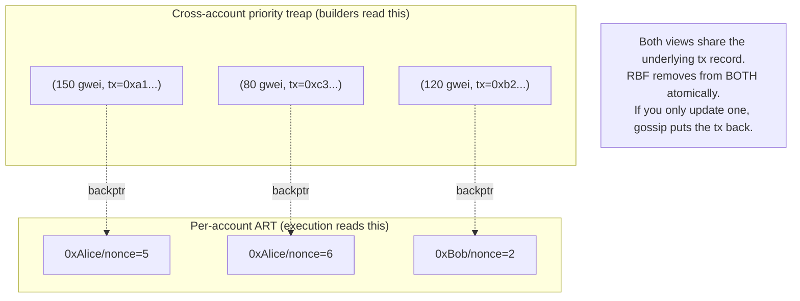

The mempool is the staging area between gossiped txs and block
inclusion. Most node implementations get the priority queue
subtly wrong under heavy fee competition: an RBF (replace-by-fee)
bump arrives, the impl evicts the original from the priority
treap but forgets the per-account index, the next gossip
re-introduces the original because its hash isn't in the dedup
anymore. Geth had a variant of this for years; production hot
mempools (Erigon-based, Bor's mempool, BSC's full mempool) all
have at least one ratchet of similar bugs in their git history.

The mempool maintains TWO views of the same set: cross-account
by effective fee (for builders), per-account by nonce (for
execution ordering). Both views point to the same underlying tx
records. RBF removes from BOTH. Eviction removes from BOTH. Get
this wrong and you ship a node nobody trusts.

## Ingest

```rust tab=ingest label=Rust
fn ingest(mp: &mut Mempool, tx: PendingTx, peer: PeerId) -> IngestResult {
    if !mp.peer_rate[peer].try_acquire() {
        return IngestResult::PeerRateLimited;
    }
    // Fast-path dedup. Bloom for the test; treap is authoritative.
    if mp.dedup_bloom.might_contain(&tx.hash) {
        if mp.tx_by_hash.contains(&tx.hash) {
            return IngestResult::Duplicate;
        }
    }
    // Sig verification is the bulk of per-ingest cost.
    if !mp.verifier.verify(&tx) {
        return IngestResult::BadSignature;
    }

    // RBF check. Same (sender, nonce) with >= 110% fee bump =
    // replacement. Atomic: evict the existing, insert the new.
    // If you skip the per-account index update here, the
    // existing returns to the pool via gossip ten seconds later.
    if let Some(existing) = mp.by_account.get_nonce(tx.sender, tx.nonce) {
        if tx.gas_price < existing.gas_price * 110 / 100 {
            return IngestResult::RbfUnderpriced;
        }
        // CRITICAL: remove from BOTH the priority treap AND the
        // per-account ART. Some impls do only the treap, then
        // gossip re-introduces via the account index path.
        mp.evict(existing.hash);
    }

    // Insert into both views.
    mp.priority.insert((tx.effective_gas_price_desc(), tx.hash));
    mp.by_account.insert((tx.sender, tx.nonce), tx.clone());
    mp.dedup_bloom.insert(tx.hash);
    IngestResult::Accepted
}
```
```java tab=ingest label=Java
IngestResult ingest(Mempool mp, PendingTx tx, PeerId peer) {
    if (!mp.peerRate().get(peer).tryAcquire()) return IngestResult.PEER_RATE_LIMITED;
    if (mp.dedupBloom().mightContain(tx.hash())) {
        if (mp.txByHash().containsKey(tx.hash())) return IngestResult.DUPLICATE;
    }
    if (!mp.verifier().verify(tx)) return IngestResult.BAD_SIGNATURE;

    PendingTx existing = mp.byAccount().getNonce(tx.sender(), tx.nonce());
    if (existing != null) {
        BigInteger threshold = existing.gasPrice().multiply(BigInteger.valueOf(110)).divide(BigInteger.valueOf(100));
        if (tx.gasPrice().compareTo(threshold) < 0) return IngestResult.RBF_UNDERPRICED;
        mp.evict(existing.hash());
    }
    mp.priority().insert(tx.effectiveGasPriceDesc(), tx.hash());
    mp.byAccount().insert(tx.sender(), tx.nonce(), tx);
    mp.dedupBloom().insert(tx.hash());
    return IngestResult.ACCEPTED;
}
```

## The dual-view structure



The shared backpointer is the load-bearing detail. Writes (insert,
RBF, evict) must update BOTH views in the same critical section
OR you ship a node with the famous mempool re-introduction bug.

## Latency budget

| Step | Recipe perf | Per-ingest cost |
|---|---|---|
| Per-peer rate-limit | [Rate limiter p99 < 100ns](/cookbook/recipes/subms-rate-limiter) | ~80 ns |
| Dedup bloom | [Bloom p99 ~16ns](/cookbook/recipes/subms-bloom-filter) | ~16 ns |
| Sig verification (secp256k1) | external | ~80 us |
| Priority treap insert | [Treap insert p99 < 1us](/cookbook/recipes/subms-treap) | ~500 ns |
| Per-account ART insert | [ART insert p99 < 1us](/cookbook/recipes/subms-adaptive-radix-tree) | ~800 ns |
| Gossip MPSC drain | [MPSC poll p99 < 1us](/cookbook/recipes/subms-mpsc-queue) | ~300 ns |
| Hist record | [HDR p99 < 100ns](/cookbook/recipes/subms-hdr-histogram) | ~80 ns |

Per-ingest: ~82 us (sig-verification-dominated). Parallel
verification across cores keeps total throughput at 50k tx/sec.
The sig cost is the floor; geth's `crypto/secp256k1` cgo binding
sets this for Go nodes; Rust nodes using libsecp256k1 are 2-3x
faster.

## Eviction under memory pressure

| Score function | Bias | Use when |
|---|---|---|
| `1 / effective_gas_price` | Newest low-fee first | Default; cheap to compute |
| `age_seconds / gas_price` | Balances age vs price | Reduces churn from new low-fee displacing waiting low-fee |
| `(1 + log(age)) / price` | Sublinear age boost | Production sweet spot for hot mempools |

Production deployments target 100k-300k capacity. Eviction
triggers at 95% capacity. An evicted tx hash goes into a
60-second blocklist; the same gossip storm can't re-introduce it
immediately.

## RBF specifics

| Policy | What | Where |
|---|---|---|
| 110% bump minimum | New tx must beat existing by >= 10% | Ethereum L1 default |
| 112.5% bump | Stricter; some L2s | Polygon mainnet |
| 100% (no bump) | Cheapest replacement | Some testnets only |
| RBF disabled | No replacement allowed | Old Bitcoin; not relevant in EVM |

Ethereum L1 uses 110%. Stricter bumps reduce RBF spam at the
cost of trapping users who underpriced their original. The 10%
is the empirical sweet spot; don't change it without strong
reason.

## Failures I've seen

**RBF without account-index update.** Already covered above. The
specific symptom: a tx that the user RBF'd ten minutes ago shows
up as still pending. They think the bump failed. They submit
again. Now there are TWO RBF'd transactions for the same nonce
in flight; only one will land.

**Single peer flood DoS.** One peer connected and gossiped 100k
txs/sec. Without per-peer rate limit, all of them entered the
verification pipeline, the verifier queue grew, latency p99
went from 80us to 50ms. Mitigation: per-peer rate-limiter at
the gossip layer; misbehaving peers get throttled.

**Eviction thrash.** A peer kept gossiping low-fee txs that got
evicted within seconds. Without the post-eviction blocklist, the
same txs re-entered immediately. The mempool churned without
making progress. Mitigation: 60-second hash blocklist after
eviction.

**Cross-validator concurrent read produces a torn view.**
Builders read the priority treap; the mempool's writer modifies
it concurrently. Without persistent-treap snapshot reads, builder
sometimes saw a torn book. Mitigation: persistent-treap variant
(same pattern as [order-book-matching](../defi/order-book-matching));
readers pin a version.

## Per-network defaults

| Network | Capacity | Tx-size cap | Notes |
|---|---|---|---|
| Ethereum L1 | 50k-150k | 128 KB | Hot mempools target 300k for builder edge |
| Arbitrum L2 | 5k-15k | 96 KB | Smaller; L2 doesn't need depth |
| Optimism L2 | 5k-15k | 96 KB | Same as Arbitrum |
| BSC | 100k-500k | 32 KB | High capacity, tight individual cap |
| Polygon | 50k-100k | 96 KB | Hot at certain hours |

The "right" capacity depends on tx submission rate × time-to-mine.
A network with 100ms block time needs much less mempool depth
than one with 12s blocks.
