MEV captured per year on Ethereum L1: ~$1B in 2022. ~$700M in
2023. The market consolidates: top 5 searchers capture ~60%
across most opportunity classes. The competitive moat is
end-to-end latency from "pending tx observed" to "bundle
submitted." 20ms is table stakes. 5ms is competitive. Below 5ms
gets you into the private-orderflow auction world; below 1ms is
co-located with builders.

This topic is the public-mempool searcher pipeline. Private
orderflow (orderflow auctions, direct user connections) is a
separate game with different infrastructure.

## The pipeline

```rust tab=assemble label=Rust
fn on_pending_tx(s: &mut Searcher, tx: PendingTx) {
    // Classify against known patterns in parallel. Each pattern
    // is a small detector; running ~50 of them per pending tx is
    // ~25us of CPU. Cheap.
    let opportunities: Vec<_> = s.patterns.iter()
        .filter_map(|p| p.detect(&tx))
        .collect();

    let mut arena = Arena::with_capacity(4096);
    for opp in opportunities {
        // Insert into priority treap. High-EV first.
        s.opp_queue.insert((opp.estimated_profit, opp.id));
    }

    // Drain priority queue. The simulator is the bulk cost;
    // parallelise across workers if you have multiple opportunities.
    while let Some((profit_est, opp_id)) = s.opp_queue.pop_max() {
        let opp = s.opportunities.get(opp_id);
        let bundle = s.construct_bundle(opp, &mut arena);
        let sim = s.simulator.simulate(&bundle, TraceLevel::Events);

        if sim.reverted() {
            // Bundle reverts on-chain = wasted gas. Skip + log.
            continue;
        }
        let actual_profit = sim.profit();
        let bid_amount = compute_bid(actual_profit, opp.confidence);

        // Submit to all configured relays in parallel. Relays
        // dedup by bundle hash so multi-relay submit is safe.
        for relay in &s.relays {
            if relay.rate_limiter.try_acquire() {
                relay.out.push(Bundle { ops: bundle.clone(), bid: bid_amount });
            }
        }
    }
    s.hist.record(now_ns() - tx.observed_at);
    arena.reset();
}
```
```java tab=assemble label=Java
void onPendingTx(Searcher s, PendingTx tx) {
    List<Opportunity> opportunities = s.patterns().stream()
        .map(p -> p.detect(tx))
        .filter(Optional::isPresent).map(Optional::get).toList();

    Arena arena = Arena.withCapacity(4096);
    for (Opportunity opp : opportunities) {
        s.oppQueue().insert(opp.estimatedProfit(), opp.id());
    }
    while (!s.oppQueue().isEmpty()) {
        OpportunityId oppId = s.oppQueue().popMax();
        Opportunity opp = s.opportunities().get(oppId);
        Bundle bundle = s.constructBundle(opp, arena);
        SimResult sim = s.simulator().simulate(bundle, TraceLevel.EVENTS);
        if (sim.reverted()) continue;
        BigInteger bidAmount = computeBid(sim.profit(), opp.confidence());
        for (Relay relay : s.relays()) {
            if (relay.rateLimiter().tryAcquire()) {
                relay.out().push(new SubmittedBundle(bundle, bidAmount));
            }
        }
    }
    s.hist().record(System.nanoTime() - tx.observedAt());
    arena.close();
}
```

## Opportunity patterns

```mermaid
flowchart LR
  Pending["Pending tx"]
  Pending --> P1{"sandwich?"}
  Pending --> P2{"back-run?"}
  Pending --> P3{"liquidation race?"}
  Pending --> P4{"arb?"}

  P1 -- yes --> O1["(sw_buy, tx, sw_sell)"]
  P2 -- yes --> O2["(tx, arb_to_pool_b)"]
  P3 -- yes --> O3["(liquidate)"]
  P4 -- yes --> O4["(buy_pool_a, sell_pool_b)"]

  O1 --> Q["priority treap"]
  O2 --> Q
  O3 --> Q
  O4 --> Q

  classDef sw fill:#2e1a25,stroke:#ff5f8a
  classDef arb fill:#1c2e22,stroke:#7ad9a7
  class O1 sw
  class O4 arb
```



Each pattern is a small detector. Production searchers run
dozens; some patterns hit 10% of pending txs, others <0.01%.
Per-pattern hit-rate × per-pattern average profit is the long-
term tuning surface.

## Bid amount strategy

| Heuristic | When | Trade-off |
|---|---|---|
| `bid = profit × 0.5` (50/50 split) | Stable strategies | Predictable; loses to dynamic competitors |
| `bid = profit × (1 - 1/confidence)` | High-variance opps | Burns more on uncertain bundles |
| Adaptive (track per-relay win-rate, tune over time) | Production | Self-tunes after hours of data |
| `bid = profit - $50` (fixed alpha) | Liquidation races | Cheap to compute; the alpha is your edge |

Production searchers tune per-pattern. The arms race: as more
searchers compete, bids approach 100% of profit. The market is
efficient; alpha comes from being FASTER, not bidding more.

## Latency budget

| Step | Recipe perf | Cost |
|---|---|---|
| Per-source SPSC read | [SPSC dequeue p99 < 1us](/cookbook/recipes/subms-spsc-ring-buffer) | ~200 ns |
| Pattern detection | inline | ~500 ns × 50 patterns = 25us |
| Opp treap insert | [Treap insert p99 < 1us](/cookbook/recipes/subms-treap) | ~500 ns |
| Simulator call | [Simulator](../smart-contracts/simulator) | ~10 ms |
| Bid construction | inline | ~50 us |
| Per-relay rate-limit | [Rate limiter p99 < 100ns](/cookbook/recipes/subms-rate-limiter) | ~80 ns |
| Relay submit | [SPSC enqueue p99 < 1us](/cookbook/recipes/subms-spsc-ring-buffer) | ~200 ns |
| Inbound result drain | [MPSC poll p99 < 1us](/cookbook/recipes/subms-mpsc-queue) | per-bundle |

Per-opportunity: ~10.5 ms (simulator-dominated). Inside 20ms; the
budget is for cold-cache simulator paths. Hot-cache simulator
drops to 3ms, putting the searcher at ~3.5ms total - competitive.

## Sandwich attack mechanics (concrete)

```
1. Searcher sees pending swap: user wants to swap 10 ETH -> USDC
   on Uniswap V2 at current price.
2. Construct bundle:
   tx_1: searcher swaps 50 ETH -> USDC  (pushes ETH price down)
   tx_2: user's pending swap            (now executes at worse price)
   tx_3: searcher swaps USDC -> 51 ETH (recovers + 1 ETH profit)
3. Submit to relay. Bundle must be atomic; partial inclusion is
   not allowed. Relay's "all or nothing" semantics give us this.
4. Profit (~1 ETH ~= $2K minus gas ~= $1900) split with builder
   via bid (~$1000 to builder, ~$900 to searcher).
```

The user loses ~$2K to slippage they wouldn't have lost at the
original price. This is MEV's externality on retail users; one
of the design goals of CowSwap (batch auctions) is to defeat it.

## Failures

**Slow opportunity-detection misses the race.** Detector ran
sequentially; by the time pattern 25 was checked, the bundle
deadline had passed. Mitigation: parallel detection across all
patterns; the slowest pattern sets the latency, not the sum.

**Bundle revert (sim mismatched real).** Searcher's simulator
returned profit estimates, but the actual block execution had a
different intermediate state because of a concurrent tx that
landed first. Bundle reverted; searcher paid gas. Mitigation:
conservative slippage tolerances in the sim; the bid markup
covers expected-revert losses.

**Lost race to faster searcher.** Same opportunity detected by
both; competitor's bundle landed first. Mitigation: detection
+ simulation latency optimisation; nothing else competes here.

**Strategy pattern leak.** A competitor reverse-engineered the
searcher's strategy from observed bundles. Started front-running
the front-run. Mitigation: per-searcher private mempool channels
+ relay-side bundle privacy (TEE or similar). The cat-and-mouse
is permanent.

## What MEV looks like by venue

| Venue | MEV per slot (rough) | Pattern mix |
|---|---|---|
| Ethereum L1 | $1k-$10k typical, $100k+ during volatility | 60% arb, 30% liquidation, 10% sandwich |
| Polygon | $10-$100 typical | 70% arb, 25% sandwich, 5% other |
| Arbitrum L2 | $50-$500 typical | 80% arb (cross-DEX) |
| BNB Chain | Similar to Polygon | Heavy sandwich on PancakeSwap |

L2s have less MEV because spreads are tighter and block times
are faster. L1 mainnet remains the largest source of MEV
revenue.

## What you can defer

- **Private orderflow ingest.** Subscribing to private channels
  (orderflow auctions like Flashbots Protect, direct user
  connections). v0 ships public-mempool only.
- **TEE bundle privacy.** Running inside SGX/SEV gives users
  cryptographic guarantees. Significant operational overhead.
- **Multi-chain.** v0 ships one chain. Each new chain is a
  duplicate-pipeline cost.

What you can't defer: parallel pattern detection, the simulator
integration, multi-relay submission, per-pattern profit tracking.
