A double-sign costs you ~1 ETH per validator (currently ~$3000)
plus the validator gets ejected from the active set. For an
operator running 1000 validators, an architectural flaw that
double-signs across the fleet means a ~$3M loss in a single
event. This has happened multiple times in the wild, including
to professional staking operators.

There are exactly two ways to prevent it and neither involves
trusting yourself to remember. The persistent slasher DB
(EIP-3076 format) is one. The keystore at-most-one signing
property (web3signer or equivalent) is the other. Both. Belt
and braces.

## The signing path

```rust tab=sign label=Rust
fn sign_duty(vc: &mut Vc, duty: Duty) -> Result<Signature, RefusalReason> {
    let key = (duty.validator_pubkey, duty.slot, duty.kind);

    // Fast-path bloom. Bloom-negative = definitely never signed.
    if !vc.signed_bloom.might_contain(&key) {
        return self.write_intent_and_sign(duty);
    }

    // Bloom-positive (could be FP) goes to LSM for authoritative
    // answer.
    match vc.slasher_db.get(key) {
        // Idempotent re-sign. Same content, same key, return
        // cached sig. The network gossiped our own sig back to us.
        Some(record) if record.signing_root == duty.signing_root => {
            Ok(record.signature)
        }
        // Different content, same slot/kind. WOULD SLASH. REFUSE.
        // This is the line between you keeping your stake and
        // losing it.
        Some(_) => {
            vc.audit.refuse(duty.clone(), "would slash");
            Err(RefusalReason::WouldSlash)
        }
        // Bloom FP; not actually in the DB.
        None => self.write_intent_and_sign(duty),
    }
}

fn write_intent_and_sign(vc: &mut Vc, duty: Duty) -> Result<Signature, RefusalReason> {
    // Write INTENT before signing. If we crash here, recovery
    // sees the intent + refuses any later conflicting request.
    // This is the recovery-safety property; do not skip.
    vc.slasher_db.put_intent(&duty);

    let sig = vc.keystore.sign(&duty.validator_pubkey, &duty.signing_root)
        .map_err(|_| RefusalReason::KeystoreUnavailable)?;

    vc.slasher_db.put_signed(&duty, &sig);
    vc.signed_bloom.insert(&(duty.validator_pubkey, duty.slot, duty.kind));
    Ok(sig)
}
```
```java tab=sign label=Java
Optional<Signature> signDuty(Vc vc, Duty duty) {
    var key = new SigningKey(duty.validatorPubkey(), duty.slot(), duty.kind());
    if (!vc.signedBloom().mightContain(key)) {
        return writeIntentAndSign(vc, duty);
    }
    Optional<SignedRecord> existing = vc.slasherDb().get(key);
    if (existing.isPresent()) {
        if (existing.get().signingRoot().equals(duty.signingRoot())) {
            return Optional.of(existing.get().signature());
        }
        vc.audit().refuse(duty, "would slash");
        return Optional.empty();
    }
    return writeIntentAndSign(vc, duty);
}
```

## The slashable cases

```mermaid
flowchart TB
  Sign["New signing request"]
  Sign --> Q1{"bloom test"}
  Q1 -- "definitely not signed (95%)" --> Write["write intent + sign"]
  Q1 -- "maybe signed (5%)" --> Q2{"LSM lookup"}
  Q2 -- "same root" --> Idem["return cached sig"]
  Q2 -- "DIFFERENT root" --> Refuse["REFUSE<br/>(would be slashable)"]
  Q2 -- "not found (FP)" --> Write
  Write --> Ks["keystore.sign<br/>(web3signer)"]
  Ks --> Done["store + return"]

  classDef bad fill:#2e1a25,stroke:#ff5f8a
  classDef ok fill:#1c2e22,stroke:#7ad9a7
  class Refuse bad
  class Idem,Done ok
```



The slasher's authoritative check is the security boundary. The
bloom is just an optimisation; if you skip the LSM check on
bloom-positive, you've effectively skipped slasher protection,
because the bloom has false positives.

## The Lido / Allnodes incident, 2023

In Feb 2023 Allnodes had a double-signing event on a small
percentage of Lido's validators. Root cause was a configuration
issue during failover that allowed two VCs to be active for the
same key simultaneously. The slasher DB was per-VC, so each VC
"knew" it hadn't signed for that slot, but they weren't aware
of each other. Loss: small (~$50K), but high-profile.

The fix: the KEYSTORE (web3signer) is the at-most-one enforcer,
not the VC. The web3signer maintains its own slashing protection
across all VCs that share a key. Even if two VCs both ask to
sign, the keystore returns only one signature.

If you're running validators in 2026, use web3signer (or
distributed-validator-tech, which is the next layer). Don't run
slasher protection only in the VC.

## Latency budget

| Step | Recipe perf | Cost |
|---|---|---|
| Inbound duty drain | [MPSC poll p99 < 1us](/cookbook/recipes/subms-mpsc-queue) | ~300 ns |
| Bloom check | [Bloom p99 ~16ns](/cookbook/recipes/subms-bloom-filter) | ~16 ns |
| LSM check (5%) | [LSM get p99 < 15us](/cookbook/recipes/subms-lsm-tree) | ~10 us avg |
| Intent write | [LSM put p99 < 2us](/cookbook/recipes/subms-lsm-tree) | ~1 us |
| BLS sign (keystore RPC) | external | ~2 ms (dominant) |
| Final write | LSM put | ~1 us |
| Outbound publish | [SPSC enqueue p99 < 1us](/cookbook/recipes/subms-spsc-ring-buffer) | ~200 ns |
| Deadline tracking | [Timer-wheel schedule p99 < 100ns](/cookbook/recipes/subms-timer-wheel) | ~50 ns |
| Hist record | [HDR p99 < 100ns](/cookbook/recipes/subms-hdr-histogram) | ~80 ns |

Per-sign: ~2.5 ms (BLS-dominated). At 1000 validators × one
attestation per slot = ~3 seconds of work spread across multiple
keystore-signing threads. Easily fits in the 4-second attestation
window.

## DVT - the next layer

Distributed Validator Technology (DVT, e.g. Obol/Charon, SSV
Network). Same BLS key shared across N nodes via threshold
cryptography. To produce a signature, k-of-N nodes must agree.

| Topology | Slash protection | Operational complexity |
|---|---|---|
| Single VC | DB on the one node | Simplest; single point of failure |
| Active + passive VCs sharing key | Slasher DB replicated; KEYSTORE enforces at-most-one | Standard institutional setup |
| DVT (k-of-N) | No single VC can produce a slashable sig | Highest complexity; highest fault tolerance |

DVT is the production answer for serious staking operations. The
cookbook's slasher + bloom shape applies inside each DVT node;
the DVT layer adds the cross-node consensus.

## Failures I've watched

**Crash mid-sign without intent write.** Old impl wrote the
intent AFTER the BLS sign. Crash between sign and DB write =
no record of the sign + the network has the gossiped sig + next
request looks new + double-sign. Mitigation: intent BEFORE sign,
always.

**Keystore RPC timeout treated as failure.** VC requested sign,
keystore took 6 seconds to respond (network blip). VC timed
out and retried. Second request: keystore had already signed
the first; rejected the second; both attempts logged in the
audit. Mitigation: keystore-side retry idempotency keyed on
signing root.

**Slasher DB lost during disk failure.** Disk crashed; DB lost;
recovered from backup that was 6 hours stale. Many "new" signing
requests would have been double-signs against the gap. The VC
treated the gap as "definitely never signed" because the DB had
no record. Mitigation: bounded acceptance window after recovery;
refuse any signing for slots within the last N hours after a
slasher-DB restore.

**Stale consensus client view.** CC was 2 slots behind the
network; gave the VC a duty for a slot that had already passed.
VC signed; the sig was late; missed attestation. Mitigation:
cross-CC ratification (require 2+ CCs to agree on the duty
before signing).

## EIP-3076 import/export

EIP-3076 is the standard slashing-protection database format.
Lets operators move validators between client implementations
(Prysm, Lighthouse, Teku, Nimbus) without losing protection.
The cookbook's LSM-backed slasher exports/imports this format
directly.

If you're migrating between clients, USE the import. Don't
"start fresh" with a new DB; the new DB doesn't know about your
old signatures, and the network does.
