Bridges are where DeFi money goes to die. Ronin: $625M. Wormhole:
$325M. Nomad: $190M. Harmony: $100M. The list is long and each
postmortem implicates the off-chain messenger or its on-chain
counterpart. The messenger is most of the attack surface; build
it like the rest of your protocol depends on it (because it
does).

The defences: per-direction sequence-number ordering (gaps =
alarm), on-chain status flag preventing double-relay,
cross-source proof verification (two implementations of the
proof construction must agree before submission), explicit
finality awareness (no L2->L1 relay before finality).

If you're building a bridge in 2026 without reviewing the
postmortems of Wormhole/Ronin/Nomad first, stop and read those.
The patterns repeat.

## The relay flow

```rust tab=relay label=Rust
fn process_message(m: &mut Messenger, msg: BridgeMessage) -> RelayResult {
    // Dedup across multiple RPC sources.
    if m.dedup.contains(&msg.id) { return RelayResult::AlreadySeen; }
    m.dedup.insert(msg.id);

    // Sequence-number ordering. If not next-in-line, queue.
    // Out-of-order processing produces unexpected state (e.g.
    // a later deposit credited before an earlier one).
    let expected_seq = m.next_seq(msg.direction);
    if msg.sequence != expected_seq {
        m.pending.insert((msg.sequence, msg.id), msg);
        return RelayResult::WaitingForPredecessor;
    }

    // L2->L1 needs finality. Don't relay before the L2 batch is
    // finalised on L1 (challenge window closed for optimistic;
    // proof landed for ZK). Pre-finality relay = catastrophic
    // if the L2 state reorgs.
    if msg.direction == Direction::L2ToL1 {
        let ready_at = msg.l2_block_finality_time();
        if now() < ready_at {
            m.wheel.schedule(msg.id, ready_at, RelayStage::FinalityReached);
            return RelayResult::WaitingForFinality;
        }
    }

    // Construct + cross-source verify the Merkle proof for L2->L1.
    // The cross-source verify is the defence against off-chain
    // bugs; two impls must agree before we submit.
    if msg.direction == Direction::L2ToL1 {
        let proof = m.construct_proof(&msg);
        let cross_proof = m.alt_implementation.construct_proof(&msg);
        if proof != cross_proof {
            m.alarm.proof_mismatch(msg.id);
            return RelayResult::ProofMismatch;
        }
        if !m.relay_rate.try_acquire(msg.target_chain) {
            return RelayResult::RateLimited;
        }
        m.l1_out.push(SubmitRelay { msg, proof });
    } else {
        if !m.relay_rate.try_acquire(msg.target_chain) {
            return RelayResult::RateLimited;
        }
        m.l2_out.push(SubmitRelay { msg, proof: Proof::empty() });
    }
    m.advance_seq(msg.direction);
    RelayResult::Submitted
}
```
```java tab=relay label=Java
RelayResult processMessage(Messenger m, BridgeMessage msg) {
    if (m.dedup().contains(msg.id())) return RelayResult.ALREADY_SEEN;
    m.dedup().insert(msg.id());
    long expectedSeq = m.nextSeq(msg.direction());
    if (msg.sequence() != expectedSeq) {
        m.pending().insert(msg.sequence(), msg.id(), msg);
        return RelayResult.WAITING_FOR_PREDECESSOR;
    }
    if (msg.direction() == Direction.L2_TO_L1) {
        Instant readyAt = msg.l2BlockFinalityTime();
        if (Instant.now().isBefore(readyAt)) {
            m.wheel().schedule(msg.id(), readyAt, RelayStage.FINALITY_REACHED);
            return RelayResult.WAITING_FOR_FINALITY;
        }
    }
    if (msg.direction() == Direction.L2_TO_L1) {
        Proof primary = m.constructProof(msg);
        Proof crossProof = m.altImplementation().constructProof(msg);
        if (!primary.equals(crossProof)) {
            m.alarm().proofMismatch(msg.id());
            return RelayResult.PROOF_MISMATCH;
        }
        if (!m.relayRate().tryAcquire(msg.targetChain())) return RelayResult.RATE_LIMITED;
        m.l1Out().push(new SubmitRelay(msg, primary));
    } else {
        if (!m.relayRate().tryAcquire(msg.targetChain())) return RelayResult.RATE_LIMITED;
        m.l2Out().push(new SubmitRelay(msg, Proof.empty()));
    }
    m.advanceSeq(msg.direction());
    return RelayResult.SUBMITTED;
}
```

## The state machine

```mermaid
stateDiagram-v2
  [*] --> Pending: source chain event observed
  Pending --> WaitingForPredecessor: not next in seq
  WaitingForPredecessor --> Pending: predecessor processed
  Pending --> WaitingForFinality: L2->L1, not finalised
  WaitingForFinality --> Pending: finality reached
  Pending --> ProofMismatch: cross-source disagrees
  ProofMismatch --> [*]: operator alarm + manual investigation
  Pending --> Submitted: relayed to destination
  Submitted --> Relayed: destination confirms
  Submitted --> Failed: revert on destination
  Failed --> Pending: operator retry
  Relayed --> [*]

  classDef bad fill:#2e1a25,stroke:#ff5f8a
  class ProofMismatch,Failed bad
```



## The Wormhole lesson

Feb 2022: Wormhole bridge between Solana and Ethereum exploited
for $325M. Root cause: the off-chain "guardian" signature
validation skipped a critical check, allowing an attacker to
forge guardian signatures via a recently-deprecated Solana
sysvar. The on-chain contract trusted the guardian signatures
without independent verification.

What would have prevented it: cross-source proof verification.
A second guardian implementation, running in parallel, would
have caught the discrepancy. Wormhole had a single guardian
codebase; the bug was in that codebase; nothing caught it.

The lesson generalises. Off-chain proof construction is where
bridges break. Two implementations + a comparison gate is the
minimum defence.

## Latency budget

| Step | Recipe perf | Cost |
|---|---|---|
| Cross-RPC dedup | [Bloom p99 ~16ns](/cookbook/recipes/subms-bloom-filter) | ~16 ns |
| Per-direction ordering | [Treap insert p99 < 1us](/cookbook/recipes/subms-treap) | ~500 ns |
| Finality timer | [Timer-wheel p99 < 100ns](/cookbook/recipes/subms-timer-wheel) | ~50 ns per schedule |
| Merkle proof construction | per-trie impl | ~5 ms (32-level proof) |
| Cross-source proof verify | parallel | ~5 ms |
| Rate-limit | [Rate limiter p99 < 100ns](/cookbook/recipes/subms-rate-limiter) | ~80 ns |
| Outbound submit | [SPSC enqueue p99 < 1us](/cookbook/recipes/subms-spsc-ring-buffer) | ~200 ns |
| Hist record | [HDR p99 < 100ns](/cookbook/recipes/subms-hdr-histogram) | ~80 ns |

L1->L2 relay (no proof): ~5ms. L2->L1 (with proof): ~15ms. The
finality wait (7d or 1h) dominates wall-clock for L2->L1; the
processing inside the wait is microsecond-class.

## Failures the cookbook would have caught

**Wormhole-class bug (forged guardian sig).** Defence: cross-
source proof verify. Two impls must agree. Doesn't help if both
impls have the same bug; rotate the auditing teams to avoid
mono-culture.

**Pre-finality relay (would have caused Ronin if Ronin were
optimistic).** Defence: finality timer; relay deferred until
ready_at. The L2-to-L1 path NEVER relays before finality.

**Replay attack (double-relay).** Same message relayed twice;
destination credited twice. Defence: on-chain `relayed` status
flag at destination. Second relay reverts. The status flag IS
the security property; don't trust the off-chain dedup alone.

**Sequence-number gap (Nomad-class).** Out-of-order processing
applied a fix without applying its predecessor. Defence: per-
direction sequence-number ordering; gaps queue + alarm.

## What you can defer

- **Permissionless relay (anyone can submit).** v0 ships single
  operator. Less decentralised but simpler operations.
- **Multi-chain expansion.** v0 ships one L1 + one L2 pair.
  Each additional chain is operational complexity (more RPC
  subscriptions, more bond posting, more cross-source verifies).
- **MEV-resistant relay ordering.** v0 ships first-come-first-
  serve.

What you can't defer: per-direction sequence numbers,
cross-source proof verification, finality timer, on-chain
status flag. Bridges that skip any of these have postmortem
URLs in their future.
