Censorship resistance is meaningless without a working forced-
inclusion path. The path is meaningless without an off-chain
monitor watching the queue. Most L2s have the path but don't
have anyone actively monitoring. The path exists for compliance
reasons; the monitor is what makes the compliance enforceable.

Arbitrum, Optimism, zkSync all have forced-inclusion mechanisms.
Few have battle-tested off-chain monitors that actively watch
the queue. The monitor is what notices when a sequencer is
SILENTLY refusing to process a transaction; without active
monitoring, the sequencer can soft-censor for hours without
anyone noticing.

## The monitor loop

```rust tab=monitor label=Rust
fn on_queue_event(m: &mut Monitor, evt: QueueEvent) {
    match evt {
        QueueEvent::Added { entry } => {
            // Schedule escalating alerts. The T-30min alarm is
            // SMS-grade; unacknowledged escalates to phone.
            let d = entry.deadline;
            m.wheel.schedule(entry.id, d - Duration::hours(24),  AlertStage::Warn);
            m.wheel.schedule(entry.id, d - Duration::hours(1),   AlertStage::Critical);
            m.wheel.schedule(entry.id, d - Duration::minutes(30), AlertStage::FinalPage);
            m.wheel.schedule(entry.id, d,                         AlertStage::DeadlineMissed);
            m.pending.insert((d, entry.id), entry);
        }
        QueueEvent::IncludedInL2 { entry_id, l2_block } => {
            m.included_bloom.insert(&entry_id);
            m.pending.remove_by_id(entry_id);
            m.audit.log_included(entry_id, l2_block);
        }
        QueueEvent::Reorg { affected_blocks } => {
            // L1 reorg can shift deadlines; recompute + retract
            // pending alarms.
            for block in affected_blocks {
                m.reevaluate_deadlines_after_reorg(block);
            }
        }
    }
}

fn on_timer_fire(m: &mut Monitor, entry_id: EntryId, stage: AlertStage) {
    if m.included_bloom.contains(&entry_id) {
        // Already mined. Silent skip; no alarm.
        return;
    }
    let entry = m.pending.get_by_id(entry_id).unwrap();
    match stage {
        AlertStage::Warn         => m.alarm.warn(entry),
        AlertStage::Critical     => m.alarm.critical(entry),
        AlertStage::FinalPage    => m.alarm.sms_page(entry),
        AlertStage::DeadlineMissed => {
            m.alarm.deadline_missed(entry);
            if m.config.auto_permissionless_post {
                m.coordinator.post_permissionless_batch(entry);
            }
        }
    }
}
```
```java tab=monitor label=Java
void onQueueEvent(Monitor m, QueueEvent evt) {
    switch (evt) {
        case QueueEvent.Added(var entry) -> {
            Instant d = entry.deadline();
            m.wheel().schedule(entry.id(), d.minus(Duration.ofHours(24)), AlertStage.WARN);
            m.wheel().schedule(entry.id(), d.minus(Duration.ofHours(1)),  AlertStage.CRITICAL);
            m.wheel().schedule(entry.id(), d.minus(Duration.ofMinutes(30)), AlertStage.FINAL_PAGE);
            m.wheel().schedule(entry.id(), d, AlertStage.DEADLINE_MISSED);
            m.pending().insert(d, entry.id(), entry);
        }
        case QueueEvent.IncludedInL2(var entryId, var l2Block) -> {
            m.includedBloom().insert(entryId);
            m.pending().removeById(entryId);
            m.audit().logIncluded(entryId, l2Block);
        }
        case QueueEvent.Reorg(var affected) -> {
            for (BlockHeader block : affected) {
                m.reevaluateDeadlinesAfterReorg(block);
            }
        }
    }
}
```

## The lifecycle

```mermaid
sequenceDiagram
  participant U as User
  participant L1 as L1 Queue contract
  participant M as Monitor
  participant Seq as L2 Sequencer
  participant Ops as Operator

  U->>L1: submitTx (with deadline)
  L1-->>M: event QueueAdded
  M->>M: schedule T-24h, T-1h, T-30min, deadline

  Seq->>L1: include queued txs in next L2 batch
  L1-->>M: event IncludedInL2
  Note over M: T-24h fires, but already included -> skip

  rect rgb(46, 26, 37)
  Note over Seq,M: ALTERNATIVE: sequencer ignores queue
  M->>Ops: T-30min SMS PAGE
  M->>Ops: T-1min phone call
  Note over M: deadline hits, NOT included
  M->>L1: post permissionless batch (auto)
  end
```



The auto-post is operator-configured. Some deployments require
manual confirmation; others auto-fire once deadline misses. Both
valid; the operator's choice.

## Latency budget

| Step | Recipe perf | Cost |
|---|---|---|
| L1 event drain | [MPSC poll p99 < 1us](/cookbook/recipes/subms-mpsc-queue) | per-block |
| Pending insert | [Treap insert p99 < 1us](/cookbook/recipes/subms-treap) | ~500 ns |
| Timer schedule | [Timer-wheel p99 < 100ns](/cookbook/recipes/subms-timer-wheel) | ~50 ns per schedule |
| Inclusion bloom check | [Bloom p99 ~16ns](/cookbook/recipes/subms-bloom-filter) | ~16 ns |
| Alarm push | [SPSC enqueue p99 < 1us](/cookbook/recipes/subms-spsc-ring-buffer) | ~200 ns |
| Hist record | [HDR p99 < 100ns](/cookbook/recipes/subms-hdr-histogram) | ~80 ns |

The monitor isn't latency-critical. It must keep up with L1
block cadence (12s); the actual work is microseconds. Easy.

## The use case nobody thinks about

Sanctions compliance. A user submits a perfectly legal tx that
the sequencer refuses because the sender is on an OFAC list.
The user submits via L1 forced-inclusion; the sequencer is
FORCED to include it; the L1 path is the user's only recourse.

This isn't theoretical. After OFAC sanctioned Tornado Cash
addresses in Aug 2022, multiple block builders began censoring
sanctioned-address txs. Forced-inclusion (if it exists on the
L2; not all L2s have it yet) is what gives sanctioned-but-legal
users access to the chain.

Operators must NOT add an exclusion list at the sequencer that
would render the forced-inclusion meaningless. The legal
position is: "the sequencer can't censor, the L1 forced-inclusion
fires after delay." If you censor at the sequencer AND don't
honour forced-inclusion, you've created a censorship monopoly.

## Failures

**Missed deadline event (timer didn't fire).** Operator forgot
to enable timer scheduling on a new deployment. Queue grew. No
alarm. Three hours past deadline, user complained on Twitter.
Mitigation: per-entry deadline timer in wheel; fires regardless
of L1 event activity; verify timer wheel is firing in
production.

**False missed-deadline alarm.** Sequencer included the entry at
the LAST second; monitor's timer fired before the indexer
reported the inclusion. Alarm fired; operator was paged
unnecessarily. Mitigation: inclusion bloom checked at every
timer fire; bloom-positive means already-included, skip alarm.

**L1 reorg shifted deadlines.** L1 reorganised; the deadline
that was at L1-block-100 is now at L1-block-101. Monitor's
pre-reorg deadline was about to fire; would have fired against
the wrong block. Mitigation: per-event reorg reevaluation +
retract stale alarms.

**Auto-permissionless-post fired falsely.** Inclusion happened
during the deadline; the monitor's timer fired before the
indexer updated; auto-post submitted a duplicate. The on-chain
bridge contract rejected the duplicate. No money lost but
operator was paged twice (for the post failure and the inclusion
notice arriving simultaneously). Mitigation: bloom check + audit
log; require explicit "already included" rejection before
auto-posting.

## Operational policies

| Policy | Default | Note |
|---|---|---|
| Auto-permissionless-post | Off | Operator confirms before submitting |
| Alert thresholds | T-24h, T-1h, T-30min, deadline | Operator-tunable |
| Per-user severity tiers | Same for all | Don't differentiate; sanctions compliance |
| Audit log retention | Forever | Public transparency surface |

## What can't be deferred

- The timer-wheel scheduler (without it, you don't notice
  missed deadlines until users tell you)
- Inclusion bloom dedup (without it, false alarms)
- L1 reorg handling (without it, alarms fire on shifted deadlines)
- Public audit log (without it, users can't verify their txs
  were respected)
