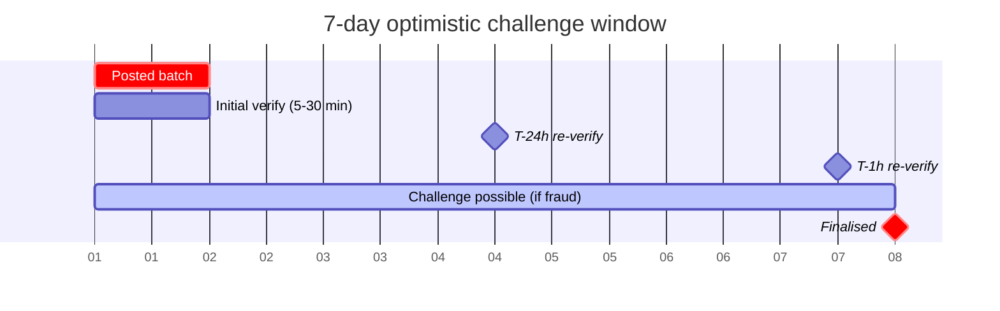

Optimistic rollups are "optimistic" because someone watches. If
nobody watches, "optimistic" means "trust the sequencer." That's
not what users signed up for.

In practice, the watcher network is the rollup's security model.
Production rollups run 3-10 independent watchers per chain.
Arbitrum has Offchain Labs, Lyra DAO, and others. Optimism has
several. The bond + reward economics work: watchers post 10-100
ETH; successful fraud-proof submissions pay ~5-10% of the
sequencer's stake. Watchers can profit when fraud actually
happens; the threat of profitable challenge is what disciplines
sequencers.

Arbitrum has never had a successful fraud challenge in
production. Neither has Optimism. The proof that the system
works is that no fraud has been attempted. That proof depends
on someone being ready to challenge.

## Verification loop

```rust tab=verify label=Rust
fn verify_batch(w: &mut Watcher, b: PostedBatch) -> VerifyOutcome {
    // Load L2 state at batch start. Most of the per-batch cost
    // lives in this fetch + re-execution; the comparison is free.
    let mut state = w.state_at(b.start_block);
    let mut arena = Arena::with_capacity(16 * 1024);

    // Fetch batch txs from DA layer. Multi-source for safety.
    let txs = w.da.fetch_batch_txs(b.batch_id)
        .expect("DA layer failure - skip + retry; do NOT auto-challenge");

    // Re-execute. The watcher's EVM MUST be byte-identical to
    // the sequencer's EVM for the same input to produce the same
    // result. Both use revm (or equivalent); the version pinning
    // matters.
    for tx in &txs {
        let exec = w.evm.execute(tx, &mut state, &mut arena);
        state.commit(&exec.state_diff);
    }

    let local_root = state.compute_root();
    if local_root == b.posted_root {
        return VerifyOutcome::Match;
    }

    // MISMATCH. Construct fraud proof. Re-run with detailed trace
    // to find the exact opcode mismatch.
    let proof = w.construct_fraud_proof(b.batch_id, &txs, b.posted_root, local_root);
    w.submit_challenge(proof);
    VerifyOutcome::Challenged { local_root, posted_root: b.posted_root }
}
```
```java tab=verify label=Java
VerifyOutcome verifyBatch(Watcher w, PostedBatch b) {
    L2State state = w.stateAt(b.startBlock());
    Arena arena = Arena.withCapacity(16 * 1024);
    try {
        List<Transaction> txs = w.da().fetchBatchTxs(b.batchId());
        for (Transaction tx : txs) {
            ExecResult exec = w.evm().execute(tx, state, arena);
            state.commit(exec.stateDiff());
        }
        Bytes32 localRoot = state.computeRoot();
        if (localRoot.equals(b.postedRoot())) return VerifyOutcome.match();
        FraudProof proof = w.constructFraudProof(b.batchId(), txs, b.postedRoot(), localRoot);
        w.submitChallenge(proof);
        return VerifyOutcome.challenged(localRoot, b.postedRoot());
    } finally {
        arena.close();
    }
}
```

## The 7-day challenge window



The watcher re-verifies multiple times in the window. The
multiple-verify pattern catches "the batch verified at T+5min
but became invalid by T+5d because subsequent state changes
exposed it." Rare in practice; the protocol against false
positives.

## Cross-watcher coordination

```mermaid
flowchart TB
  Posted["Batch posted to L1"]
  Posted --> W1["Watcher A"]
  Posted --> W2["Watcher B"]
  Posted --> W3["Watcher C"]

  W1 -. verifies match .-> Done["all happy"]
  W2 -. verifies match .-> Done

  W3 -. DETECTS FRAUD .-> Gossip["share via gossip"]
  Gossip --> W1
  Gossip --> W2

  W1 --> Wait["random 0-30s delay"]
  W2 --> Wait
  W3 --> Wait

  Wait --> First["FIRST to submit wins reward"]

  classDef bad fill:#2e1a25,stroke:#ff5f8a
  class W3,Gossip,First bad
```



Random submission delay prevents 3+ watchers racing into wasted
gas. On-chain contract accepts only the first; subsequent
revert. Bond pooling shares both reward + risk; some operations
do this to amortise.

## Latency budget

| Step | Recipe perf | Per-batch cost |
|---|---|---|
| Batch event drain | [MPSC poll p99 < 1us](/cookbook/recipes/subms-mpsc-queue) | ~300 ns |
| Per-tx state load | [LSM get p99 < 15us](/cookbook/recipes/subms-lsm-tree) | per slot read |
| EVM re-execute | external | ~50-500 us/tx (dominant) |
| State-root compute | merkle | ~ms for 1k slots |
| Outbound work-dispatch | [SPSC enqueue p99 < 1us](/cookbook/recipes/subms-spsc-ring-buffer) | ~200 ns |
| Per-batch arena | [Arena p99 < 100ns](/cookbook/recipes/subms-arena-allocator) | ~50 ns |
| Challenge timer | [Timer-wheel schedule p99 < 100ns](/cookbook/recipes/subms-timer-wheel) | ~50 ns |
| Hist record | [HDR p99 < 100ns](/cookbook/recipes/subms-hdr-histogram) | ~80 ns |

A 1000-tx batch × 200us/tx = 200ms re-execution. For a popular
L2 posting every 5 min, the watcher's CPU utilisation is <1%.
The budget exists for catchup after a network blip + the rare
case where multiple batches arrive faster than usual.

## Bond economics

| Role | Bond | Reward on success | Slashing on false |
|---|---|---|---|
| Watcher | 10-100 ETH | ~5-10% of sequencer stake | Full bond |
| Sequencer | 10000+ ETH | N/A | Portion to challenger |

Expected return for an honest watcher with well-tested code:
small (`P(fraud) × reward`), but non-zero. The economics make
the role viable for professional operators; hobby watchers
exist but the rounding-error EV doesn't justify ongoing
infrastructure.

## Failures

**Missed fraud (watcher offline).** Solo watcher; their server
crashed for two days; missed a posted batch that turned out
benign. No actual loss but the security model was degraded
during the window. Mitigation: multi-watcher redundancy +
operator-side uptime monitoring + alarms on watcher staleness.

**False challenge (watcher's local state was wrong).** Watcher's
EVM was a slightly older version than the sequencer's; one
opcode behaved differently; watcher re-executed and got a
different root; submitted challenge. Lost bond. Mitigation:
EVM version-pin against the sequencer; cross-watcher gossip
before submission (require 2+ watchers agree).

**State-availability gap.** DA layer didn't have the batch's
data; watcher couldn't re-execute. Mitigation: multi-DA source
(L1 calldata + L1 blob + backup full node); per-source health
tracking.

**Slow re-execution past challenge deadline.** Watcher's
re-execution pipeline got behind during catchup after an outage;
challenge window for one batch was about to close while still
re-verifying. Mitigation: per-batch deadline alarm at T-1h;
operator paged.

## What can't be deferred

- Local state replica (LSM-backed); without it you can't
  re-execute
- Cross-watcher gossip for challenge coordination
- Per-batch deadline timer with escalating alerts
- Multi-DA source for safety against single-source failure

What you can defer: bond pooling (start as a solo operator),
sophisticated batch re-execution parallelism (single-threaded
is fine until you hit posting cadence problems), private
watcher gossip channels (start public).
