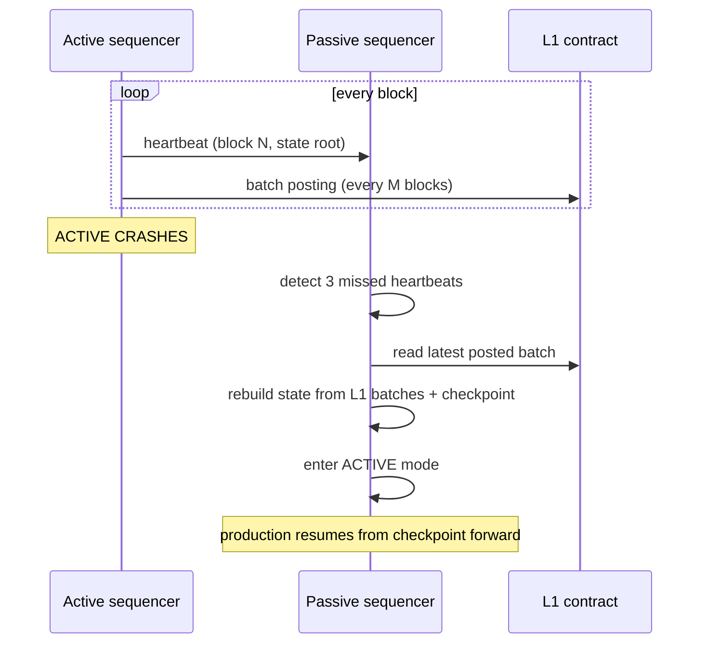

Your sequencer is the user's experience of your rollup. If it
takes 200ms to acknowledge inclusion, your users will go to a
different rollup. If it desyncs from the L1 batch on failover,
you have an existential incident.

Arbitrum's sequencer has been down ~5 separate times in the last
two years - one for ~30 minutes during a state-update bug.
Optimism's has had its own incidents. zkSync's prover lagging its
sequencer is a documented operational mode. Run a sequencer, plan
for failure modes the same way.

The shape: single hot-thread per shard, persistent state via LSM,
verifier replica that runs the same input + alarms on divergence,
passive failover that recovers from the last L1-posted batch.

## The block loop

```rust tab=block label=Rust
fn produce_block(s: &mut Sequencer, parent: BlockHeader) -> Block {
    // Per-block arena. Reset between blocks; zero garbage in the
    // steady state.
    let mut arena = Arena::with_capacity(64 * 1024);
    let mut block_txs = Vec::new();
    let mut gas_used = 0u64;
    let gas_limit = s.config.block_gas_limit;

    // Pop from priority treap. Highest effective_gas_price first.
    while let Some((_, tx_hash)) = s.priority.try_pop_max() {
        let tx = s.pending.get(tx_hash).unwrap();
        if gas_used + tx.gas_limit > gas_limit { break; }

        // Execute against in-memory hot state (LSM-backed).
        let exec = s.evm.execute(&tx, &mut s.state, &mut arena);
        match exec.status {
            ExecStatus::Success | ExecStatus::Reverted => {
                gas_used += exec.gas_used;
                block_txs.push(tx);
                s.state.commit(&exec.state_diff);
            }
            ExecStatus::Invalid => continue,
        }
    }

    let state_root = s.state.compute_root();
    let block = Block::new(parent, block_txs, state_root, gas_used);

    // SPSC to L1-poster. Sequencer never blocks on the poster;
    // poster cadence is bounded by L1 block times, not us.
    s.l1_out.push(block.clone());
    s.hist.record_block();
    arena.reset();
    block
}
```
```java tab=block label=Java
Block produceBlock(Sequencer s, BlockHeader parent) {
    Arena arena = Arena.withCapacity(64 * 1024);
    List<Transaction> blockTxs = new ArrayList<>();
    long gasUsed = 0;
    long gasLimit = s.config().blockGasLimit();
    while (true) {
        Optional<TxHash> hashOpt = s.priority().tryPopMax();
        if (hashOpt.isEmpty()) break;
        Transaction tx = s.pending().get(hashOpt.get()).orElseThrow();
        if (gasUsed + tx.gasLimit() > gasLimit) break;
        ExecResult exec = s.evm().execute(tx, s.state(), arena);
        switch (exec.status()) {
            case SUCCESS, REVERTED -> {
                gasUsed += exec.gasUsed();
                blockTxs.add(tx);
                s.state().commit(exec.stateDiff());
            }
            case INVALID -> { /* skip */ }
        }
    }
    Bytes32 stateRoot = s.state().computeRoot();
    Block block = Block.of(parent, blockTxs, stateRoot, gasUsed);
    s.l1Out().push(block);
    s.hist().recordBlock();
    arena.close();
    return block;
}
```

## The architecture

```mermaid
flowchart LR
  Users["Users (RPC)"]
  Users --> Ingest["Tx ingest workers<br/>(N threads)"]
  Ingest --> MPSC[MPSC]
  MPSC --> Seq["Sequencer thread<br/>(single hot loop)"]

  Seq --> State[("L2 state<br/>LSM + block-cache hot tier")]
  Seq --> Out[SPSC]
  Out --> L1["L1-poster<br/>(calldata/blob)"]

  Seq -. snapshot .-> Ver["Verifier replica<br/>(parallel state)"]
  Ver -. divergence .-> Page["operator paged"]

  Pas["Passive sequencer<br/>(heartbeat-monitored)"]
  Seq -. heartbeat .-> Pas
  Pas -. takes over .-> Seq

  classDef hot fill:#2c2418,stroke:#ffb454
  classDef warn fill:#2e1a25,stroke:#ff5f8a
  class Seq hot
  class Page warn
```



Single hot thread. Multi-threaded sequencer means lock contention
on state writes; you'd rather have one fast thread + a verifier
replica than two contending writers. The ingest workers fan in
via MPSC; the L1-poster reads from the outbound SPSC; verifier
+ passive both run independent copies of the input.

## Latency budget

| Step | Recipe perf | Per-block cost |
|---|---|---|
| Tx ingest from MPSC | [MPSC poll p99 < 1us](/cookbook/recipes/subms-mpsc-queue) | continuous |
| Priority pop | [Treap pop p99 < 1us](/cookbook/recipes/subms-treap) | ~150 ns/tx |
| EVM execute per tx | external (revm) | ~50-500 us/tx |
| State write per slot | [LSM put p99 < 2us](/cookbook/recipes/subms-lsm-tree) | aggregated |
| State root compute | merkle impl | ~ms for 1k touched slots |
| L1-out push | [SPSC enqueue p99 < 1us](/cookbook/recipes/subms-spsc-ring-buffer) | ~200 ns |
| Per-tx rate-limit | [Rate limiter p99 < 100ns](/cookbook/recipes/subms-rate-limiter) | ~80 ns |
| Arena reset | [Arena p99 < 100ns](/cookbook/recipes/subms-arena-allocator) | ~50 ns/block |
| Hist record | [HDR p99 < 100ns](/cookbook/recipes/subms-hdr-histogram) | ~80 ns |

500 tx/block × 100us each = 50ms. The 5ms p99 target applies to
the surrounding orchestration; the EVM is the dominant cost in
production. The point of 5ms-class orchestration is that THE
EVM is the bottleneck, not the queueing or state-management
plumbing.

## The failover problem



The handoff is the trickiest part of the design. Incorrect
handoff can produce two conflicting state roots simultaneously
(the fraud-proof system catches this, but it damages user trust
for weeks).

Periodic checkpoint to a persistent snapshot. Failover replays
from snapshot forward to the current L1-posted height. Handoff
time = checkpoint age + replay time, typically < 1 min on
modern L2 deployments.

## Failures that have actually happened

**Arbitrum sequencer down (~30 min, 2022).** State-update bug
caused the sequencer to halt. No fraud, no double-state, just
no progress. Users couldn't transact during the window. Recovery
was manual operator restart. Lesson: have automated restart
heuristics + checkpoint-based recovery.

**zkSync prover lagging sequencer.** The sequencer kept producing
blocks; the prover kept generating validity proofs; the prover
fell behind. State roots posted to L1 were ahead of finalised-
on-L1 by hours. Users had pre-finality acceptance from the
sequencer; finality came hours later. Acceptable for most use
cases; problematic for bridges. The sequencer doesn't fix this -
the prover scaling does.

**Optimism reorg of L1 batch posting.** L1 reorg invalidated the
sequencer's batch posting tx. The rollup's local state was ahead
of the L1-anchored state. Recovery: re-post the batch to the
new canonical L1. Mitigation: post only after L1 finality
(typically 64 L1 blocks); during pre-finality, the local state
IS the chain but downstream consumers know their view is
reorgable.

**MEV by the sequencer itself.** Some sequencers can reorder txs
within a block for their own benefit. The fraud-proof watcher
detects this if the sequencer commits to FCFS ordering. Some
operators (Hyperliquid, dYdX) publish their ordering rules
explicitly + accept verifier-replica enforcement.

## Per-rollup-type tradeoffs

| Type | Posting cadence | Finality | Pros | Cons |
|---|---|---|---|---|
| Optimistic (Arbitrum, Optimism) | 1-5 min | 7 days (challenge window) | Cheaper L1 posting; faster sequencer | Long withdrawal delay |
| ZK (zkSync, StarkNet) | 1-30 min | Minutes-hours (proof gen) | Fast finality | Expensive L1 verification; prover capacity is the bottleneck |
| Validium | Per-block to DA layer | Same as ZK + DA layer's | Cheapest; can scale to massive TPS | Trust assumption on DA layer |

The sequencer code is largely DA-agnostic. The L1-poster swaps
the right serialiser for the chosen DA target (L1 calldata,
EIP-4844 blob, Celestia, EigenDA).

## What you can defer to v2

- **Decentralised sequencing.** v0 ships single-operator. v2
  introduces a sequencer rotation or a proposer/builder split.
  Mostly speculative; production rollups all currently run
  centralised sequencers.
- **Cross-rollup atomic transactions.** Multi-rollup composability.
  Far future.
- **MEV-resistance via PEPC or PBS.** Speculative; nascent.

What you can't defer: verifier replica, periodic checkpoint,
single-hot-thread sequencer, L1 posting only after finality.
