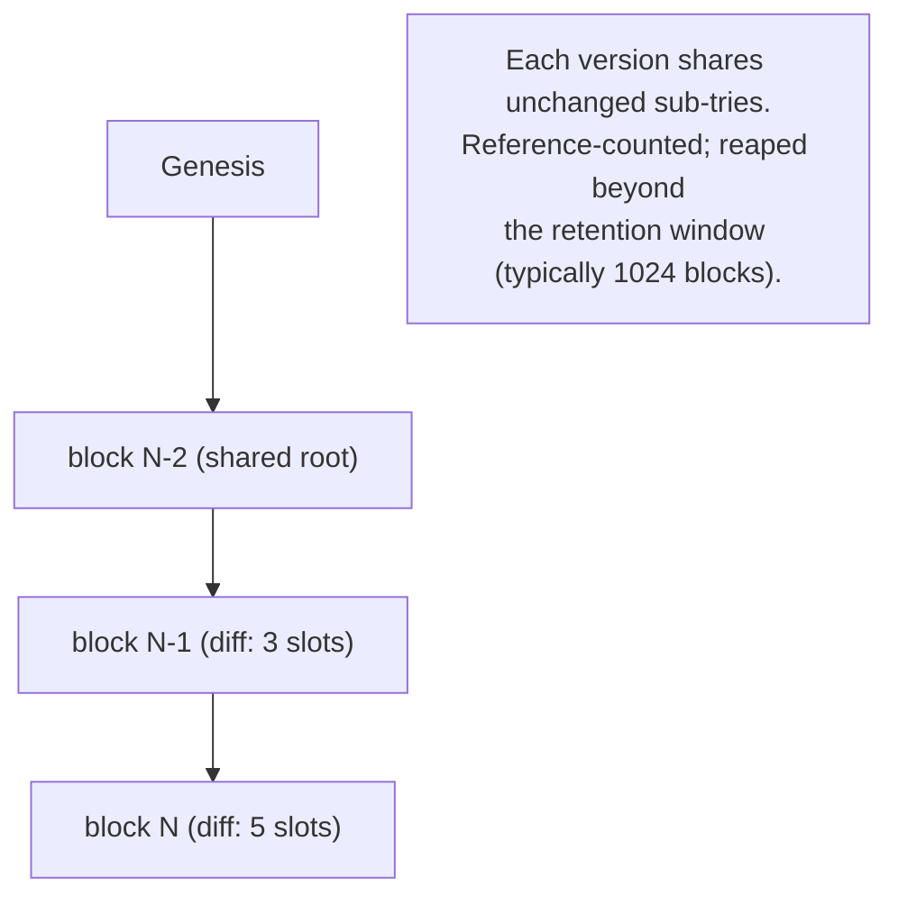

Light clients verify chain facts via Merkle proofs against a
trusted root. The witness server is what produces them. If your
witness server is slow, your whole light-client ecosystem is
slow - including bridges, fraud-proof systems, audit tooling.

Geth's eth_getProof RPC is the canonical "witness server" but it
runs cold against the LSM for every request - 100ms+ per proof
at scale. A dedicated witness server with hot-cached upper trie
levels gets the same proof in 1.5ms. The 67x speedup is what
makes light-client ecosystems viable.

## Proof generation

```rust tab=prove label=Rust
fn generate_proof(s: &Server, req: ProofRequest, arena: &mut Arena) -> ProofResponse {
    // Pin trie root at requested block. Versions are ref-counted;
    // pinning prevents GC of an in-flight proof's version.
    let root = s.versions.root_at(req.block_number)
        .ok_or(ProofError::BlockNotRetained)?;

    // Walk from root to key. Each level reads either from cache
    // (hot path) or LSM (cold path). The hot tier holds the
    // root + 5-6 levels; cold tier is the leaves.
    let mut path = TriePath::new(arena);
    let mut node = root;
    for nibble in nibbles_of(req.key) {
        let entry = s.cache.get_or_load(node, &s.lsm);
        path.push(entry.sibling_at(nibble));
        node = entry.child_at(nibble);
        if node.is_empty() {
            // Non-existence proof terminates here.
            return Ok(ProofResponse::nonexistent(path));
        }
    }
    let leaf = s.cache.get_or_load(node, &s.lsm);
    Ok(ProofResponse::existing(leaf.value(), path))
}
```
```java tab=prove label=Java
ProofResponse generateProof(Server s, ProofRequest req, Arena arena) {
    TrieRoot root = s.versions().rootAt(req.blockNumber())
        .orElseThrow(() -> new ProofException("block not retained"));
    TriePath path = new TriePath(arena);
    NodeHash node = root.hash();
    for (int nibble : nibblesOf(req.key())) {
        TrieEntry entry = s.cache().getOrLoad(node, s.lsm());
        path.push(entry.siblingAt(nibble));
        node = entry.childAt(nibble);
        if (node.isEmpty()) return ProofResponse.nonexistent(path);
    }
    TrieEntry leaf = s.cache().getOrLoad(node, s.lsm());
    return ProofResponse.existing(leaf.value(), path);
}
```

## The cache hierarchy

```mermaid
flowchart TB
  Req["Proof request<br/>(key, block_number)"]
  Req --> Root["versions.root_at(block)"]

  subgraph Hot["Hot tier (block-cache)"]
    direction TB
    L0["root + level 1"]
    L1["levels 2-6 (hot, ~32GB in cache)"]
  end

  subgraph Cold["Cold tier (LSM)"]
    L2["levels 7+ (mostly disk)"]
  end

  Root --> Hot
  Hot -- hit --> Path["build path"]
  Hot -- miss --> Cold
  Cold -- read --> Hot
  Cold --> Path
  Path --> Resp["proof response"]

  classDef hot fill:#152034,stroke:#9ec5ff
  classDef cold fill:#1f2128,stroke:#7a838f
  class Hot,L0,L1 hot
  class Cold,L2 cold
```



The hot tier is sized so 99% of trie walks never hit disk. A
typical mainnet trie has root + 5-6 hot levels (~8-32 GB in
cache); the cold tier is the LSM with N segments of deeper
sub-tries.

## Latency budget

| Step | Recipe perf | Per-proof cost (warm) | Per-proof cost (cold) |
|---|---|---|---|
| Inbound request | [MPSC poll p99 < 1us](/cookbook/recipes/subms-mpsc-queue) | ~300 ns | ~300 ns |
| Per-client rate-limit | [Rate limiter p99 < 100ns](/cookbook/recipes/subms-rate-limiter) | ~80 ns | ~80 ns |
| Per-level cache hit | [Block-cache get p99 < 100ns](/cookbook/recipes/subms-block-cache) | ~80 ns × 6 levels | (n/a) |
| Per-level LSM read | [LSM get p99 < 15us](/cookbook/recipes/subms-lsm-tree) | (n/a) | ~10 us × 10 levels |
| Arena scratch | [Arena p99 < 100ns](/cookbook/recipes/subms-arena-allocator) | ~50 ns | ~50 ns |
| Outbound push | [SPSC enqueue p99 < 1us](/cookbook/recipes/subms-spsc-ring-buffer) | ~200 ns | ~200 ns |
| Hist record | [HDR p99 < 100ns](/cookbook/recipes/subms-hdr-histogram) | ~80 ns | ~80 ns |

Warm proof: ~1.5us. Cold proof: ~100us. Production cache hit
rate >95% at the upper levels; cold-cache walks are rare and
amortised. Cache size IS the tuning knob; spend memory on it.

## Per-block versioning



The trie is persistent. Each block produces a new version
sharing most storage with the previous. Reference-counted;
versions older than the retention window are reaped by a
background GC thread.

## Per-tier policy

| Tier | Proofs/sec | Block retention | Use case |
|---|---|---|---|
| Free | 10 | Current block only | Light wallet client |
| Standard | 100 | Last 100 blocks | Bridge messenger |
| Pro | 1000 | Last 1024 blocks | Audit + analytics |
| Internal | unbounded | Last 8192 blocks | Fraud-proof watcher |

Heavier clients (fraud-proof watchers running thousands of
proofs/sec) need their own dedicated server instance OR a
massive rate-cap. Don't mix them with retail; they'll thrash
the cache.

## What makes a slow witness server

Bare geth `eth_getProof`:
- No hot cache; every proof walks LSM from disk
- No per-client rate limiting; one heavy client thrashes the cache
- Returns proof in JSON-RPC (heavy serialisation cost)

A dedicated witness server:
- Hot cache for upper trie levels
- Per-client rate-limit + per-client cache budget
- Binary proof format (1/3 the size of JSON)
- Per-block versioning for historical queries

Geth's `eth_getProof` works for low-volume use cases. A bridge
messenger doing 100 proofs/sec needs the dedicated server.

## Failures

**Proof against orphaned state.** Client requested proof at
block N; the server's local copy of block N had been reorged out
upstream but the server hadn't seen the reorg yet. Proof
verified against the orphaned root. Mitigation: cross-reference
finalised root from L1; refuse pre-finality proofs for
safety-critical use cases (bridges, fraud-proof watchers).

**Trie corruption from storage bug.** Disk subsystem returned
incorrect bytes for some LSM segments; the server constructed
invalid proofs. Light clients rejected; the server's reputation
crashed. Mitigation: continuous integrity check (re-hash random
samples against expected post-block root; alarm on mismatch).

**Cache poisoning.** Buggy prefetcher inserted wrong values into
the hot cache. Subsequent proofs used the poisoned entries.
Mitigation: sample-check cache entries against the underlying
LSM on read.

**DDoS via proof requests.** Malicious client requested proofs
at 100k/sec; cache thrashed; legitimate clients saw 100ms+
latency. Mitigation: per-client rate-limit; the limiter's
lock-free CAS is sub-microsecond.

**Stale state on startup.** Server initialised from a snapshot
that was 2 hours stale; sequencer pulled ahead; proofs returned
correct numbers but for OLD state. Mitigation: per-block sync
lag alarm; refuse proofs against states older than N blocks.

## Operational tuning

- **Cache size = working set of upper trie levels.** Production
  deployments tune from observed hit rate; typical: 8-32 GB of
  cache for the upper 5 levels of a 100GB trie.
- **State sync from trusted snapshot.** Initial sync from a
  snapshot taken on a vetted source (e.g. Offchain Labs for
  Arbitrum; OP Labs for Optimism). Subsequent sync from the
  sequencer's state-diff stream.
- **Per-tier dedicated instances.** Mix retail + pro tiers on
  one server only if you have explicit cache-budget isolation;
  otherwise run separate instances.
