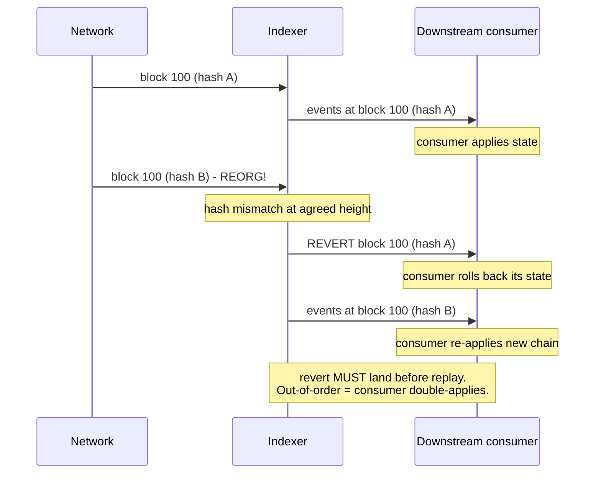

Every protocol has an indexer. Most are broken in subtle ways
you find out three days later, when your downstream consumer's
state has silently diverged from chain. A missed event here, a
duplicate event there, a reorg that didn't get propagated as a
revert. The Graph's hosted service had multiple instances of
this; The Graph hosted runs at a different scale than your
in-house indexer, but the failure modes are the same.

The shape that holds up: cross-RPC consensus (require 2-of-N
agreement on block hashes), LSM-backed archive (per-event keys
support point lookups and range scans), per-subscriber SPSC
rings (no slow consumer blocks the canonicaliser), explicit
revert signals on reorgs (downstream consumers can roll back
deterministically).

If you build one feature, build the reorg handling. The rest is
craftsmanship; reorgs are the make-or-break.

## The canonicaliser

```rust tab=canonicalise label=Rust
fn canonicalise(idx: &mut Indexer, block: BlockEvent, source: RpcSource) {
    // 1. Cross-RPC consensus. A single RPC's view is unreliable;
    // require 2-of-N for the block hash at this height. The 2
    // is operator-tunable; production prod runs use 3-of-5.
    idx.observations.insert((block.number, source.id, block.hash));
    if !idx.observations.has_consensus(block.number, 2) {
        return;  // waiting for another RPC to confirm
    }

    // 2. Reorg detection. Block hash mismatch on a previously-
    // agreed height = reorg. Common ancestor walk; emit revert
    // for the orphaned suffix.
    if let Some(prev) = idx.canonical_chain.get(block.number) {
        if prev.hash != block.hash {
            let range = prev.range_back_to_common_ancestor(&block);
            idx.emit_revert(range);
        }
    }
    idx.canonical_chain.set(block.number, block);

    // 3. Per-block touched-contracts bloom. Downstream consumers
    // use this to short-circuit their per-block sweeps. At 95%
    // skip rate this is what makes 1000+ subscribers tractable.
    let mut bloom = Bloom::new(block.logs.len() * 8);
    for log in &block.logs {
        bloom.insert(&log.address);
    }
    idx.touched_blooms.put(block.number, bloom);

    // 4. Per-event dedup. Cuckoo (not bloom) because the dedup
    // window slides; we need explicit delete on reorg.
    // 5. Decode + persist + fan-out.
    for log in &block.logs {
        if idx.event_dedup.contains(&log.hash()) { continue; }
        idx.event_dedup.insert(log.hash());
        let decoded = idx.abi_registry.decode(&log);
        idx.lsm.put(log.key(), decoded.serialise());
        for sub in idx.subscribers.iter() {
            if sub.interest.might_contain(&log.address) {
                sub.ring.push(decoded.clone_into(&sub.arena));
            }
        }
    }
}
```
```java tab=canonicalise label=Java
void canonicalise(Indexer idx, BlockEvent block, RpcSource source) {
    idx.observations().insert(block.number(), source.id(), block.hash());
    if (!idx.observations().hasConsensus(block.number(), 2)) return;

    Optional<BlockEvent> prev = idx.canonicalChain().get(block.number());
    if (prev.isPresent() && !prev.get().hash().equals(block.hash())) {
        idx.emitRevert(prev.get().rangeBackToCommonAncestor(block));
    }
    idx.canonicalChain().set(block.number(), block);

    Bloom bloom = Bloom.of(block.logs().size() * 8);
    for (Log log : block.logs()) bloom.insert(log.address());
    idx.touchedBlooms().put(block.number(), bloom);

    for (Log log : block.logs()) {
        if (idx.eventDedup().contains(log.hash())) continue;
        idx.eventDedup().insert(log.hash());
        DecodedEvent decoded = idx.abiRegistry().decode(log);
        idx.lsm().put(log.key(), decoded.serialise());
        for (Subscriber sub : idx.subscribers()) {
            if (sub.interest().mightContain(log.address())) {
                sub.ring().push(decoded.cloneInto(sub.arena()));
            }
        }
    }
}
```

## Reorg handling - the part everyone gets wrong



The revert signal must land BEFORE the replay. Downstream
consumers MUST process the revert as a synchronous step before
applying the new chain suffix. Without that:

- Consumer applies new events without rolling back
- State now reflects BOTH the orphaned blocks AND the new chain
- State is silently corrupt
- Discovery is forensic, weeks later

I've seen production indexers that emit revert AFTER the new
suffix because "it's faster." This is the bug. Speed isn't the
priority on reorg paths; correctness is.

## Latency budget

| Step | Recipe perf | Cost |
|---|---|---|
| Inbound MPSC | [MPSC poll p99 < 1us](/cookbook/recipes/subms-mpsc-queue) | ~300 ns |
| Consensus check | inline | ~80 ns |
| Event dedup | [Cuckoo p99 < 100ns](/cookbook/recipes/subms-cuckoo-filter) | ~100 ns |
| ABI decode (cached) | inline | ~3 us |
| ABI decode (cold) | inline | ~50 us (first time per contract) |
| LSM put | [LSM put p99 < 2us](/cookbook/recipes/subms-lsm-tree) | ~500 ns |
| Touched-bloom build (per block) | [Bloom p99 ~16ns/insert](/cookbook/recipes/subms-bloom-filter) | per-block |
| Interest test (per sub) | [Bloom p99 ~16ns](/cookbook/recipes/subms-bloom-filter) | M × 16 ns |
| Per-sub SPSC push | [SPSC enqueue p99 < 1us](/cookbook/recipes/subms-spsc-ring-buffer) | M × 200 ns |

At 1000 subs, 5 matching per event: ~5us per event on the
canonicaliser. The decoder is dominant; the steady-state with
hot ABI cache is ~3us per event. At 100k events/sec that's 300ms
of compute per second - 30% of one core. Fits.

## Cross-RPC vs single-RPC, why

| Setup | Reorg detection | Silent-drop catch | Cost |
|---|---|---|---|
| Single RPC | Trust whatever the RPC says | Cannot catch RPC drops | 1× RPC bill |
| 2-of-2 RPCs | Catches divergence; can't proceed during one RPC outage | Catches silent drops by either | 2× RPC bill |
| 2-of-3 RPCs (default) | Catches divergence; tolerates 1 RPC outage | Catches silent drops by 1 source | 3× RPC bill |
| 3-of-5 RPCs | Tolerates 2 outages | Catches silent drops by up to 2 sources | 5× RPC bill |

Production deployments run 2-of-3. The cost is real (RPC plans
aren't free) but the failure mode you avoid - silent drift -
costs orders of magnitude more.

## The Graph and what their failures teach

The Graph's hosted service had several incidents where indexers
fell behind during ingest spikes (e.g. NFT mint waves) and
downstream consumers read stale state for minutes. Their fix:
horizontal sharding by contract address + faster pickup
heuristics. Worth reading their postmortems if you're operating
at scale.

Lesson for in-house indexers: budget for ingest bursts. A normal
day might be 10k events/sec; an NFT-mint or DEX-launch day is
100k events/sec. The architecture must hold at the burst rate
or you're going to fall behind during the worst moments.

## Failures I've seen

**Single-RPC silent drop of a reorg.** Production indexer
subscribed to one RPC. That RPC quietly missed a chain reorg
(internal bug); the indexer never knew. Downstream state drifted
for ~6 hours before someone noticed via a different cross-check.
The fix is cross-RPC; pay for it.

**Replay double-counted because revert was missed.** Indexer
emitted revert events but the consumer wasn't subscribing to
the revert channel (only the events channel). Consumer applied
the new chain events without rolling back the orphaned ones.
State diverged. Mitigation: revert and event must come on the
SAME channel. Don't split them.

**ABI registry stale; new contract events undecoded.** New
contract deployed; its ABI hadn't been added to the registry;
the indexer treated the events as unparseable and dropped them.
Three days before someone noticed analytics weren't reflecting
the new contract. Mitigation: undecoded events queued for
retro-decode; ABI hot-reload watches the registry.

**LSM compaction during an ingest burst.** Indexer's LSM had a
compaction kick off during a mint wave; the compaction
serialised against ongoing writes; ingest latency p99 spiked
from 5us to 200ms; consumers fell behind. Mitigation: tune the
LSM's compaction trigger to be aware of write load; defer
compaction during bursts.

## Operational defaults

- **3 RPC sources, 2-of-3 consensus.** Production default.
- **128-block reorg horizon.** Beyond this, no rollback signal
  emitted; downstream consumers treat data as final.
- **Per-subscriber ring depth 1024.** Tolerates 100ms of fall-
  behind at 10k events/sec.
- **LSM segment size 64MB.** Larger = fewer files + slower
  compaction; smaller = more files + faster compaction.
- **Audit retention 7 days.** Compliance-driven; tune per
  regulatory requirement.
