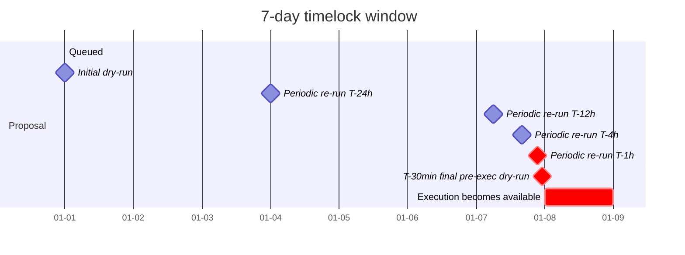

The timelock IS the security property of governance contracts.
But it's meaningless if nobody actually reviews during the window.
Most protocols don't, until they get burned. Then they automate
it. This topic is the automation.

Beanstalk got drained for $182M because their timelock was 24h
and the proposal description didn't match the implementation -
a malicious proposal granted emergency-execute powers, and
nobody noticed during the 24h window because nobody dry-ran it.
Loss: protocol-existential. Every modern protocol should run
this watcher; many still don't.

## The monitor's lifecycle

```rust tab=lifecycle label=Rust
fn on_proposal_queued(mon: &mut Monitor, p: Proposal) {
    let unlock = p.queue_time + p.timelock_duration;
    // Schedule alerts across the window. The T-1h is the loudest;
    // unacknowledged alerts at T-30min escalate to SMS.
    mon.wheel.schedule(p.id, p.queue_time + Duration::minutes(5), Stage::Initial);
    for h in [24, 12, 4, 1] {
        mon.wheel.schedule(p.id, unlock - Duration::hours(h), Stage::PeriodicReview);
    }
    mon.wheel.schedule(p.id, unlock - Duration::minutes(30), Stage::PreExecution);
    mon.active.insert((unlock, p.id));
}

fn on_timer_fired(mon: &mut Monitor, p_id: ProposalId, stage: Stage) {
    let p = mon.active.get(p_id);
    let mut arena = Arena::with_capacity(8192);

    // Dry-run via the simulator. Trace level: CallFrames so we
    // see the call tree. Standard sim cost is ~30-50ms.
    let sim_req = SimRequest {
        tx: p.encoded_calls.clone(),
        block_number: mon.current_block(),
        trace_level: TraceLevel::CallFrames,
    };
    let sim = mon.simulator.run(sim_req);

    // Run the state-diff through the watcher's rules.
    let verdicts = mon.diff_watcher.evaluate(&sim.state_diff, &sim.events);

    let unexpected: Vec<_> = verdicts.iter().filter(|v| v.is_unexpected()).collect();
    if !unexpected.is_empty() {
        mon.alarm.fire(p_id, stage, unexpected, &mut arena);
    }
    // Re-run divergence check: did this dry-run produce a
    // different result than the previous one? If so, base state
    // has shifted in a way that affects the proposal.
    if let Some(prev) = mon.last_dry_run(p_id) {
        if sim.state_diff.diverges_materially(&prev.diff) {
            mon.alarm.fire_divergence(p_id, stage, &mut arena);
        }
    }
    mon.audit.record(p_id, stage, sim, verdicts);
    arena.reset();
}
```
```java tab=lifecycle label=Java
void onProposalQueued(Monitor mon, Proposal p) {
    Instant unlock = p.queueTime().plus(p.timelockDuration());
    mon.wheel().schedule(p.id(), p.queueTime().plus(Duration.ofMinutes(5)), Stage.INITIAL);
    for (int h : new int[]{24, 12, 4, 1}) {
        mon.wheel().schedule(p.id(), unlock.minus(Duration.ofHours(h)), Stage.PERIODIC_REVIEW);
    }
    mon.wheel().schedule(p.id(), unlock.minus(Duration.ofMinutes(30)), Stage.PRE_EXECUTION);
    mon.active().insert(unlock, p.id());
}

void onTimerFired(Monitor mon, ProposalId pId, Stage stage) {
    Proposal p = mon.active().get(pId);
    Arena arena = Arena.withCapacity(8192);
    SimRequest req = new SimRequest(p.encodedCalls(), mon.currentBlock(), TraceLevel.CALL_FRAMES);
    SimResult sim = mon.simulator().run(req);
    List<RuleVerdict> verdicts = mon.diffWatcher().evaluate(sim.stateDiff(), sim.events());
    List<RuleVerdict> unexpected = verdicts.stream().filter(RuleVerdict::isUnexpected).toList();
    if (!unexpected.isEmpty()) mon.alarm().fire(pId, stage, unexpected, arena);
    mon.lastDryRun(pId).ifPresent(prev -> {
        if (sim.stateDiff().divergesMaterially(prev.diff())) {
            mon.alarm().fireDivergence(pId, stage, arena);
        }
    });
    mon.audit().record(pId, stage, sim, verdicts);
    arena.close();
}
```

## The schedule



Each fired timer runs a fresh dry-run. The repeat is intentional:
the chain state at queue time differs from the chain state at
unlock. A proposal that's safe at queue might be unsafe at unlock
because of intermediate state changes. The divergence detection
catches this.

## Alarm escalation

| Stage | Alarm channel | Operator response |
|---|---|---|
| Initial (T+5min) | Slack/dashboard | Review queue entry |
| Periodic re-run (T-24h, T-12h, T-4h, T-1h) | Slack + email | Acknowledge each |
| Divergence between dry-runs | Pager (paged response) | Investigate cause |
| Pre-execution (T-30min) | SMS + phone for unacknowledged earlier | Acknowledge or cancel |
| Post-execution mismatch with last dry-run | All channels | Immediate forensic |

Unacknowledged operator alerts escalate. The escalation pattern
is the operator's accountability surface; an operator who lets a
T-1h pass without acknowledging gets paged personally at T-30min
+ SMS at T-15min + phone at T-5min. Don't soften this.

## Latency budget

| Step | Recipe perf | Cost |
|---|---|---|
| Timer fire | [Timer-wheel schedule p99 < 100ns](/cookbook/recipes/subms-timer-wheel) | ~50 ns |
| Proposal lookup | [Treap lookup p99 < 1us](/cookbook/recipes/subms-treap) | < 1 us |
| Simulator call | [Simulator](./simulator) | ~30 ms (5-call proposal) |
| Rule evaluation | [State-diff watcher](./state-diff-watcher) | ~5 ms per 100 mutations |
| Inbound event drain | [MPSC poll p99 < 1us](/cookbook/recipes/subms-mpsc-queue) | per event |
| Arena reset | [Arena p99 < 100ns](/cookbook/recipes/subms-arena-allocator) | ~50 ns |
| Hist record | [HDR p99 < 100ns](/cookbook/recipes/subms-hdr-histogram) | ~80 ns |

Per-dry-run: ~35-50ms. The 100ms budget is for heavier proposals
(10+ contract calls); typical DeFi governance proposals are 1-3
calls.

## The Beanstalk lesson

Beanstalk's timelock was 24h. The malicious proposal description
was "BIP-18: Solidly Improbable" - benign-sounding governance
text. The implementation: grant emergency-execute powers to a
contract under attacker control. Nobody noticed during the 24h
window. Attacker executed, drained $182M.

What would have prevented it: a dry-run watcher reading the
proposal's call tree. The first dry-run would have shown
"Grant role EMERGENCY_GOVERNOR to 0xATTACKER" in the call frame
trace. The state-diff rule for the governance contract would
have flagged "the roles mapping shouldn't grant EMERGENCY_GOVERNOR
to anything other than known operator addresses" as
`Unexpected`. The operator would have been paged. The proposal
would have been cancelled by the multisig.

Beanstalk has since added exactly this. Don't wait for your
incident to add it.

## Failures the watcher itself can have

**Dry-run mismatches actual execution.** Simulator's chain state
was stale by 10 minutes; the real execution at unlock used the
fresh state; results differed. Mitigation: T-30min pre-exec
dry-run + post-execution comparison; mismatch is the immediate
alarm.

**Operator misses T-1h alarm.** The escalation path saved the
day: SMS at T-30min, phone at T-15min. Operator acknowledged at
T-12min, cancelled the proposal. Don't soften escalation; the
hour you save is the hour an attacker exploits.

**Coordinated multi-proposal attack.** Three benign-looking
proposals queue simultaneously; individually each passes the
rule check; combined, they enable the attack. Mitigation:
cross-proposal dry-run that evaluates the COMBINED effect when
proposals overlap in their execution window.

**Auto-rule-generation produced a bad rule.** Team had a tool
that auto-generated state-diff rules from contract source. The
tool emitted a rule with `direction: any`, which silently
allowed all mutations. Three weeks before someone audited. Lint
your rules; review generated output the same as hand-authored.

## What you defer to v2

- **Multi-stage alarms with PagerDuty integration.** v0 uses
  Slack + email; SMS via Twilio. PagerDuty's incident
  management is the next layer.
- **Cross-proposal evaluation.** v0 runs each proposal
  independently. v2 evaluates pairs/triples of overlapping
  proposals together.
- **Auto-rule-generation from Solidity source.** Manual rules
  in a repo. Auto-generation is a v2 ML/static-analysis layer.

What you can't defer: the dry-run schedule itself, the
divergence-between-runs check, the escalation. These are the
spine.
