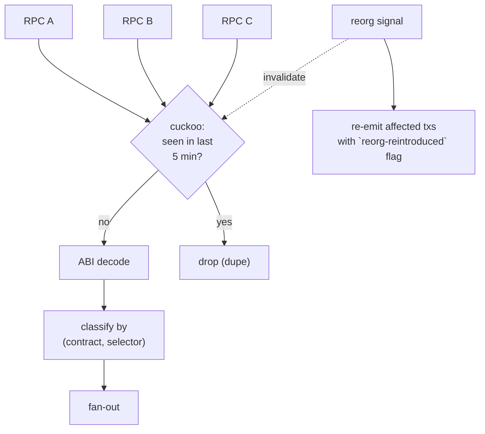

If you're building a searcher and your mempool-to-bundle latency
is north of 30ms, you're not in the game. The winners operate at
5ms. The losers chalk it up to "private orderflow we can't see;"
the truth is mostly that they're 25ms slower on the public
mempool and they didn't measure where the time went.

The mempool watcher is the input to a [searcher's bundle
assembly](../layer-1/mev-bundle-assembly). It pulls pending txs
from N RPCs, dedups cross-source, ABI-decodes via the registry,
classifies by `(contract, function_selector)`, and fans the
classified events to per-subscriber rings. Sub-5ms is the table
stake; sub-2ms is competitive.

## The pipeline

```rust tab=ingest label=Rust
fn ingest(w: &mut Watcher, tx: PendingTx, source: RpcSource) {
    // Cuckoo dedup. Same tx hash from multiple RPCs = drop.
    // Cuckoo over bloom because the dedup window slides; you
    // need explicit delete for drop-then-rebroadcast handling.
    if w.dedup.contains(&tx.hash) { return; }
    w.dedup.insert(tx.hash);

    // ABI decode. Cached for known contracts (~3us). Cold path
    // (~50us) goes into the unknown queue for retro-decode once
    // the ABI lands. Don't blind-decode against the wrong ABI;
    // you'll classify cross-contract calls incorrectly.
    let decoded = match w.abi_registry.decode(&tx) {
        Some(d) => d,
        None    => {
            w.unknown_queue.push(tx);
            return;
        }
    };

    // Per-contract pending index. Downstream consumers query
    // "what's pending against contract X right now?" via this.
    w.by_contract.insert((decoded.contract, decoded.tx_hash));

    // Fan to per-subscriber rings. Interest bloom filters first;
    // 95% of subscribers don't care about any given event.
    for sub in w.subscribers.iter() {
        if !sub.interest.might_contain(&decoded.contract) { continue; }
        if !sub.rate_limiter.try_acquire() { continue; }
        sub.ring.push(decoded.clone_into(&sub.arena));
    }
    w.hist.record(now_ns() - tx.observed_at);
}
```
```java tab=ingest label=Java
void ingest(Watcher w, PendingTx tx, RpcSource source) {
    if (w.dedup().contains(tx.hash())) return;
    w.dedup().insert(tx.hash());
    Optional<DecodedTx> decoded = w.abiRegistry().decode(tx);
    if (decoded.isEmpty()) {
        w.unknownQueue().push(tx);
        return;
    }
    DecodedTx d = decoded.get();
    w.byContract().insert(d.contract(), d.txHash());
    for (Subscriber sub : w.subscribers()) {
        if (!sub.interest().mightContain(d.contract())) continue;
        if (!sub.rateLimiter().tryAcquire()) continue;
        sub.ring().push(d.cloneInto(sub.arena()));
    }
    w.hist().record(System.nanoTime() - tx.observedAt());
}
```

## The 5ms breakdown

Where the time goes in a competitive watcher:

| Step | Recipe perf | Time | Note |
|---|---|---|---|
| RPC subscription receive | network | 1-2 ms | The biggest variable; pick low-latency providers |
| Inbound MPSC | [MPSC poll p99 < 1us](/cookbook/recipes/subms-mpsc-queue) | ~300 ns | |
| Cuckoo dedup | [Cuckoo p99 < 100ns](/cookbook/recipes/subms-cuckoo-filter) | ~100 ns | |
| ABI decode (cached) | inline | ~3 us | Function-selector dispatch + arg parsing |
| Per-contract ART insert | [ART insert p99 < 1us](/cookbook/recipes/subms-adaptive-radix-tree) | ~800 ns | |
| Per-sub interest test | [Bloom p99 ~16ns](/cookbook/recipes/subms-bloom-filter) | ~16 ns per sub |
| Per-sub rate-limit | [Rate limiter p99 < 100ns](/cookbook/recipes/subms-rate-limiter) | ~80 ns per sub |
| Per-sub SPSC push | [SPSC enqueue p99 < 1us](/cookbook/recipes/subms-spsc-ring-buffer) | ~200 ns per matching sub |
| Hist record | [HDR p99 < 100ns](/cookbook/recipes/subms-hdr-histogram) | ~80 ns |

5ms target with 1-2ms in RPC network = 3-4ms budget for the
watcher itself. At 100 subs, 5 matching per event: ~5us of
watcher CPU work. The remaining 3-4ms is mostly slack you don't
use; the tight constraint is the RPC subscription path.

Buy low-latency RPC. Run colos for the absolute lowest latency.
If you're not running colos and your competitors are, you've
already lost.

## Cross-RPC dedup window



5 minutes is the typical dedup window. Shorter = miss legitimate
late-arriving dupes; longer = more memory + less reactive to
re-broadcasts.

## Drop event taxonomy

When a previously-pending tx leaves the mempool, the watcher
emits a drop event. Reasons:

| Reason | Default action |
|---|---|
| `mined` | Tx included in a block; emit `(tx_hash, block_number)` drop |
| `replaced` | Same `(sender, nonce)` got a higher-fee tx; emit drop + replacement hash |
| `ttl-expired` | Pending > N minutes without inclusion; emit drop |
| `reorg-orphaned` | Mined but the block got reorged out; emit `reorg-reintroduced` |

The drop taxonomy is the consumer's reconciliation surface.
Consumers that care about mempool state (MEV bots, frontend sim)
need to know the difference between "this tx is gone because it
mined" and "this tx is gone because someone bumped its fee."

## Three failures

**Slow RPC sourced events 100ms late.** Watcher subscribed to a
free-tier RPC service. Latency from-network-broadcast to RPC-
emit was ~100ms. Watcher was always behind competitors using
paid-tier RPCs. Mitigation: cross-source from paid + free; the
faster source's events win the dedup. Cost is the paid-RPC bill;
the alternative is losing every race.

**Drop-then-rebroadcast misclassified as duplicate.** A user's
tx got dropped from a peer's mempool (gas-price-too-low), came
back 30 seconds later after they bumped. Same hash. Watcher's
dedup said "already seen." Downstream consumer thought the tx
was still in its original pending state. Mitigation: cuckoo's
delete on drop-event emission. A dropped tx's hash is removed
from dedup; the next arrival is a fresh event.

**Slow subscriber blocked ingest.** Watcher used a shared queue
for all subscribers. One subscriber stopped reading (their
client crashed). The shared queue filled. The publisher
back-pressured. Watcher's ingest stalled. Mitigation: per-
subscriber SPSC rings (same shape as
[market-data-fanout](../defi/market-data-fanout)); one slow
subscriber falls behind alone.

## What you defer to v2

- **Private orderflow ingest.** Some searchers subscribe to
  private channels (orderflow auctions, direct user
  connections). v0 ships public-mempool only.
- **MEV-Boost relay integration.** Bundles from other searchers
  submitted via relays; if you're watching for them you need a
  relay subscription. v0 doesn't need this.
- **Multi-chain.** v0 ships one chain (typically Ethereum
  mainnet). Multi-chain is a duplicate-the-pipeline problem,
  not a new-architecture problem.

What you can't defer: cross-RPC dedup, ABI decode caching,
per-subscriber rings. These are the spine.
