The naive simulator is geth running in a goroutine per request.
It gets 2 req/s and OOMs at hour three. The OOM is because each
request loads its own state replica; the slowness is because
each loads the WHOLE state, which is hundreds of GB at mainnet
scale.

Production simulators share the base state across simulations.
Each request gets a per-simulation overlay arena - writes go to
the overlay; reads check overlay first then base. The overlay is
freed as a unit when the simulation completes. No memory leaks,
no state contamination, no per-simulation full load.

Used by: MEV bots (verify counter-bundle profit before
committing), transaction batchers (verify batched cost),
frontends (pre-flight tx sims for "this would revert because X"
user feedback), risk dashboards (project keeper cost during a
cascade).

## The simulation, in code

```rust tab=sim label=Rust
fn simulate(sim: &mut Simulator, req: SimRequest) -> SimResult {
    // Per-simulation overlay arena. Reads cascade through:
    //   overlay (this sim's pending writes) -> base (shared LSM)
    // Writes go to overlay only. Free overlay as a unit on return.
    let mut overlay = OverlayArena::new(8192);

    // Pin base state at the requested block. Versions are
    // reference-counted; pinning prevents the GC from reaping
    // mid-simulation.
    let base = sim.base_state.view_at(req.block_number);

    // Run the EVM. The execution-state combines (base, overlay).
    let exec_state = ExecutionState::new(&base, &mut overlay);
    let result = sim.evm.execute(&req.tx, exec_state, req.trace_level);

    SimResult {
        gas_used:    result.gas_used,
        status:      result.status,
        state_diff:  overlay.dump(),  // the overlay IS the diff
        events:      result.events,
        trace:       result.trace,
        block:       req.block_number,
    }
    // overlay drops here -> arena freed as one operation
}
```
```java tab=sim label=Java
SimResult simulate(Simulator sim, SimRequest req) {
    OverlayArena overlay = OverlayArena.of(8192);
    try {
        StateView base = sim.baseState().viewAt(req.blockNumber());
        ExecutionState exec = new ExecutionState(base, overlay);
        EvmResult result = sim.evm().execute(req.tx(), exec, req.traceLevel());
        return new SimResult(
            result.gasUsed(),
            result.status(),
            overlay.dump(),
            result.events(),
            result.trace(),
            req.blockNumber()
        );
    } finally {
        overlay.close();
    }
}
```

## The overlay model

```mermaid
flowchart TB
  Base["Base state (shared)<br/>LSM + block-cache hot tier<br/>~200GB on disk + ~32GB in cache"]

  subgraph Sim1["Simulation 1 (arena)"]
    O1["slot A = 100"]
    O2["slot B = 50"]
  end

  subgraph Sim2["Simulation 2 (arena)"]
    O3["slot A = 200"]
    O4["slot C = 75"]
  end

  Sim1 -- read fallthrough --> Base
  Sim2 -- read fallthrough --> Base

  Note["Sim1 doesn't see Sim2's writes.<br/>Sim2 doesn't see Sim1's writes.<br/>Both see the same base state.<br/>Per-sim overhead: one allocation + one deallocation."]

  classDef sim fill:#152034,stroke:#9ec5ff
  class Sim1,Sim2 sim
```



The arena makes this efficient. Per-overlay memory is bounded
by the simulation's touched slots; freeing is one pointer
rewind. The base is shared - no copy needed.

## Trace levels

| Level | Captures | Overhead | Use |
|---|---|---|---|
| 0 | Gas, status, count of slots touched | ~1ms baseline | Eligibility check (does this tx revert?) |
| 1 | + events + state diff | +2-5ms | Standard DeFi sim (the default) |
| 2 | + per-call frame trace | +10ms | Multi-call debug |
| 3 | + opcode-level + memory snapshots | +50ms, 10x output | Deep debug only |

Clients request what they need. The instrumentation pass is
gated on the level - cheaper levels skip the more expensive
bookkeeping entirely. Don't always default to level 3 because
"it's safer to have more data" - that costs 25x throughput.

## Latency budget

| Step | Recipe perf | Cost (warm) | Cost (cold) |
|---|---|---|---|
| Request drain | [MPSC poll p99 < 1us](/cookbook/recipes/subms-mpsc-queue) | ~300 ns | ~300 ns |
| Overlay arena alloc | [Arena p99 < 100ns](/cookbook/recipes/subms-arena-allocator) | ~50 ns | ~50 ns |
| Base read (cache hit) | [Block-cache get p99 < 100ns](/cookbook/recipes/subms-block-cache) | ~80 ns × slots | (n/a) |
| Base read (cache miss) | [LSM get p99 < 15us](/cookbook/recipes/subms-lsm-tree) | (rare) | ~10 us × slots |
| EVM opcode execution | external | varies | varies |
| Trace serialise (lvl 1) | inline | ~10 us | ~10 us |
| Result push | [SPSC enqueue p99 < 1us](/cookbook/recipes/subms-spsc-ring-buffer) | ~200 ns | ~200 ns |
| Overlay free | [Arena p99 < 100ns](/cookbook/recipes/subms-arena-allocator) | ~50 ns | ~50 ns |

A simple DeFi swap at warm cache: ~3ms. Cold cache: ~25ms. The
cache hit rate is the dominant lever; spend memory on cache.

## Why people get the cache wrong

Naive cache: LRU per slot, sized for "the working set." Doesn't
work. The trie's UPPER levels are touched by every simulation -
they're hot. The leaves are touched once per simulation - cold
per-slot but the simulation needs them. An LRU treats both
equally.

Production simulators use a hierarchical cache: hot tier for
the root + top ~6 levels (~10GB), cold tier for the leaves
(falls through to LSM). The hot tier is sized so 99% of trie
walks never hit disk.

## Forks-of-forks

A simulation that itself forks for "what if A happens then B"
analysis:

```rust
// MEV bot pattern: simulate target tx (fork 1), then simulate
// counter-bundle against the post-fork state (fork 2).
let sim1 = sim.simulate(target_tx)?;
let sim2 = sim.simulate_against(&sim1, counter_bundle)?;
```

Each nested fork is its own arena. Reads cascade through all
parent overlays + the base. The cost is N × arena, where N is
nesting depth; production deployments bound depth to ~10.

## Failures

**OOM on per-sim full state copy.** Day-one team built the
simulator as "fork the full state per request." 200GB per
request × 100 concurrent = 20TB needed. OOM in 30 minutes.
Migrated to shared-base + overlay. Don't repeat this.

**State sync fell behind sequencer.** Simulator's base lagged
the chain by hours. Sims returned correct results for stale
state. MEV bot acted on outdated assumptions. Lost capital.
Mitigation: per-block sync lag alarm; refuse simulations against
states older than N blocks.

**Trace mismatch vs real execution.** Simulator returned status
=success on a tx that actually reverted on-chain. Cause: simu's
EVM was a different version than the L1 client's EVM. Cancun
hardfork had landed; simulator didn't have it. Mitigation:
continuous cross-check (sample N% of real on-chain txs +
simulate + compare); alarm on mismatch.

**Overlay leak.** Try/finally was wrong; overlay arena freed
only on success path, not on revert/panic. Memory grew. Found
out at 24h uptime. Mitigation: arena is dropped in destructor
(Rust) or try-with-resources (Java); never manual close.

## What MEV bots actually do

The simulator's heaviest user. Patterns:

| Pattern | What it sims |
|---|---|
| Sandwich | `(sw_buy, user_tx, sw_sell)` against current state |
| Back-run | `(user_tx, arb_to_pool_b)` against post-user-tx state |
| Liquidation race | `(liquidate_call)` against current state, profit = liquidation_fee |
| Cross-pool arb | `(buy_pool_a, sell_pool_b)` against current state |

Each pattern hits the simulator at ~30ms per evaluation. The
bot pre-classifies opportunities (in [mempool-watcher](./mempool-watcher))
to avoid simulating obviously-unprofitable ones.

## Tier policy

| Tier | Sims/sec | Block retention | Use case |
|---|---|---|---|
| Free | 10 | Latest only | Frontend pre-flight |
| Standard | 100 | Last 100 blocks | Strategy research |
| Pro | 1000 | Last 1024 blocks | MEV searcher |
| Internal | unbounded | Last 8192 blocks | Audit, risk projection |
