Events are advertisements. Storage mutations are the truth. If a
vault's `totalAssets` slot changes without a `Deposit` or
`Withdraw` event firing, either the contract has a bug OR the
contract's been bypassed. Either case is silent to event-based
monitoring; you only find out via reconciliation that surfaces
the discrepancy. This topic surfaces it in real-time.

The watcher is rule-based. Each `(contract, slot)` pair has 0+
expectations: "this slot changes only via these functions, in
these directions." A diff that doesn't match its rule = alarm.
Production deployments monitor 100-2000 contracts × 5-20 slots
each. The work is proportional to the number of rules, but most
mutations don't match any watched slot, so the filter cost is
near-zero.

## The rule evaluation

```rust tab=check label=Rust
fn check_mutation(w: &Watcher, m: SlotMutation, block: &Block) -> RuleVerdict {
    // Bloom short-circuit. At 10k watched (contract, slot) pairs,
    // bloom probe is ~16ns; full ART lookup is ~800ns. Bloom
    // skips 99% of out-of-scope mutations in 16ns each.
    if !w.watchlist_bloom.might_contain(&(m.contract, m.slot)) {
        return RuleVerdict::OutOfScope;
    }
    let rules = match w.watchlist.get((m.contract, m.slot)) {
        Some(r) => r,
        None    => return RuleVerdict::OutOfScope,  // bloom FP
    };

    for rule in rules {
        let caller_match = rule.expected_callers.iter().any(|c| {
            block.had_call_to(m.contract, c.function_selector)
        });
        let direction_match = match (rule.direction, m.direction()) {
            (Direction::Any, _) => true,
            (Direction::Increase, Some(true))  => true,
            (Direction::Decrease, Some(false)) => true,
            _ => false,
        };
        if caller_match && direction_match {
            return RuleVerdict::Expected;
        }
    }

    // No rule matched. Check upgrade exemption before alarming.
    if rules.iter().any(|r| r.upgrade_exemption) && block.is_upgrade_tx() {
        return RuleVerdict::ExemptUpgrade;
    }

    // The bad case. State changed in a way no rule allows.
    // Operator gets paged.
    RuleVerdict::Unexpected
}
```
```java tab=check label=Java
RuleVerdict checkMutation(Watcher w, SlotMutation m, Block block) {
    if (!w.watchlistBloom().mightContain(m.contract(), m.slot())) {
        return RuleVerdict.OUT_OF_SCOPE;
    }
    Optional<List<Rule>> rulesOpt = w.watchlist().get(m.contract(), m.slot());
    if (rulesOpt.isEmpty()) return RuleVerdict.OUT_OF_SCOPE;
    List<Rule> rules = rulesOpt.get();
    for (Rule rule : rules) {
        boolean callerMatch = rule.expectedCallers().stream()
            .anyMatch(c -> block.hadCallTo(m.contract(), c.functionSelector()));
        boolean dirMatch = switch (rule.direction()) {
            case ANY      -> true;
            case INCREASE -> m.directionIsIncrease().orElse(false);
            case DECREASE -> !m.directionIsIncrease().orElse(true);
        };
        if (callerMatch && dirMatch) return RuleVerdict.EXPECTED;
    }
    if (rules.stream().anyMatch(Rule::upgradeExemption) && block.isUpgradeTx()) {
        return RuleVerdict.EXEMPT_UPGRADE;
    }
    return RuleVerdict.UNEXPECTED;
}
```

## Rule format

```yaml
contract: 0xDeadBeef0123...
slot: 0x0                  # canonical totalAssets storage slot
expected_callers:
  - function: deposit(uint256,address)
    direction: increase
  - function: withdraw(uint256,address,address)
    direction: decrease
  - function: redeem(uint256,address,address)
    direction: decrease
upgrade_exemption: true     # accepts mutations during upgrade txs
```

Rules are versioned alongside the contract code. A contract
upgrade requires a matching rule update OR the rule is marked
stale + the watcher pages. Rule files live in a repo; reviews
gate rule additions. Don't let one engineer ship a rule without
review; the rule's correctness IS the security check.

## The pipeline

```mermaid
flowchart LR
  Diff["Per-block diff (RPC)"]
  Diff --> MPSC[MPSC]
  MPSC --> Canon["Canonicaliser"]

  Canon --> Filter["watchlist bloom"]
  Filter -- pass --> Rule["walk rule treap"]
  Filter -- skip --> Drop["out of scope (99%)"]

  Rule --> Verdict{verdict}
  Verdict -- expected --> Audit["record + ok"]
  Verdict -- unexpected --> Alarm["page operator<br/>+ audit"]
  Verdict -- exempt-upgrade --> Audit

  Audit --> Lsm[("audit log<br/>LSM")]
  Alarm --> Pager["operator paging"]
  Alarm --> Lsm

  classDef bad fill:#2e1a25,stroke:#ff5f8a
  class Alarm bad
```



## Latency budget

| Step | Recipe perf | Per-block cost |
|---|---|---|
| New-block event drain | [MPSC poll p99 < 1us](/cookbook/recipes/subms-mpsc-queue) | per-block |
| Per-mutation bloom test | [Bloom p99 ~16ns](/cookbook/recipes/subms-bloom-filter) | N_mutations × 16 ns |
| Watchlist ART lookup | [ART lookup p99 < 1us](/cookbook/recipes/subms-adaptive-radix-tree) | N_match × 800 ns |
| Rule treap walk | [Treap lookup p99 < 1us](/cookbook/recipes/subms-treap) | N_match × N_rules × 150 ns |
| Audit-log write | [LSM put p99 < 2us](/cookbook/recipes/subms-lsm-tree) | ~500 ns |
| Hist record | [HDR p99 < 100ns](/cookbook/recipes/subms-hdr-histogram) | ~80 ns |

A block with 2000 mutations × 16ns bloom = 32us. Of those, 50
match the watchlist × 800ns ART lookup = 40us. Plus rule walks
~20us. Total ~92us per block. Inside 10ms budget by orders of
magnitude; the budget exists for post-upgrade blocks with
thousands of matching mutations.

## When rule-based monitoring fails

The model assumes: "this slot only changes via these specific
functions." When that's not true, rule-based monitoring is the
wrong tool:

- **User-input mappings.** A slot inside an `mapping(address =>
  uint256)` that any user can write to via `setMyValue()`. No
  rule constrains that; the rule would just say "any caller, any
  direction." Useless. Don't add such slots to the watchlist;
  use event-based reconciliation instead.
- **Internal scratch slots.** Storage used as transient state
  within a function. Changes constantly; no semantic rule
  applies. Skip.
- **Proxy admin functions.** Upgrades rewrite many slots. The
  `upgrade_exemption: true` flag handles the common case; for
  truly heterogeneous upgrades, a specific upgrade-time bypass
  is needed.

What rule-based monitoring IS good at:

- Slots that represent semantic invariants (vault.totalAssets;
  governor.timelock; insuranceFund.balance)
- Slots that change in response to specific public functions
  with known direction
- Cross-slot invariants ("slot A AND slot B must move together")
  - cross-slot rules are more complex; production deployments
  typically build these into a separate "invariant checker"
  topic.

## Failures I've watched

**Slot layout drift between contract versions.** Contract was
upgraded; storage layout changed; rule's slot number now
referred to a different field. Watcher fired thousands of false
alarms. Mitigation: rules are stamped against the contract's
deployed code hash; upgrade without matching rule update = alarm.

**Rule with `direction: any` was useless.** Engineer added a
rule "slot 42 changes only via function X" with `direction:
any`. Function X had two code paths; one increased the slot,
one decreased. Both produced expected mutations, so the rule
never fired. Then a third path - a NEW function added without
rule update - also wrote slot 42; rule "matched" because of
`direction: any`. Mitigation: lint requires explicit direction;
`any` requires extra justification.

**Bloom false-positive triggers expensive walks.** Bloom said
"watchlist entry maybe present;" walk found no rule; ~800ns
wasted. At 2000 mutations × 1% FP = 20 spurious walks per
block. Acceptable. Don't tune the bloom to FP-rate zero; the
walk cost is bounded.

## What you defer to v2

- **Cross-slot rules.** v0 evaluates per-slot independently.
  v2 introduces cross-slot constraint checking ("slot A's value
  must equal slot B's value" or similar).
- **Time-based rules** ("slot must increase monotonically over
  N blocks"). v0 just compares to previous-block value.
- **Auto-rule-generation** from contract source code analysis.
  v0 has hand-authored rules in a repo. v2 would parse Solidity
  to propose rules.

What you can't defer: bloom short-circuit, rule version stamping
against contract code hashes, upgrade exemption handling, audit
log. These are the spine.
