The ERC-4626 inflation attack has been documented since at least
2022. New protocols still ship with the attack vector open. The
attack: deposit 1 wei to get 1 share, donate large balance directly
to the contract, ratio is now grotesquely skewed, next user's small
deposit rounds down to zero shares but gives away the deposit
amount. The fix on-chain is well-known (mint dead shares, require
minimum initial deposit). The fix the protocol team OFTEN forgets:
the reconciler that catches the attack signature when it happens
anyway.

The reconciler reads `totalAssets()` on-chain, reads the actual
ERC-20 balance held by the vault, computes the implied
share-to-asset ratio, compares to the previous block. Any drift
past a per-asset-class threshold = alarm + freeze deposits in the
UI. Five minutes from attack signature to operator paging. The
on-chain contract is unchanged - the freeze is a frontend gate.

## The reconcile loop

```rust tab=reconcile label=Rust
fn reconcile_block(rec: &mut Reconciler, block: BlockHeader) {
    // Touched-contracts bloom from the event indexer. Most vaults
    // don't change every block; the bloom is the fast-path filter.
    // At 10k vaults, 5% touched per block, this saves 95% of the
    // RPC work.
    let touched = rec.event_indexer.touched_contracts_bloom(block.number);

    for vault_id in rec.active_vaults.iter() {
        if !touched.might_contain(&vault_id) {
            continue;  // 95% case
        }

        let vault = rec.vaults.get(vault_id);  // ART lookup
        // Three reads, all at the SAME block tag. Don't mix block
        // numbers across reads or you'll get false-positive drift.
        let on_chain_balance = rec.rpc.erc20_balance_at(vault.asset, vault.addr, block.number);
        let reported_assets  = rec.rpc.eth_call_at(vault.addr, "totalAssets()", block.number);
        let total_supply     = rec.rpc.eth_call_at(vault.addr, "totalSupply()", block.number);

        let ratio = reported_assets * RATIO_PRECISION / total_supply;
        let delta_bp = (ratio - vault.last_ratio).abs() * 10_000 / vault.last_ratio;

        // Push to rolling window. The drift integral is what
        // catches slow drift (0.0002% per block compounding to
        // 0.5% over a month) that point-comparison would miss.
        vault.window.push(delta_bp);
        let drift_24h = vault.window.integrate(24 * BLOCKS_PER_HOUR);

        if drift_24h > rec.threshold(vault.asset_class) {
            rec.alarm.fire(vault_id, drift_24h);
            rec.ui.freeze_deposits(vault_id);
        }
        vault.last_ratio = ratio;
    }
}
```
```java tab=reconcile label=Java
void reconcileBlock(Reconciler rec, BlockHeader block) {
    Bloom touched = rec.eventIndexer().touchedContractsBloom(block.number());
    for (VaultId vaultId : rec.activeVaults()) {
        if (!touched.mightContain(vaultId)) continue;
        Vault vault = rec.vaults().get(vaultId);
        BigInteger balance = rec.rpc().erc20BalanceAt(vault.asset(), vault.address(), block.number());
        BigInteger assets  = rec.rpc().ethCallAt(vault.address(), "totalAssets()", block.number());
        BigInteger supply  = rec.rpc().ethCallAt(vault.address(), "totalSupply()", block.number());
        BigInteger ratio = assets.multiply(RATIO_PRECISION).divide(supply);
        BigInteger deltaBp = ratio.subtract(vault.lastRatio()).abs()
                                  .multiply(TEN_THOUSAND).divide(vault.lastRatio());
        vault.window().push(deltaBp);
        BigInteger drift24h = vault.window().integrate(24L * BLOCKS_PER_HOUR);
        if (drift24h.compareTo(rec.threshold(vault.assetClass())) > 0) {
            rec.alarm().fire(vaultId, drift24h);
            rec.ui().freezeDeposits(vaultId);
        }
        vault.setLastRatio(ratio);
    }
}
```

## The drift signatures

```mermaid
flowchart LR
  subgraph Pattern["Drift patterns and what they mean"]
    direction TB
    P1["Single-block 5% drop<br/>= rebase event or large transfer<br/>(legitimate; rebasers get slack)"]
    P2["Steady 0.0002% per block<br/>= rounding error compound<br/>(silent attack; catch with 24h integral)"]
    P3["First-deposit ratio anomaly<br/>= inflation attack signature<br/>(catch with monotonicity check)"]
    P4["Sudden 30%+ jump<br/>= bridge / withdrawal limit fail<br/>(immediate operator page)"]
  end

  classDef benign fill:#1c2e22,stroke:#7ad9a7
  classDef attack fill:#2e1a25,stroke:#ff5f8a
  class P1 benign
  class P2,P3,P4 attack
```



The thresholds are asset-class-aware:

| Asset class | Per-block tolerance | 24h drift tolerance |
|---|---|---|
| Standard ERC-20 | 0.005% | 0.05% |
| Rebasing token (stETH, AMPL) | 0.05% | 0.5% |
| Yield-bearing token | 0.02% | 0.2% |
| Vault asset (vault-in-vault) | 0.01% | 0.1% |

A "standard ERC-20" with 0.05% drift over 24h is the silent-
attack signature. A rebasing token at 0.05% drift is Tuesday.
Same threshold for both = false-positive flood OR missed real
attacks. Tune per-asset.

## Latency budget

| Step | Recipe perf | Cost |
|---|---|---|
| Touched-contracts bloom | [Bloom p99 ~16ns](/cookbook/recipes/subms-bloom-filter) | ~16 ns/vault × 10k = 160 us |
| Walk active-vault treap | [Treap lookup p99 < 1us](/cookbook/recipes/subms-treap) | ~150 ns × 10k = 1.5 ms total |
| Per-vault ART lookup | [ART lookup p99 < 1us](/cookbook/recipes/subms-adaptive-radix-tree) | ~800 ns × touched |
| 3x RPC eth_call (touched only) | external | ~50 ms each, parallelised |
| Window push + integrate | inline | ~200 ns |
| New-block event drain | [MPSC offer p99 < 1us](/cookbook/recipes/subms-mpsc-queue) | per-block |

500 touched vaults × 50ms RPC at 10 parallel workers: ~2.5s per
block. Inside 12s L1 block period. Sub-second on L2 with faster
RPC.

## Failures I've watched land

**Drift threshold too tight; UI froze legitimate vaults during a
rebase event.** Team set 0.005% per-block tolerance across all
asset classes. stETH rebased 0.04%; system flagged it as drift;
UI froze deposits to every stETH vault for hours. Mitigation:
asset-class-aware thresholds. Stop trying to use one number.

**Mixed-block-number reads.** Reconciler read `totalAssets()` at
block N, `totalSupply()` at block N+1 (because the RPC was slow
on the first read and the block advanced). Computed an
absurd ratio. False alarm. Operator paged at 3am. Mitigation:
explicit block tag on every RPC; refuse-to-reconcile if block
advanced mid-read.

**Inflation attack signature missed.** Reconciler only checked
the per-block delta, not the first-deposit pattern. Attacker
seeded with 1 wei + donated $10k directly; the ratio looked
plausibly explained-by-rebase. First subsequent depositor lost
~$8k. Postmortem: add monotonicity check for first-mover ratio
changes during initial-mint period. Specifically: any ratio
increase before any `Deposit` event = alarm.

**Bloom false-negative on a real vault touch.** Vault touched
in a block; the event indexer's per-block touched-bloom missed
it (bloom FN); reconciler skipped that vault. The reconciler
runs again on every block, so the drift caught up within one
block. Acceptable. The bloom is fast-path; periodic full sweeps
catch the long tail.

## What's still the contract author's job

The cookbook contribution is the off-chain reconciler. The
on-chain inflation-attack hardening is the contract author's
responsibility:

- Mint a small initial-share supply to the dead address before
  any user deposit. This makes the inflation attack
  multiplicatively more expensive.
- Require minimum-shares on first deposit (`>= 1000` shares
  minted, not `>= 1 wei`). This prevents the round-to-zero edge
  case.
- Use OpenZeppelin's ERC-4626 reference (or the equivalent
  audited reference for your language); don't reimplement the
  math.

The reconciler is your last line. It doesn't excuse the contract
from getting the basics right.
